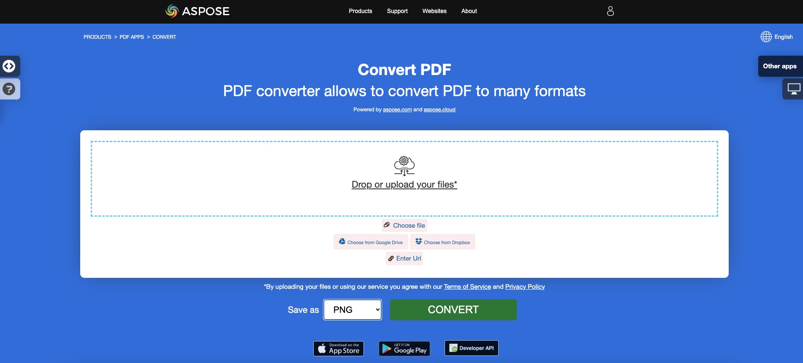

<script type="application/ld+json">
{
    "@context": "https://schema.org",
    "@type": "TechArticle",
    "headline": "Convert PDF to Different Image Formats in C#",
    "alternativeHeadline": "Convert PDF Files to Multiple Image Formats in C#",
    "abstract": "Функция в Aspose.PDF for .NET позволяет пользователям без проблем конвертировать PDF файлы в несколько форматов изображений, таких как TIFF, BMP, EMF, JPEG, PNG, GIF и SVG. Эта функциональность упрощает работу с документами, позволяя конвертацию всего за несколько строк кода на C#, что делает её незаменимым инструментом для разработчиков, стремящихся улучшить свои приложения с помощью универсальных возможностей обработки PDF.",
    "author": {
        "@type": "Person",
        "name": "Anastasiia Holub",
        "givenName": "Anastasiia",
        "familyName": "Holub",
        "url": "https://www.linkedin.com/in/anastasiia-holub-750430225/"
    },
    "genre": "pdf document generation",
    "wordcount": "2012",
    "proficiencyLevel": "Beginner",
    "publisher": {
        "@type": "Organization",
        "name": "Aspose.PDF for .NET",
        "url": "https://products.aspose.com/pdf",
        "logo": "https://www.aspose.cloud/templates/aspose/img/products/pdf/aspose_pdf-for-net.svg",
        "alternateName": "Aspose",
        "sameAs": [
            "https://facebook.com/aspose.pdf/",
            "https://twitter.com/asposepdf",
            "https://www.youtube.com/channel/UCmV9sEg_QWYPi6BJJs7ELOg/featured",
            "https://www.linkedin.com/company/aspose",
            "https://stackoverflow.com/questions/tagged/aspose",
            "https://aspose.quora.com/",
            "https://aspose.github.io/"
        ],
        "contactPoint": [
            {
                "@type": "ContactPoint",
                "telephone": "+1 903 306 1676",
                "contactType": "sales",
                "areaServed": "US",
                "availableLanguage": "en"
            },
            {
                "@type": "ContactPoint",
                "telephone": "+44 141 628 8900",
                "contactType": "sales",
                "areaServed": "GB",
                "availableLanguage": "en"
            },
            {
                "@type": "ContactPoint",
                "telephone": "+61 2 8006 6987",
                "contactType": "sales",
                "areaServed": "AU",
                "availableLanguage": "en"
            }
        ]
    },
    "url": "/net/convert-pdf-to-images-format/",
    "mainEntityOfPage": {
        "@type": "WebPage",
        "@id": "/net/convert-pdf-to-images-format/"
    },
    "dateModified": "2025-04-08",
    "description": "Aspose.PDF может выполнять не только простые и легкие задачи, но также справляться с более сложными целями. Проверьте следующий раздел для продвинутых пользователей и разработчиков."
}
</script>

## Обзор

Эта статья объясняет, как конвертировать PDF в различные форматы изображений с использованием C#. Она охватывает следующие темы.

_Формат изображения_: **TIFF**
- [C# PDF в TIFF](#csharp-pdf-to-tiff)
- [C# Конвертация PDF в TIFF](#csharp-pdf-to-tiff)
- [C# Конвертация отдельных или конкретных страниц PDF в TIFF](#csharp-pdf-to-tiff-pages)


_Формат изображения_: **BMP**
- [C# PDF в BMP](#csharp-pdf-to-bmp)
- [C# Конвертация PDF в BMP](#csharp-pdf-to-bmp)
- [C# Конвертер PDF в BMP](#csharp-pdf-to-bmp)

_Формат изображения_: **EMF**
- [C# PDF в EMF](#csharp-pdf-to-emf)
- [C# Конвертация PDF в EMF](#csharp-pdf-to-emf)
- [C# Конвертер PDF в EMF](#csharp-pdf-to-emf)


_Формат изображения_: **JPG**
- [C# PDF в JPG](#csharp-pdf-to-jpg)
- [C# Конвертация PDF в JPG](#csharp-pdf-to-jpg)
- [C# Конвертер PDF в JPG](#csharp-pdf-to-jpg)


_Формат изображения_: **PNG**
- [C# PDF в PNG](#csharp-pdf-to-png)
- [C# Конвертация PDF в PNG](#csharp-pdf-to-png)
- [C# Конвертер PDF в PNG](#csharp-pdf-to-png)


_Формат изображения_: **GIF**
- [C# PDF в GIF](#csharp-pdf-to-gif)
- [C# Конвертация PDF в GIF](#csharp-pdf-to-gif)
- [C# Конвертер PDF в GIF](#csharp-pdf-to-gif)

_Формат изображения_: **SVG**
- [C# PDF в SVG](#csharp-pdf-to-svg)
- [C# Конвертация PDF в SVG](#csharp-pdf-to-svg)
- [C# Конвертер PDF в SVG](#csharp-pdf-to-svg)

## C# Конвертация PDF в изображение

Следующий фрагмент кода также работает с библиотекой [Aspose.PDF.Drawing](/pdf/ru/net/drawing/).

**Aspose.PDF for .NET** использует несколько подходов для конвертации PDF в изображение. Говоря в общем, мы используем два подхода: конвертация с использованием подхода Device и конвертация с использованием SaveOption. Этот раздел покажет вам, как конвертировать PDF документы в форматы изображений, такие как BMP, JPEG, GIF, PNG, EMF, TIFF и SVG, используя один из этих подходов.

В библиотеке есть несколько классов, которые позволяют использовать виртуальное устройство для преобразования изображений. DocumentDevice ориентирован на конвертацию всего документа, а ImageDevice - на конкретную страницу.

## Конвертация PDF с использованием класса DocumentDevice

**Aspose.PDF for .NET** позволяет конвертировать страницы PDF в изображения TIFF.

Класс TiffDevice (основанный на DocumentDevice) позволяет конвертировать страницы PDF в изображения TIFF. Этот класс предоставляет метод с именем `Process`, который позволяет вам конвертировать все страницы в PDF файле в одно изображение TIFF.

{}
**Попробуйте конвертировать PDF в TIFF онлайн**

Aspose.PDF for .NET предлагает вам онлайн бесплатное приложение ["PDF в TIFF"](https://products.aspose.app/pdf/conversion/pdf-to-tiff), где вы можете попробовать исследовать функциональность и качество его работы.

[](https://products.aspose.app/pdf/conversion/pdf-to-tiff)
{}

### Конвертация страниц PDF в одно изображение TIFF

Aspose.PDF for .NET объясняет, как конвертировать все страницы в PDF файле в одно изображение TIFF:

<a name="csharp-pdf-to-tiff"><strong>Шаги: Конвертация PDF в TIFF на C#</strong></a>

1. Создайте объект класса **Document**.
2. Создайте объекты **TiffSettings** и **TiffDevice**.
3. Вызовите метод **TiffDevice.Process()** для конвертации PDF документа в TIFF.
4. Чтобы установить свойства выходного файла, используйте класс **TiffSettings**.

Следующий фрагмент кода показывает, как конвертировать все страницы PDF в одно изображение TIFF.

```csharp
public static void ConvertPDFtoTIFF()
{
    // Open document
    Document document = new Document(dataDir + "PageToTIFF.pdf");

    // Create Resolution object
    Resolution resolution = new Resolution(300);

    // Create TiffSettings object
    TiffSettings tiffSettings = new TiffSettings
    {
        Compression = CompressionType.None,
        Depth = ColorDepth.Default,
        Shape = ShapeType.Landscape,
        SkipBlankPages = false
    };

    // Create TIFF device
    TiffDevice tiffDevice = new TiffDevice(resolution, tiffSettings);

    // Convert a particular page and save the image to stream
    tiffDevice.Process(document, dataDir + "AllPagesToTIFF_out.tif");
}
```

### Конвертация одной страницы в изображение TIFF

Aspose.PDF for .NET позволяет конвертировать конкретную страницу в PDF файле в изображение TIFF, используя перегруженную версию метода Process(..), которая принимает номер страницы в качестве аргумента для конвертации. Следующий фрагмент кода показывает, как конвертировать первую страницу PDF в формат TIFF.

<a name="csharp-pdf-to-tiff-pages"><strong>Шаги: Конвертация отдельных или конкретных страниц PDF в TIFF на C#</strong></a>

1. Создайте объект класса **Document**.
2. Создайте объекты **TiffSettings** и **TiffDevice**.
3. Вызовите перегруженный метод **TiffDevice.Process()** с параметрами **fromPage** и **toPage** для конвертации страниц PDF документа в TIFF.

```csharp
public static void ConvertPDFtoTiffSinglePage()
{
    // Open document
    Document document = new Document(dataDir + "PageToTIFF.pdf");

    // Create Resolution object
    Resolution resolution = new Resolution(300);

    // Create TiffSettings object
    TiffSettings tiffSettings = new TiffSettings
    {
        Compression = CompressionType.None,
        Depth = ColorDepth.Default,
        Shape = ShapeType.Landscape,
    };

    // Create TIFF device
    TiffDevice tiffDevice = new TiffDevice(resolution, tiffSettings);

    // Convert a particular page and save the image to stream
    tiffDevice.Process(document, 1, 1, dataDir + "PageToTIFF_out.tif");
}
```

### Использование алгоритма Бредли во время конвертации

Aspose.PDF for .NET поддерживает функцию конвертации PDF в TIF с использованием сжатия LZW, а затем с использованием AForge можно применить бинаризацию. Однако один из клиентов запросил, чтобы для некоторых изображений они хотели получить порог с использованием метода Оцу, поэтому они также хотели бы использовать Бредли.

```csharp
public static void ConvertPDFtoTiffBradleyBinarization()
{
    // Open document
    Document document = new Document(dataDir + "PageToTIFF.pdf");

    string outputImageFile = dataDir + "resultant_out.tif";
    string outputBinImageFile = dataDir + "37116-bin_out.tif";

    // Create Resolution object
    Resolution resolution = new Resolution(300);
    // Create TiffSettings object
    TiffSettings tiffSettings = new TiffSettings
    {
        Compression = CompressionType.LZW,
        Depth = Aspose.Pdf.Devices.ColorDepth.Format1bpp
    };
    // Create TIFF device
    TiffDevice tiffDevice = new TiffDevice(resolution, tiffSettings);
    // Convert a particular page and save the image to stream
    tiffDevice.Process(document, outputImageFile);

    using (FileStream inStream = new FileStream(outputImageFile, FileMode.Open))
    {
        using (FileStream outStream = new FileStream(outputBinImageFile, FileMode.Create))
        {
            tiffDevice.BinarizeBradley(inStream, outStream, 0.1);
        }
    }
} 
```

## Конвертация PDF с использованием класса ImageDevice

`ImageDevice` является предком для `BmpDevice`, `JpegDevice`, `GifDevice`, `PngDevice` и `EmfDevice`.

- Класс [BmpDevice](https://reference.aspose.com/pdf/ru/net/aspose.pdf.devices/bmpdevice) позволяет конвертировать страницы PDF в <abbr title="Bitmap Image File">BMP</abbr> изображения.
- Класс [EmfDevice](https://reference.aspose.com/pdf/ru/net/aspose.pdf.devices/emfdevice) позволяет конвертировать страницы PDF в <abbr title="Enhanced Meta File">EMF</abbr> изображения.
- Класс [JpegDevice](https://reference.aspose.com/pdf/ru/net/aspose.pdf.devices/jpegdevice) позволяет конвертировать страницы PDF в JPEG изображения.
- Класс [PngDevice](https://reference.aspose.com/pdf/ru/net/aspose.pdf.devices/pngdevice) позволяет конвертировать страницы PDF в <abbr title="Portable Network Graphics">PNG</abbr> изображения.
- Класс [GifDevice](https://reference.aspose.com/pdf/ru/net/aspose.pdf.devices/gifdevice) позволяет конвертировать страницы PDF в <abbr title="Graphics Interchange Format">GIF</abbr> изображения.

Давайте посмотрим, как конвертировать страницу PDF в изображение.

Класс `BmpDevice` предоставляет метод с именем [Process](https://reference.aspose.com/pdf/ru/net/aspose.pdf.devices/bmpdevice/methods/process), который позволяет вам конвертировать конкретную страницу PDF файла в формат BMP. У других классов есть тот же метод. Таким образом, если нам нужно конвертировать страницу PDF в изображение, мы просто создаем экземпляр необходимого класса.

<a name="csharp-pdf-to-bmp"></a>
<a name="csharp-pdf-to-emf"></a>
<a name="csharp-pdf-to-jpg"></a>
<a name="csharp-pdf-to-png"></a>
<a name="csharp-pdf-to-gif"></a>
    
Следующие шаги и фрагмент кода на C# показывают эту возможность
 
 - [Конвертация PDF в BMP на C#](#csharp-pdf-to-image)
 - [Конвертация PDF в EMF на C#](#csharp-pdf-to-image)
 - [Конвертация PDF в JPG на C#](#csharp-pdf-to-image)
 - [Конвертация PDF в PNG на C#](#csharp-pdf-to-image)
 - [Конвертация PDF в GIF на C#](#csharp-pdf-to-image)

<a name="csharp-pdf-to-image"><strong>Шаги: PDF в изображение (BMP, EMF, JPG, PNG, GIF) на C#</strong></a>

1. Загрузите PDF файл с использованием класса **Document**.
2. Создайте экземпляр подкласса **ImageDevice**, т.е.
   * **BmpDevice** (для конвертации PDF в BMP).
   * **EmfDevice** (для конвертации PDF в Emf).
   * **JpegDevice** (для конвертации PDF в JPG).
   * **PngDevice** (для конвертации PDF в PNG).
   * **GifDevice** (для конвертации PDF в GIF).
3. Вызовите метод **ImageDevice.Process()** для выполнения конвертации PDF в изображение.

```csharp
public static class ExampleConvertPdfToImage
{
     private static readonly string dataDir = @"C:\Samples\";
    // BMP, JPEG, GIF, PNG, EMF
    public static void ConvertPDFusingImageDevice()
    {
        // Create Resolution object            
        Resolution resolution = new Resolution(300);
        BmpDevice bmpDevice = new BmpDevice(resolution);
        JpegDevice jpegDevice = new JpegDevice(resolution);
        GifDevice gifDevice = new GifDevice(resolution);
        PngDevice pngDevice = new PngDevice(resolution);
        EmfDevice emfDevice = new EmfDevice(resolution);

        Document document = new Document(dataDir + 
            "ConvertAllPagesToBmp.pdf");
            
        ConvertPDFtoImage(bmpDevice, "bmp", document);
        ConvertPDFtoImage(jpegDevice,"jpeg", document);
        ConvertPDFtoImage(gifDevice, "gif", document);
        ConvertPDFtoImage(pngDevice, "png", document);
        ConvertPDFtoImage(emfDevice, "emf", document);
            
    }
}

public static void ConvertPDFtoImage(ImageDevice imageDevice, 
        string ext, Document document)
{
    for (int pageCount = 1; pageCount <= document.Pages.Count; pageCount++)
    {
        using (FileStream imageStream = 
            new FileStream($"{dataDir}image{pageCount}_out.{ext}", 
            FileMode.Create))
        {
            // Convert a particular page and save the image to stream
            imageDevice.Process(document.Pages[pageCount], imageStream);
        }
    }
}
```

### Конвертация PDF в изображение с прозрачным фоном

Страница PDF может быть конвертирована в изображение PNG с прозрачным фоном вместо белого.



```csharp
// For complete examples and data files, visit https://github.com/aspose-pdf/Aspose.PDF-for-.NET
private static void ConvertPDFtoImageWithTransparentBackground()
{
    // The path to the documents directory
    var dataDir = RunExamples.GetDataDir_AsposePdf_WorkingDocuments();

    // Open PDF document
    using (var document = new Aspose.Pdf.Document(dataDir + "ConvertPDFtoImageWithTransparentBackground.pdf"))
    {
        var pngDevice = new Aspose.Pdf.Devices.PngDevice();
        pngDevice.TransparentBackground = true;
        using (var pngStream = new FileStream(dataDir + "ConvertPDFtoImageWithTransparentBackground.png", FileMode.Create))
        {
            // Convert page to PNG image
            pngDevice.Process(document.Pages[1], pngStream);
        }
    }
}
```



```csharp
// For complete examples and data files, visit https://github.com/aspose-pdf/Aspose.PDF-for-.NET
private static void ConvertPDFtoImageWithTransparentBackground()
{
    // The path to the documents directory
    var dataDir = RunExamples.GetDataDir_AsposePdf_WorkingDocuments();

    // Open PDF document
    using var document = new Aspose.Pdf.Document(dataDir + "ConvertPDFtoImageWithTransparentBackground.pdf");
    var pngDevice = new Aspose.Pdf.Devices.PngDevice()
    {
        TransparentBackground = true
    };
    using var pngStream = new FileStream(dataDir + "ConvertPDFtoImageWithTransparentBackground.png", FileMode.Create);
    // Convert page to PNG image
    pngDevice.Process(document.Pages[1], pngStream);
}
```



{}
**Попробуйте конвертировать PDF в PNG онлайн**

В качестве примера того, как работают наши бесплатные приложения, пожалуйста, проверьте следующую функцию.

Aspose.PDF for .NET предлагает вам онлайн бесплатное приложение ["PDF в PNG"](https://products.aspose.app/pdf/conversion/pdf-to-png), где вы можете попробовать исследовать функциональность и качество его работы.

[](https://products.aspose.app/pdf/conversion/pdf-to-png)
{}

## Конвертация PDF с использованием класса SaveOptions

Эта часть статьи показывает, как конвертировать PDF в <abbr title="Scalable Vector Graphics">SVG</abbr> с использованием C# и класса SaveOptions.

{}
**Попробуйте конвертировать PDF в SVG онлайн**

Aspose.PDF for .NET предлагает вам онлайн бесплатное приложение ["PDF в SVG"](https://products.aspose.app/pdf/conversion/pdf-to-svg), где вы можете попробовать исследовать функциональность и качество его работы.

[](https://products.aspose.app/pdf/conversion/pdf-to-svg)
{}

**Масштабируемая векторная графика (SVG)** - это семейство спецификаций формата файла на основе XML для двумерной векторной графики, как статической, так и динамической (интерактивной или анимированной). Спецификация SVG является открытым стандартом, который разрабатывается Консорциумом Всемирной паутины (W3C) с 1999 года.

Изображения SVG и их поведение определяются в текстовых файлах XML. Это означает, что их можно искать, индексировать, скриптовать и, если необходимо, сжимать. Как XML файлы, изображения SVG могут быть созданы и отредактированы с помощью любого текстового редактора, но часто удобнее создавать их с помощью графических программ, таких как Inkscape.

Aspose.PDF for .NET поддерживает функцию конвертации изображений SVG в формат PDF и также предлагает возможность конвертации PDF файлов в формат SVG. Для выполнения этого требования в пространство имен Aspose.PDF был введен класс [`SvgSaveOptions`](https://reference.aspose.com/pdf/ru/net/aspose.pdf/svgsaveoptions/methods/index). Создайте объект SvgSaveOptions и передайте его в качестве второго аргумента методу [`Document.Save(..)`](https://reference.aspose.com/pdf/ru/net/aspose.pdf/document/methods/save/index).

Следующий фрагмент кода показывает шаги для конвертации PDF файла в формат SVG с использованием .NET.

<a name="csharp-pdf-to-svg"><strong>Шаги: Конвертация PDF в SVG на C#</strong></a>

1. Создайте объект класса **Document**.
2. Создайте объект **SvgSaveOptions** с необходимыми настройками.
3. Вызовите метод **Document.Save()** и передайте ему объект **SvgSaveOptions** для конвертации PDF документа в SVG.

```csharp
public static void ConvertPDFtoSVG()
{
    // Load PDF document
    Document document = new Document(dataDir + "input.pdf");
    // Instantiate an object of SvgSaveOptions
    SvgSaveOptions saveOptions = new SvgSaveOptions
    {
        // Do not compress SVG image to Zip archive
        CompressOutputToZipArchive = false,
        TreatTargetFileNameAsDirectory = true                
    };
            
    // Save the output in SVG files
    document.Save(dataDir + "PDFToSVG_out.svg", saveOptions);
}
```