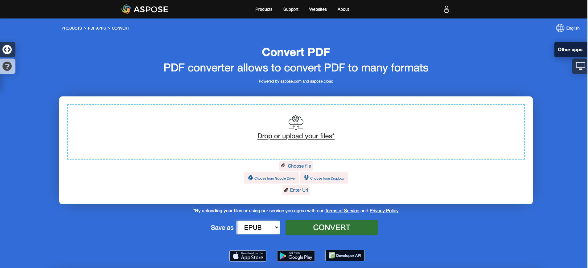

<script type="application/ld+json">
{
    "@context": "https://schema.org",
    "@type": "TechArticle",
    "headline": "Convert PDF to EPUB, LaTeX, Text, XPS in C#",
    "alternativeHeadline": "Add PDF format conversion to EPUB, LaTeX, Text, XPS in C#",
    "abstract": "Aspose.PDF for .NET представляет мощную функцию, которая позволяет бесшовную конвертацию PDF файлов в различные форматы, включая EPUB, LaTeX, Text, XPS и Markdown. Эта функциональность улучшает доступность и удобство документов, позволяя разработчикам без усилий интегрировать разнообразные конверсии форматов файлов в свои C# приложения, тем самым обслуживая более широкую аудиторию и оптимизируя контент для различных платформ.",
    "author": {
        "@type": "Person",
        "name": "Anastasiia Holub",
        "givenName": "Anastasiia",
        "familyName": "Holub",
        "url": "https://www.linkedin.com/in/anastasiia-holub-750430225/"
    },
    "genre": "pdf document generation",
    "wordcount": "1419",
    "proficiencyLevel": "Beginner",
    "publisher": {
        "@type": "Organization",
        "name": "Aspose.PDF for .NET",
        "url": "https://products.aspose.com/pdf",
        "logo": "https://www.aspose.cloud/templates/aspose/img/products/pdf/aspose_pdf-for-net.svg",
        "alternateName": "Aspose",
        "sameAs": [
            "https://facebook.com/aspose.pdf/",
            "https://twitter.com/asposepdf",
            "https://www.youtube.com/channel/UCmV9sEg_QWYPi6BJJs7ELOg/featured",
            "https://www.linkedin.com/company/aspose",
            "https://stackoverflow.com/questions/tagged/aspose",
            "https://aspose.quora.com/",
            "https://aspose.github.io/"
        ],
        "contactPoint": [
            {
                "@type": "ContactPoint",
                "telephone": "+1 903 306 1676",
                "contactType": "sales",
                "areaServed": "US",
                "availableLanguage": "en"
            },
            {
                "@type": "ContactPoint",
                "telephone": "+44 141 628 8900",
                "contactType": "sales",
                "areaServed": "GB",
                "availableLanguage": "en"
            },
            {
                "@type": "ContactPoint",
                "telephone": "+61 2 8006 6987",
                "contactType": "sales",
                "areaServed": "AU",
                "availableLanguage": "en"
            }
        ]
    },
    "url": "/net/convert-pdf-to-other-files/",
    "mainEntityOfPage": {
        "@type": "WebPage",
        "@id": "/net/convert-pdf-to-other-files/"
    },
    "dateModified": "2024-11-25",
    "description": "Aspose.PDF может выполнять не только простые и легкие задачи, но и справляться с более сложными целями. Проверьте следующий раздел для продвинутых пользователей и разработчиков."
}
</script>

## Конвертация PDF в EPUB

{}
**Попробуйте конвертировать PDF в EPUB онлайн**

Aspose.PDF for .NET представляет вам онлайн бесплатное приложение ["PDF в EPUB"](https://products.aspose.app/pdf/conversion/pdf-to-epub), где вы можете попробовать исследовать функциональность и качество его работы.

[](https://products.aspose.app/pdf/conversion/pdf-to-epub)
{}

**<abbr title="Электронная публикация">EPUB</abbr>** — это бесплатный и открытый стандарт электронных книг от Международного форума цифрового издательства (IDPF). Файлы имеют расширение .epub.
EPUB предназначен для контента с возможностью изменения формата, что означает, что EPUB-ридер может оптимизировать текст для конкретного устройства отображения. EPUB также поддерживает контент с фиксированным макетом. Формат предназначен как единый формат, который издатели и конверсионные компании могут использовать внутри компании, а также для распространения и продажи. Он заменяет стандарт Open eBook.

Следующий фрагмент кода также работает с библиотекой [Aspose.PDF.Drawing](/pdf/ru/net/drawing/).

Aspose.PDF for .NET также поддерживает функцию конвертации PDF документов в формат EPUB. У Aspose.PDF for .NET есть класс под названием EpubSaveOptions, который можно использовать в качестве второго аргумента для метода [`Document.Save(..)`](https://reference.aspose.com/pdf/ru/net/aspose.pdf/document/methods/save/index), чтобы сгенерировать файл EPUB.
Пожалуйста, попробуйте использовать следующий фрагмент кода для выполнения этой задачи с C#.

```csharp
// For complete examples and data files, visit https://github.com/aspose-pdf/Aspose.PDF-for-.NET
private static void ConvertPDFtoEPUB()
{
    // The path to the documents directory
    var dataDir = RunExamples.GetDataDir_AsposePdf_DocumentConversion();

    // Open PDF document
    using (var document = new Aspose.Pdf.Document(dataDir + "PDFToEPUB.pdf"))
    {
        // Instantiate Epub Save options
        EpubSaveOptions options = new EpubSaveOptions();
        // Specify the layout for contents
        options.ContentRecognitionMode = EpubSaveOptions.RecognitionMode.Flow;

        // Save ePUB document
        document.Save(dataDir + "PDFToEPUB_out.epub", options);
    }
}
```

## Конвертация PDF в LaTeX/TeX

**Aspose.PDF for .NET** поддерживает конвертацию PDF в LaTeX/TeX.
Формат файла LaTeX — это текстовый формат файла со специальной разметкой, используемый в системе подготовки документов на основе TeX для высококачественной верстки.

{}
**Попробуйте конвертировать PDF в LaTeX/TeX онлайн**

Aspose.PDF for .NET представляет вам онлайн бесплатное приложение ["PDF в LaTeX"](https://products.aspose.app/pdf/conversion/pdf-to-tex), где вы можете попробовать исследовать функциональность и качество его работы.

[](https://products.aspose.app/pdf/conversion/pdf-to-tex)
{}

Чтобы конвертировать PDF файлы в TeX, Aspose.PDF имеет класс [LaTeXSaveOptions](https://reference.aspose.com/pdf/ru/net/aspose.pdf/latexsaveoptions), который предоставляет свойство OutDirectoryPath для сохранения временных изображений в процессе конвертации.

Следующий фрагмент кода показывает процесс конвертации PDF файлов в формат TEX с C#.

```csharp
// For complete examples and data files, visit https://github.com/aspose-pdf/Aspose.PDF-for-.NET
private static void ConvertPDFtoTeX()
{
    // The path to the documents directory
    var dataDir = RunExamples.GetDataDir_AsposePdf_DocumentConversion();

    // Open PDF document
    using (var document = new Aspose.Pdf.Document(dataDir + "PDFToTeX.pdf"))
    {
        // Instantiate LaTex save option          
        LaTeXSaveOptions saveOptions = new LaTeXSaveOptions();

        // Specify the output directory
        string pathToOutputDirectory = dataDir;

        // Set the output directory path for save option object
        saveOptions.OutDirectoryPath = pathToOutputDirectory;

        // Save PDF document into LaTex format           
        document.Save(dataDir + "PDFToTeX_out.tex", saveOptions);
    }
}
```

## Конвертация PDF в Text

**Aspose.PDF for .NET** поддерживает конвертацию целого PDF документа и одной страницы в текстовый файл.

### Конвертация целого PDF документа в текстовый файл

Вы можете конвертировать PDF документ в TXT файл, используя метод [Visit](https://reference.aspose.com/pdf/ru/net/aspose.pdf.text/textabsorber/methods/visit/index) класса [TextAbsorber](https://reference.aspose.com/pdf/ru/net/aspose.pdf.text/textabsorber).

Следующий фрагмент кода объясняет, как извлечь текст со всех страниц.

```csharp
// For complete examples and data files, visit https://github.com/aspose-pdf/Aspose.PDF-for-.NET
private static void ConvertPDFtoTXT()
{
    // The path to the documents directory
    var dataDir = RunExamples.GetDataDir_AsposePdf_DocumentConversion();

    // Open PDF document
    using (var document = new Aspose.Pdf.Document(dataDir + "demo.pdf"))
    {
        var ta = new Aspose.Pdf.Text.TextAbsorber();
        ta.Visit(document);

        // Save the extracted text in text file
        File.WriteAllText(dataDir + "input_Text_Extracted_out.txt",ta.Text);
    }
}
```

{}
**Попробуйте конвертировать PDF в Text онлайн**

Aspose.PDF for .NET представляет вам онлайн бесплатное приложение ["PDF в Text"](https://products.aspose.app/pdf/conversion/pdf-to-txt), где вы можете попробовать исследовать функциональность и качество его работы.

[](https://products.aspose.app/pdf/conversion/pdf-to-txt)
{}

### Конвертация страницы PDF в текстовый файл

Вы можете конвертировать PDF документ в TXT файл с Aspose.PDF for .NET. Вам следует использовать метод `Visit` класса `TextAbsorber`, чтобы решить эту задачу.

Следующий фрагмент кода объясняет, как извлечь текст с определенных страниц.

```csharp
// For complete examples and data files, visit https://github.com/aspose-pdf/Aspose.PDF-for-.NET
private static void ConvertPDFtoTXT()
{
    // The path to the documents directory
    var dataDir = RunExamples.GetDataDir_AsposePdf_DocumentConversion();

    // Open PDF document
    using (var document = new Aspose.Pdf.Document(dataDir + "demo.pdf"))
    {
        var ta = new Aspose.Pdf.Text.TextAbsorber();
        var pages = new [] {1, 3, 4};
        foreach (var page in pages)
        {
            ta.Visit(document.Pages[page]);
        }
    
        // Save the extracted text in text file
        File.WriteAllText(dataDir + "input_Text_Extracted_out.txt", ta.Text);
    }
}
```

## Конвертация PDF в XPS

**Aspose.PDF for .NET** предоставляет возможность конвертировать PDF файлы в формат <abbr title="XML Paper Specification">XPS</abbr>. Давайте попробуем использовать представленный фрагмент кода для конвертации PDF файлов в формат XPS с C#.

{}
**Попробуйте конвертировать PDF в XPS онлайн**

Aspose.PDF for .NET представляет вам онлайн бесплатное приложение ["PDF в XPS"](https://products.aspose.app/pdf/conversion/pdf-to-xps), где вы можете попробовать исследовать функциональность и качество его работы.

[](https://products.aspose.app/pdf/conversion/pdf-to-xps)
{}

Тип файла XPS в первую очередь ассоциируется с XML Paper Specification от Microsoft Corporation. XML Paper Specification (XPS), ранее известный под кодовым названием Metro и охватывающий концепцию маркетинга Next Generation Print Path (NGPP), является инициативой Microsoft по интеграции создания и просмотра документов в операционную систему Windows.

Чтобы конвертировать PDF файлы в XPS, Aspose.PDF имеет класс [XpsSaveOptions](https://reference.aspose.com/net/pdf/aspose.pdf/xpssaveoptions), который используется в качестве второго аргумента для метода [Document.Save(..)](https://reference.aspose.com/pdf/ru/net/aspose.pdf/document/methods/save/index) для генерации файла XPS.

С момента релиза 24.2 Aspose.PDF реализовал конвертацию поискового PDF в XPS, сохраняя текст, который можно выделить в результирующем XPS. Чтобы сохранить текст, необходимо установить свойство XpsSaveOptions.SaveTransparentTexts в true.

Следующий фрагмент кода показывает процесс конвертации PDF файла в формат XPS.

```csharp
// For complete examples and data files, visit https://github.com/aspose-pdf/Aspose.PDF-for-.NET
private static void ConvertPDFtoXPS()
{
    // The path to the documents directory
    var dataDir = RunExamples.GetDataDir_AsposePdf_DocumentConversion();

    using (var document = new Aspose.Pdf.Document(dataDir + "demo.pdf"))
    {
        var xpsOptions = new XpsSaveOptions
        {
            SaveTransparentTexts = true
        };

        // Save XPS document
        document.Save(dataDir + "PDFtoXPS_out.xps", xpsOptions);
    }
}
```

## Конвертация PDF в Markdown

**Aspose.PDF for .NET** предоставляет возможность конвертировать PDF файлы в формат <abbr title="Markdown">MD</abbr>. Давайте попробуем использовать представленный фрагмент кода для конвертации PDF файлов в формат MD с C#.

Markdown — это легкий язык разметки, предназначенный для представления форматирования простого текста с максимальной читаемостью для человека и машинной читаемостью для продвинутых языков публикации.

### Оптимизация использования изображений с помощью конвертера PDF в Markdown

Вы можете заметить, что в каталогах с изображениями количество изображений меньше, чем количество изображений в PDF файлах.

Поскольку в markdown файле нельзя установить размер изображения, без опции MarkdownSaveOptions.UseImageHtmlTag, одинаковые изображения с разными размерами сохраняются как разные.

Для включенной опции MarkdownSaveOptions.UseImageHtmlTag будут сохранены уникальные изображения, которые масштабируются в документе с помощью тега img.

Код открывает PDF документ, настраивает параметры для конвертации его в файл Markdown (сохранение любых изображений в папке с именем "images") и сохраняет полученный файл Markdown в указанном выходном пути.

Следующий фрагмент кода показывает процесс конвертации PDF файла в формат MD.

```csharp
// For complete examples and data files, visit https://github.com/aspose-pdf/Aspose.PDF-for-.NET
private static void ConvertPDFtoMarkup()
{
    // The path to the documents directory
    var dataDir = RunExamples.GetDataDir_AsposePdf_DocumentConversion();

    // Open PDF document
    using (var document = new Aspose.Pdf.Document(dataDir + "demo.pdf"))
    {
        // Create an instance of MarkdownSaveOptions to configure the Markdown export settings
        var saveOptions = new MarkdownSaveOptions()
        {
            // Set to false to prevent the use of HTML  tags for images in the Markdown output
            UseImageHtmlTag = false
        }
        
        // Specify the directory name where resources (like images) will be stored
        saveOptions.ResourcesDirectoryName = "images";

        // Save PDF document in Markdown format to the specified output file path using the defined save options   
        document.Save(dataDir + "PDFtoMarkup_out.md", saveOptions);
    }
}
```

### Конвертация PDF в MobiXml

MobiXML — это популярный формат электронных книг, предназначенный для использования на мобильных платформах.
Следующий фрагмент кода объясняет, как конвертировать PDF документ в файл MobiXML.
```csharp
// For complete examples and data files, visit https://github.com/aspose-pdf/Aspose.PDF-for-.NET      
private static void ConvertPdfToMobiXml()
{
    // The path to the documents directory
    var dataDir = RunExamples.GetDataDir_AsposePdf_DocumentConversion();

    // Open PDF document
    using (var document = new Aspose.Pdf.Document(dataDir + "PDFToXML.pdf"))
    {
        // Save PDF document in XML format
        document.Save(dataDir + "PDFToXML_out.xml", Aspose.Pdf.SaveFormat.MobiXml);
    }
}
```