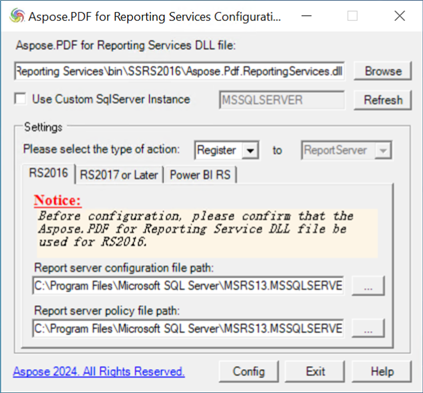

Инструмент конфигурации Aspose.PDF for Reporting Services может помочь вам настроить расширение Aspose.PDF for Reporting Services для любой поддерживаемой версии Report Server (RS). В настоящее время поддерживаются RS2016, RS2017, RS2019, RS2022 и Power BI Report Server. Инструмент конфигурации требует .NET Framework 4.8.

Если вы хотите установить расширение и зарегистрировать его на Report Server, выберите тип действия 'Register'. Для отмены регистрации и удаления расширения выберите тип действия 'Unregister'.

**Следующие шаги описывают, как использовать его подробно:**

1. Введите или выберите путь к файлу DLL для расширения Aspose.PDF for Reporting Services;
1. Выберите соответствующий тип действия: Register или Unregister;
1. Выберите вкладку, соответствующую версии Report Server, которую вы хотите настроить. Пожалуйста, убедитесь, что вы выбрали DLL‑файл, предназначенный для вашей версии RS. Если требуемая версия продукта не установлена на компьютере, инструмент конфигурации сообщит вам об этом с подсказками. Если вы настраиваете расширение для указанного экземпляра RS2016 (не для экземпляра по умолчанию 'MSSQLSERVER'), введите пользовательское имя экземпляра, затем нажмите кнопку 'Refresh'.
1. Убедитесь, что пути и имена файлов конфигурации, отображаемые в нижних текстовых полях, верны. Если они неверны, вы можете нажать кнопку 'Refresh', чтобы попытаться найти экземпляр RS снова, или же найти их вручную.
1. Нажмите кнопку 'Config'. Инструмент теперь попытается выполнить запрошенную конфигурацию и сообщит вам, успешна ли она.
 
