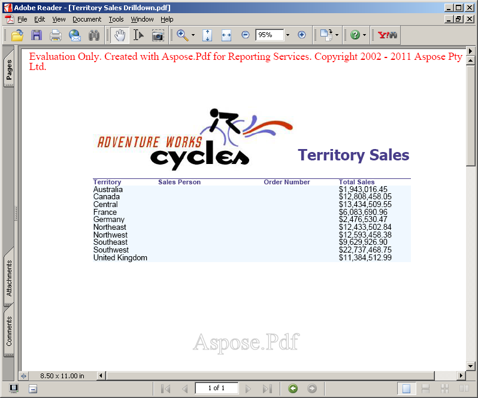

Оценочная версия **Aspose.PDF for Reporting Services** предоставляет тот же набор функций, что и лицензионная версия, за исключением оценочного водяного знака в результирующем PDF-файле при использовании оценочной версии. Посетите наш веб-сайт, загрузите версию продукта и начните изучать наш продукт с полным набором функций в ознакомительном режиме.

Если вы удовлетворены своей оценкой, [купите лицензию](https://purchase.aspose.com/buy). Перед покупкой убедитесь, что вы понимаете и согласны с условиями лицензионной подписки.

Лицензия будет доступна для скачивания на странице заказа после оплаты заказа. Лицензия представляет собой XML-файл в виде открытого текста с цифровой подписью. Лицензия содержит такую ​​информацию, как имя клиента, приобретенный продукт и тип лицензии. Не изменяйте содержимое файла лицензии, поскольку это приведет к аннулированию лицензии.

## Лицензирование сервера

Загрузите файл лицензии и скопируйте его в папку C:\Program Files\Microsoft SQL Server\<Instance>\Reporting Services\ReportServer\bin или C:\Program Files\Microsoft SQL Server\SSRS\ReportServer\bin или C:\Program Files\Microsoft Power BI Report Server\PBIRS\ReportServer\bin на сервере (тот же папка, в которой находится Aspose.Pdf.ReportingServices.dll).

`<Instance>` — это имя подкаталога, соответствующего экземпляру Microsoft SQL Server 2016, который вы хотите лицензировать.

Каталог экземпляра по умолчанию для Microsoft SQL Server 2016 — MSRS13.MSSQLSERVER.
Для Microsoft SQL Server 2017 и более поздних версий путь к экземпляру по умолчанию — C:\Program Files\Microsoft SQL Server\SSRS.
Для сервера отчетов Power BI путь к экземпляру по умолчанию — C:\Program Files\Microsoft Power BI Report Server\PBIRS.

**PDF создан на основе отчета «Детализация продаж на территории»**

**PDF создан на основе отчета «Детали заказа на продажу»**

Если при инициализации лицензии возникает проблема, в результирующем PDF-документе отображается оценочный водяной знак, как указано ниже.

**Документ PDF, созданный с помощью «Детализации продаж на территории» с водяным знаком**

Обратите внимание, что поддерживаемые имена файлов лицензий: Aspose.PDF.ReportingServices.lic, Aspose.Total.ReportingServices.lic и Aspose.Total.Product.Family.lic. Если файл имеет другое имя, переименуйте его.

## Временная лицензия

{}

Вы также можете запросить временную лицензию на 30 дней для тестирования продукта. Пожалуйста, посетите следующую ссылку для получения дополнительной информации о том, как получить временную лицензию. [Получить временную лицензию](https://purchase.aspose.com/temporary-license).

{}

