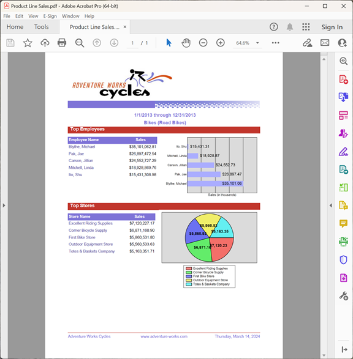

{}

Эта галерея демонстрирует PDF‑отчеты, экспортированные с помощью Aspose.PDF for Reporting Services.

{}

Большинство показанных здесь отчетов берутся из базы данных Adventure Works. Adventure Works — это пример базы данных для Microsoft SQL Server, доступный для скачивания с сайта Microsoft [здесь](http://www.microsoft.com/downloads/details.aspx?familyid=E719ECF7-9F46-4312-AF89-6AD8702E4E6E&displaylang=en).

## Продажи компании

## Сводка продаж сотрудников

## Каталог продукции

## Продажи продуктовой линейки

## Подробности заказа

