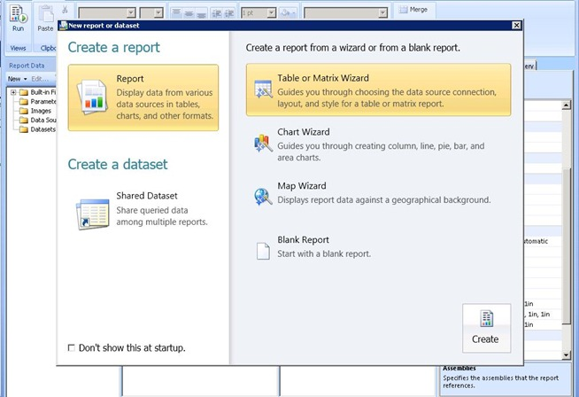

{}

Теперь, когда SharePoint установлен и сконфигурирован на сервере RS, а RS настроен через Reporting Services Configuration Manager, мы можем перейти к настройке в Central Admin. RS 2008 R2 действительно упростил этот процесс. Раньше был трехшаговый процесс, который нужно было выполнить, чтобы всё работало. Теперь у нас только один шаг.

{}

{}

Мы хотим перейти на веб‑сайт Central Administrator, а затем в раздел General Application Settings. Прокручивая вниз, мы увидим Reporting Services.

**Image1**:- диалог конфигурации SharePoint

Выберите ссылку "Reporting Services Integration". Будет отображён следующий экран.

**Image2**:- Укажите учетные данные интеграции Reporting Services

{}

## URL веб‑сервиса:

**Мы предоставим URL для сервера отчетов, который мы нашли в Reporting Services Configuration Manager.**

## Режим аутентификации:

**Мы также выберем режим аутентификации. Следующая ссылка MSDN подробно описывает, что это такое.
Обзор безопасности для Reporting Services в режиме интеграции с SharePoint**

{}

**Короче говоря, если ваш сайт использует Claims Authentication, вы всегда будете использовать Trusted Authentication независимо от того, что вы выберете здесь. Если вы хотите передать учётные данные Windows, вам следует выбрать Windows Authentication. Для Trusted Authentication мы будем передавать токен SPUser и не полагаться на учётные данные Windows. Вы также захотите использовать Trusted Authentication, если вы настроили свои сайты в Classic Mode для NTLM и RS настроен на NTLM. Для использования Windows Authentication и передачи её через ваш источник данных понадобится Kerberos.**

{}

## Activate feature:

{}

**Это дает вам возможность активировать Reporting Services во всех коллекциях сайтов, или вы можете выбрать, в каких именно вы хотите её активировать. По сути это означает, какие сайты смогут использовать Reporting Services. Когда это будет сделано, вы должны увидеть следующие результаты**

**Image3:**- Успешная интеграция Reporting Services со средой SharePoint
{}

{}

Вернувшись к URL ReportServer, мы должны увидеть нечто похожее на следующее

**Image4:**- Reporting Services успешно подключён к среде SharePoint

**NOTE:** ***Если ваш сайт SharePoint настроен на SSL, он не будет отображаться в этом списке. Это известная проблема и не означает, что есть проблема. Ваши отчёты всё равно должны работать.***
{}

{}

Now that we have successfully integrated both products, we are ready to use Reporting Services in SharePoint 2010. As the previous version we have a feature (activated when we configure Reporting Services Integration) in the “Site Collection Feature”. Also the installation added 3 content types to add to our site. In Image 7 we can see 2 of them content types added in a document library to create a custom report us ing the, as we can see in Image5 below.

**Image5:**- Report Builder

The “Reporter Builder” is an ActiveX control so we need to download it over the server, as we can see in Image 6 below.

**Image6:**- Загрузите и установите Report Builder
{}

{}

После завершения процесса загрузки загрузите элемент управления «Report Builder». Теперь мы готовы разработать наш первый отчёт, как показано ниже на Image7.

**Image7:**- Report Builder – Мастер создания нового отчёта
{}

{}

После создания нашего отчёта мы можем сохранить его в библиотеке документов, созданной для размещения отчётов в нашем SharePoint 2010. Другой тип содержимого должен быть использован для создания общих соединений в качестве источника данных и их сохранения в библиотеке документов в SharePoint. Мы можем создать библиотеку документов, добавить этот тип содержимого, и затем наши соединения будут доступны для изменения источника данных отчётов.

**Image8:**- Успешная интеграция Aspose.PDF for Reporting Services с MS SharePoint
{}

