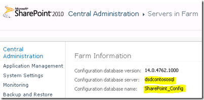

{}

Теперь нам нужно выполнить аналогичные шаги, как мы делали для SharePoint WFE. Первое — пройти установку Prereq uisites, и после её завершения запустить настройку SharePoint.

{}

Для настройки я выбираю Server Farm и полную установку, чтобы соответствовать моей SharePoint Box, так как я не хочу отдельную установку для SharePoint.

## Конфигурация SharePoint

{}

**В мастере конфигурации SharePoint мы хотим подключиться к существующей ферме.**

**Image1:- Мастер настройки SharePoint**
{}

{}

**Затем мы укажем его на базу данных SharePoint_Config, которую использует наша ферма. Если вы не знаете, где она находится, вы можете узнать через Центральное администрирование, через Системные настройки -> Управление серверами в этой ферме.**

**Image2:- Укажите параметры конфигурации базы данных**

**Image3:- Мастер настройки SharePoint**
{}

{}

**Как только мастер завершит работу, это всё, что нам нужно сделать на сервере Report Server Box пока что. Возвращаясь к URL ReportServer, мы увидим другую ошибку, но это потому, что мы не настроили её через Central Administrator.**

**Image4:- Ошибка сервера отчетов**
{}

