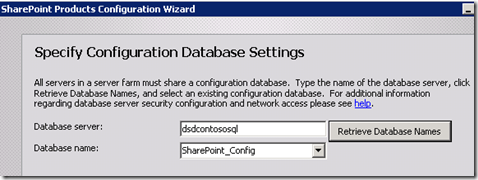
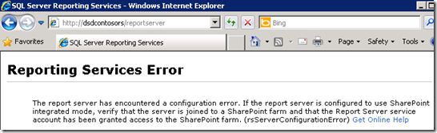

{}

Теперь нам нужно выполнить те же действия, что и для SharePoint WFE. Прежде всего необходимо выполнить установку Prerequisites и, как только это будет сделано, запустить установку SharePoint.

{}

Для установки я выбираю ферму серверов и полную установку, соответствующую моему блоку SharePoint, поскольку мне не нужна отдельная установка SharePoint.

## Конфигурация SharePoint

{}

**В мастере настройки SharePoint мы хотим подключиться к существующей ферме.**

**Изображение1: — Мастер настройки SharePoint**
{}

{}

**Затем мы укажем его на базу данных SharePoint_Config, которую использует наша ферма. Если вы не знаете, где это находится, вы можете узнать это в Центре администрирования через Настройки системы -> Серверы диспетчера в этой ферме.**

**Изображение2: – укажите параметры конфигурации базы данных**

**Изображение3: — Мастер настройки SharePoint**
{}

{}

**После завершения работы мастера это все, что нам нужно сделать в окне сервера отчетов. Возвращаясь к URL-адресу ReportServer, мы увидим еще одну ошибку, но это потому, что мы не настроили ее через Центральный администратор.**

**Изображение4: – Ошибка сервера отчетов**
{}
