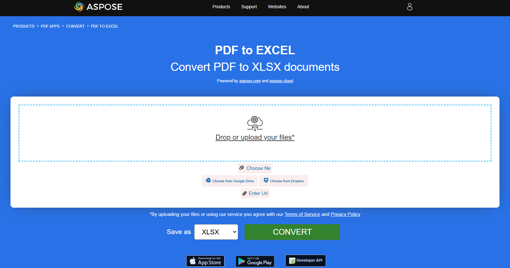

**Aspose.PDF for Rust** поддерживает функцию конвертации PDF‑файлов в формат Excel.

## Конвертируйте PDF в XLSX

Excel предоставляет расширенные инструменты для сортировки, фильтрации и анализа данных, облегчая выполнение таких задач, как анализ тенденций или финансовое моделирование, которые сложны при работе со статичными PDF‑файлами. Ручное копирование данных из PDF в Excel занимает много времени и склонно к ошибкам. Конвертация автоматизирует этот процесс, экономя значительное время при работе с большими наборами данных.

Aspose.PDF for Rust использует [save_xlsx](https://reference.aspose.com/pdf/rust-cpp/convert/save_xlsx/) для преобразования загруженного PDF‑файла в таблицу Excel и её сохранения.

1. Импортируйте необходимые пакеты.
1. Откройте PDF-файл.
1. Конвертируйте PDF в XLSX с помощью [save_xlsx](https://reference.aspose.com/pdf/rust-cpp/convert/save_xlsx/).

```rust

  use asposepdf::Document;

  fn main() -> Result<(), Box<dyn std::error::Error>> {
      // Open a PDF-document with filename
      let pdf = Document::open("sample.pdf")?;

      // Convert and save the previously opened PDF-document as XlsX-document
      pdf.save_xlsx("sample.xlsx")?;

      Ok(())
  }
```

{}
**Попробуйте конвертировать PDF в Excel онлайн**

Aspose.PDF for Rust представляет вам бесплатное онлайн‑приложение ["PDF в XLSX"](https://products.aspose.app/pdf/conversion/pdf-to-xlsx), где вы можете попробовать оценить функциональность и качество работы.

[](https://products.aspose.app/pdf/conversion/pdf-to-xlsx)
{}
