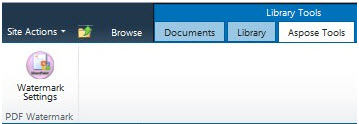
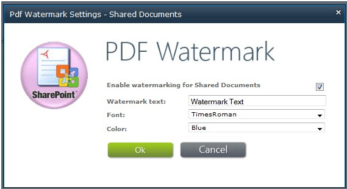

---
title: Добавить водяной знак в PDF-файл, добавленный в библиотеку SharePoint
linktitle: Добавить водяной знак в PDF
type: docs
weight: 20
url: /ru/sharepoint/add-watermark-to-pdf/
lastmod: "2020-12-16"
description: PDF SharePoint API позволяет добавлять водяные знаки в PDF-документы, добавленные в библиотеку.
---

{}

Aspose.PDF для SharePoint позволяет добавлять водяные знаки в PDF-документы. Эта функция добавляет текстовый водяной знак в левый нижний угол каждой страницы PDF-документа, добавленного в библиотеку.

## Текст водяного знака в левом нижнем углу

{}

{}

Чтобы включить функцию водяных знаков для конкретной библиотеки:

1. Нажмите **Настройки водяных знаков** на вкладке **Инструменты Aspose** в диалоговом окне **Инструменты библиотеки**.

   **Библиотечные инструменты**

Настройки водяных знаков зависят от списка, поэтому вы можете выбрать разные настройки водяных знаков для разных библиотек. На следующем снимке экрана показано диалоговое окно «Настройки водяных знаков» для библиотеки **Общие документы**.

## Настройки водяных знаков

- Выберите **Включить водяные знаки для**, чтобы включить функцию водяных знаков для определенного списка.
- **Текст водяного знака** — текст, который будет отображаться на странице в виде водяного знака.
- **Шрифт** – шрифт, используемый для водяного знака.
- **Цвет** – цвет водяного знака.

После того, как вы включите водяной знак для определенной библиотеки, Aspose.PDF добавит водяные знаки в каждый PDF-документ, добавленный в эту библиотеку.

{}

