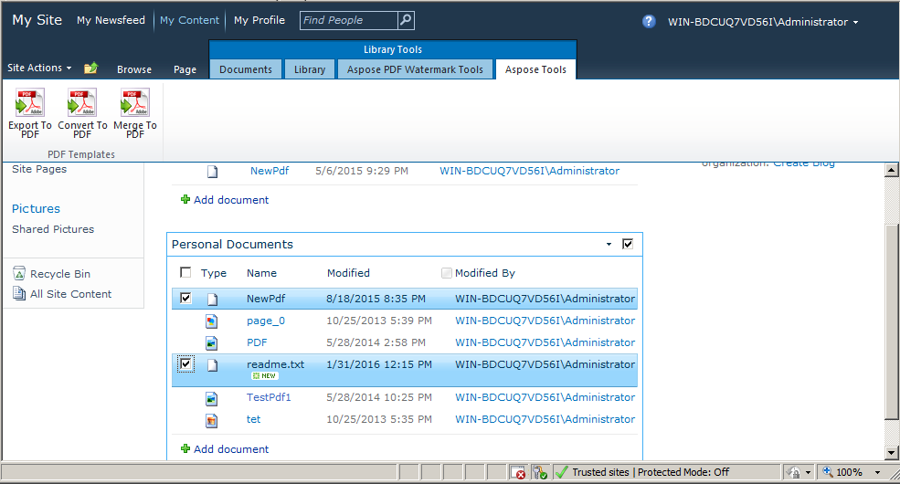

{}

Объединение/конкатенация нескольких файлов PDF в один файл PDF является очень популярной и востребованной функцией в приложениях для обработки файлов PDF. Мы представили эту важную функцию в версии [Aspose.PDF for SharePoint 2.2.0](https://releases.aspose.com/pdf/sharepoint/new-releases/aspose.pdf-for-sharepoint-2.2.0/). Объединение двух файлов — это создание одного файла путем добавления второго файла в конец первого файла.

{}

## Объедините PDF-файлы

Чтобы объединить несколько PDF-файлов из библиотеки документов SharePoint в один PDF, выполните следующие действия:

1. Выберите PDF-файлы из библиотеки документов SharePoint, которые нужно объединить.

2. Перейдите на вкладку **Aspose Tools** в разделе **Library Tools**.

3. Нажмите **Объединить в PDF** в разделе **Library Tools**, чтобы объединить все выбранные PDF-файлы в один итоговый PDF.

4. Загрузите или сохраните итоговый PDF-файл с подходящим именем, когда появится соответствующее приглашение.

