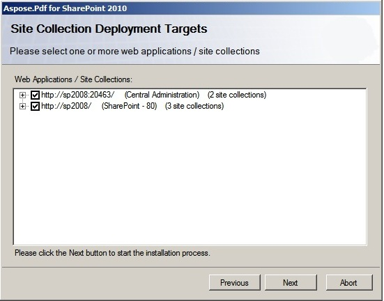

---
title: Installing Aspose.PDF for SharePoint
linktitle: Установка Aspose.PDF для SharePoint
type: docs
weight: 20
url: /ru/sharepoint/installing-aspose-pdf-for-sharepoint/
lastmod: "2020-12-16"
description: PDF SharePoint API is packaged as a SharePoint solution to simplify server farm deployment, retraction, activation, and deactivation.
---

{}

Aspose.PDF for SharePoint is downloadable as Aspose.PDF.SharePoint.zip archive.

{}

Этот архив содержит:

- Aspose.PDF.SharePoint.wsp
  SharePoint solution file. Aspose.PDF for SharePoint is packaged as a SharePoint solution to facilitate deployment/retraction and feature activation/deactivation across the server farm.
- Aspose_LicenseAgreement.rtf

**End user license agreement:**

- Aspose.PDF для SharePoint.pdf

**User documentation:**

- Aspose.PDF для SharePoint Documentation.chm

**Документация пользователя со ссылкой на общедоступный API:**

- setup.exe

**Программа установки:**

- setup.exe.config

**Файл конфигурации установки:**

Прежде чем продолжить, программа установки проверяет следующие условия:

- SharePoint 2010 установлен.
- У пользователя есть разрешение на установку решений SharePoint.
- База данных SharePoint находится в сети.
- Служба администрирования SharePoint запущена.
- Служба таймера SharePoint запущена. Служба администрирования SharePoint и служба таймера необходимы, поскольку некоторые действия по настройке зависят от задания таймера для распространения на все серверы в ферме серверов.

**Чтобы установить Aspose.PDF для SharePoint:**

- Распакуйте zip-архив Aspose.PDF.SharePoint на локальный диск.
- Запустите setup.exe и следуйте инструкциям на экране.

**Программа установки выполняет следующие действия:**

- Проверьте предварительные условия установки. Установка не продолжится, если какая-либо проверка не пройдена.

- Отобразите лицензионное соглашение с конечным пользователем. Пользователь должен принять соглашение, чтобы продолжить.

- Отобразите диалоговое окно выбора цели развертывания. Пользователь выбирает веб-приложения и семейства веб-сайтов, в которых эта функция должна быть активирована. См. рисунок ниже.

- Разверните эту функцию на ферме серверов.

- Активируйте эту функцию для выбранных семейств веб-сайтов и настройте их родительские веб-приложения.
- Отобразите список веб-приложений и семейств веб-сайтов, в которых эта функция была развернута и активирована.

