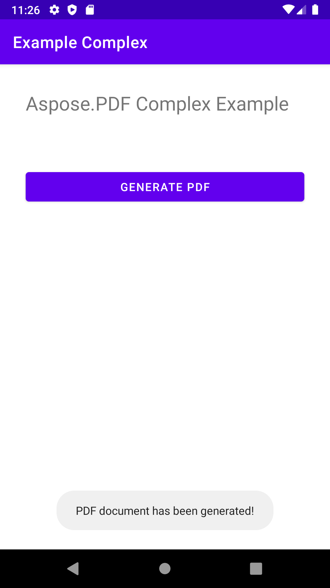

该 [你好，世界](/pdf/zh/java/hello-world-example/) 示例展示了使用 Java 和 Aspose.PDF 创建 PDF 文档的简单步骤。在本文中，我们将查看使用 Java 和 Aspose.PDF for Java 创建更复杂文档的过程。作为示例，我们将使用一家虚构的运营客运渡轮服务的公司的文档。
我们的文档将包含一张图像、两个文本片段（标题和段落）以及一个表格。要构建此类文档，我们将使用基于 DOM 的方法。您可以在相应章节中阅读更多内容。 [DOM API 基础](/pdf/zh/java/basics-of-dom-api/).

如果我们从头创建文档，需要遵循以下步骤：

1. 实例化一个 [文档](https://reference.aspose.com/pdf/java/com.aspose.pdf/document) 对象。在此步骤中，我们将创建一个带有一些元数据但没有页面的空 PDF 文档。
1. 添加一个 [页面](https://reference.aspose.com/pdf/java/com.aspose.pdf/page) 到文档对象。所以，现在我们的文档将有一页。
1. 为了添加 Image，我们创建 FileInputStream，指示所需文件的路径。然后我们将图片添加到具有给定坐标的矩形中。
1. 创建一个 [TextFragment](https://reference.aspose.com/pdf/java/com.aspose.pdf/TextFragment) 用于标题。对于标题，我们将使用 Arial 字体，字号 24pt，居中对齐。
1. 添加页眉 [段落](https://reference.aspose.com/pdf/java/com.aspose.pdf/Page#getParagraphs--).
1. 创建一个 [TextFragment](https://reference.aspose.com/pdf/java/com.aspose.pdf/TextFragment) 用于描述。对于描述，我们将使用 Arial 字体，字号 24pt，居中对齐。
1. 将（description）添加到页面段落。我们在示例中使用了 "Helvetica" 和 "Times Roman" 字体，但请记住，Android 上只有三种系统范围的字体：

- 常规 (Droid Sans);
- 衬线 (Droid Serif);
- 等宽 (Droid Sans Mono).

1. 创建表格，添加表格属性。
1. 将 (table) 添加到页面 [段落](https://reference.aspose.com/pdf/java/com.aspose.pdf/Page#getParagraphs--).
1. 保存文档 \"Complex.pdf\"。

最后，弹出窗口显示消息 \"PDF document has been generated!\"。



```java
package com.aspose.pdf.examplecomplex;

import androidx.appcompat.app.AppCompatActivity;

import android.os.Bundle;
import android.os.Environment;
import android.widget.Button;
import android.widget.Toast;

import com.aspose.pdf.BorderInfo;
import com.aspose.pdf.BorderSide;
import com.aspose.pdf.Cell;
import com.aspose.pdf.Color;
import com.aspose.pdf.Document;
import com.aspose.pdf.FontRepository;
import com.aspose.pdf.HorizontalAlignment;
import com.aspose.pdf.Page;
import com.aspose.pdf.Position;
import com.aspose.pdf.Rectangle;
import com.aspose.pdf.Row;
import com.aspose.pdf.Table;
import com.aspose.pdf.TextFragment;

import java.io.File;
import java.io.FileInputStream;
import java.time.Duration;
import java.time.LocalTime;

public class MainActivity extends AppCompatActivity {

    Button generate_button;
    File myExternalFile;
    String filepath;
    String filename;

    @Override
    protected void onCreate(Bundle savedInstanceState) {
        super.onCreate(savedInstanceState);
        setContentView(R.layout.activity_main);

        generate_button = (Button) findViewById(R.id.button);
        generate_button.setOnClickListener(v->RunComplexExample());

        if(!isExternalStorageAvailable()||isExternalStorageReadOnly()){
            generate_button.setEnabled(false);
        }
        else{
            filepath = "MyFileStorage";
            filename = "SampleFile.pdf";
            myExternalFile=new File(getExternalFilesDir(filepath), filename);
        }

    }

    private void RunComplexExample() {
        // Initialize document object
        Document document = new Document();

        // Add page
        Page page = document.getPages().add();

        // Add image
        java.io.FileInputStream imageStream = null;
        try {
            imageStream = new FileInputStream("/storage/0F03-0F02/Android/data/com.aspose.pdf.examplecomplex/files/MyFileStorage/logo.png");
        } catch (Exception e) {
            e.printStackTrace();
        }

        // Add image to the page
        page.addImage(imageStream, new Rectangle(20, 730, 120, 830));

        // Add Header
        TextFragment header = new TextFragment("New ferry routes in Fall 2020");
        header.getTextState().setFont(FontRepository.findFont("Helvetica"));
        header.getTextState().setFontSize(24);
        header.setHorizontalAlignment (HorizontalAlignment.Center);
        header.setPosition(new Position(130, 720));
        page.getParagraphs().add(header);

        // Add description
        String descriptionText = "Visitors must buy tickets online and tickets are " +
                "limited to 5,000 per day. Ferry service is operating at half capacity and" +
                " on a reduced schedule. Expect lineups.";

        TextFragment description = new TextFragment(descriptionText);
        description.getTextState().setFont(FontRepository.findFont("Helvetica"));
        description.getTextState().setFontSize(14);
        description.setHorizontalAlignment(HorizontalAlignment.Left);
        page.getParagraphs().add(description);


        // Add table
        Table table = new Table();
        table.setColumnWidths("200");
        table.setBorder(new BorderInfo(BorderSide.Box, 1f, Color.getDarkSlateGray()));
        table.setDefaultCellBorder(new BorderInfo(BorderSide.Box, 0.5f, Color.getBlack()));
        table.getMargin().setBottom(10);
        table.getDefaultCellTextState().setFont(FontRepository.findFont("Times Roman"));

        Row headerRow = table.getRows().add();
        headerRow.getCells().add("Departs City");
        headerRow.getCells().add("Departs Island");


        for (Cell headerRowCell : (Iterable<? extends Cell>) headerRow.getCells())
        {
            headerRowCell.setBackgroundColor(Color.getGray());
            headerRowCell.getDefaultCellTextState()
                    .setForegroundColor(Color.getWhiteSmoke().toRgb());
        }

        LocalTime time = LocalTime.of(6,0);
        Duration incTime = Duration.ofMinutes(30);

        for (int i = 0; i < 10; i++)
        {
            Row dataRow = table.getRows().add();
            dataRow.getCells().add(time.toString());
            time=time.plus(incTime);
            dataRow.getCells().add(time.toString());
        }

        page.getParagraphs().add(table);

        document.save("/storage/0F03-0F02/Android/data/com.aspose.pdf.examplecomplex/files/MyFileStorage/sample.pdf");

        Toast toast = Toast.makeText(MainActivity.this,
                "PDF document has been generated!", Toast.LENGTH_LONG);
        toast.show();
    }

    private static boolean isExternalStorageReadOnly(){
        String extStorageState= Environment.getExternalStorageState();
        return Environment.MEDIA_MOUNTED_READ_ONLY.equals(extStorageState);
    }

    private static boolean isExternalStorageAvailable(){
        String extStorageState=Environment.getExternalStorageState();
        return Environment.MEDIA_MOUNTED.equals(extStorageState);
    }

}
```

```xml
<?xml version="1.0" encoding="utf-8"?>
<LinearLayout xmlns:android="http://schemas.android.com/apk/res/android"
    xmlns:app="http://schemas.android.com/apk/res-auto"
    xmlns:tools="http://schemas.android.com/tools"
    android:layout_width="match_parent"
    android:layout_height="match_parent"
    android:orientation="vertical"
    tools:context=".MainActivity">

    <TextView
        android:layout_width="match_parent"
        android:layout_height="wrap_content"
        android:layout_marginTop="32dp"
        android:layout_marginLeft="32dp"
        android:layout_marginRight="32dp"
        android:text="@string/title"
        android:textSize="24sp"
        android:visibility="visible"
        app:layout_constraintBottom_toBottomOf="parent"
        app:layout_constraintLeft_toLeftOf="parent"
        app:layout_constraintRight_toRightOf="parent"
        app:layout_constraintTop_toTopOf="parent" />

    <Button
        android:id="@+id/button"
        android:layout_width="match_parent"
        android:layout_height="wrap_content"
        android:layout_marginTop="64dp"
        android:layout_marginLeft="32dp"
        android:layout_marginRight="32dp"
        android:text="@string/generate_btn" />

</LinearLayout>
```
