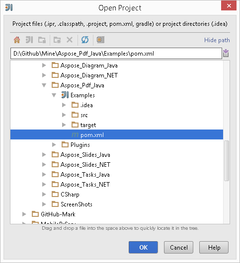
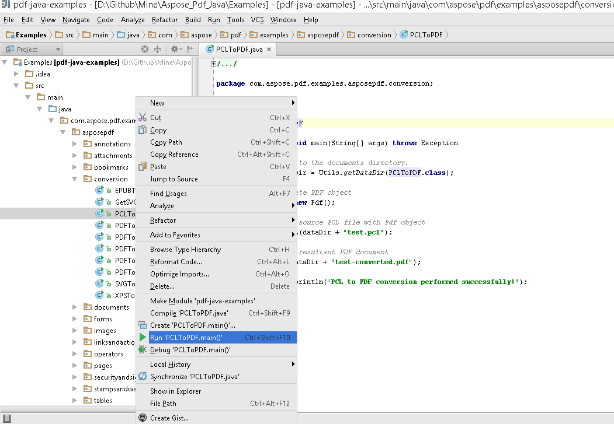

## 从 GitHub 下载

所有 Aspose.PDF for Android via Java 示例均托管在 [Github](https://github.com/aspose-pdf/Aspose.PDF-for-Java). 您可以使用您喜欢的 Github 客户端克隆仓库，或下载 ZIP 文件来自 [此处](https://github.com/aspose-pdf/Aspose.PDF-for-Java/archive/master.zip).

将 ZIP 文件的内容解压到计算机上的任意文件夹。所有示例都位于 **Examples** 文件夹中。

该项目使用 Maven 构建系统。任何现代 IDE 都可以轻松打开或导入该项目及其依赖项。下面我们展示如何使用流行的 IDE 来构建和运行示例。

### IntelliJ IDEA

单击 **File** 菜单并选择 **Open**。浏览到项目文件夹并选择 **pom.xml** 文件。

它会打开项目并自动下载依赖项。在 Project 选项卡中，浏览 **src/main/java** 文件夹中的示例。要运行示例，只需右键单击该文件并选择 "Run .."，示例将被执行，输出将显示在内置的控制台输出窗口中。

### Eclipse

单击 **File** 菜单并选择 **Import**。选择 **Maven** - Existing Maven Projects。

浏览到您从 GitHub 克隆或下载的文件夹并选择 **pom.xml** 文件。

它会打开项目并自动下载依赖项。在 Package Explorer 选项卡中，浏览 **src/main/java** 文件夹中的示例。要运行示例，只需右键单击该文件并选择 **Run As** - **Java Application**，示例将被执行，输出将显示在内置的控制台输出窗口中。

### NetBeans

单击 **File** 菜单并选择 **Open Project**。浏览到您从 GitHub 克隆或下载的文件夹。**Examples** 文件夹的图标将显示它是一个 Maven 项目。选择 Examples 并打开它。

它将打开项目并自动下载依赖项。 在 Projects 选项卡中，浏览 **source packages** 中的示例。要运行示例，只需右键单击文件并选择 **Run File**，示例将被执行，输出将显示在内置的控制台输出窗口中。

### 贡献

如果您想添加或改进示例，我们鼓励您为项目作出贡献。此仓库中的所有示例和展示项目都是开源的，您可以自由地在自己的应用程序中使用。

要进行贡献，您可以 fork 该仓库，编辑源代码并创建 pull request。我们会审查更改，如果有帮助，将把它们合并到仓库中。

