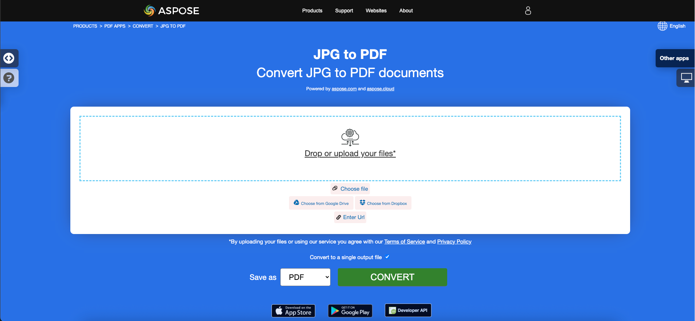

<script type="application/ld+json">
{
    "@context": "https://schema.org",
    "@type": "TechArticle",
    "headline": "Convert various Images formats to PDF in .NET",
    "alternativeHeadline": "Convert Multiple Image Formats to PDF with C#",
    "abstract": "介绍一个强大的功能，能够无缝转换多种图像格式，包括 BMP、CGM、DICOM、EMF、JPG、PNG、SVG、TIFF、CDR 和 DJVU，生成高质量的 PDF 文档。此功能提供了一种简单的方法，将图像到 PDF 的转换集成到您的 .NET 应用程序中，确保高效处理多样的图形内容。",
    "author": {
        "@type": "Person",
        "name": "Anastasiia Holub",
        "givenName": "Anastasiia",
        "familyName": "Holub",
        "url": "https://www.linkedin.com/in/anastasiia-holub-750430225/"
    },
    "genre": "pdf document generation",
    "wordcount": "5228",
    "proficiencyLevel": "Beginner",
    "publisher": {
        "@type": "Organization",
        "name": "Aspose.PDF for .NET",
        "url": "https://products.aspose.com/pdf",
        "logo": "https://www.aspose.cloud/templates/aspose/img/products/pdf/aspose_pdf-for-net.svg",
        "alternateName": "Aspose",
        "sameAs": [
            "https://facebook.com/aspose.pdf/",
            "https://twitter.com/asposepdf",
            "https://www.youtube.com/channel/UCmV9sEg_QWYPi6BJJs7ELOg/featured",
            "https://www.linkedin.com/company/aspose",
            "https://stackoverflow.com/questions/tagged/aspose",
            "https://aspose.quora.com/",
            "https://aspose.github.io/"
        ],
        "contactPoint": [
            {
                "@type": "ContactPoint",
                "telephone": "+1 903 306 1676",
                "contactType": "sales",
                "areaServed": "US",
                "availableLanguage": "en"
            },
            {
                "@type": "ContactPoint",
                "telephone": "+44 141 628 8900",
                "contactType": "sales",
                "areaServed": "GB",
                "availableLanguage": "en"
            },
            {
                "@type": "ContactPoint",
                "telephone": "+61 2 8006 6987",
                "contactType": "sales",
                "areaServed": "AU",
                "availableLanguage": "en"
            }
        ]
    },
    "url": "/net/convert-images-format-to-pdf/",
    "mainEntityOfPage": {
        "@type": "WebPage",
        "@id": "/net/convert-images-format-to-pdf/"
    },
    "dateModified": "2024-11-25",
    "description": "Aspose.PDF 不仅可以执行简单和容易的任务，还可以应对更复杂的目标。请查看下一部分以获取高级用户和开发人员的信息。"
}
</script>

## 概述

本文解释了如何使用 C# 将各种图像格式转换为 PDF。它涵盖了以下主题。

以下代码片段也适用于 [Aspose.PDF.Drawing](/pdf/zh/net/drawing/) 库。

_格式_：**BMP**
- [C# BMP 转 PDF](#csharp-bmp-to-pdf)
- [C# 将 BMP 转换为 PDF](#csharp-bmp-to-pdf)
- [C# 如何将 BMP 图像转换为 PDF](#csharp-bmp-to-pdf)

_格式_：**CGM**
- [C# CGM 转 PDF](#csharp-cgm-to-pdf)
- [C# 将 CGM 转换为 PDF](#csharp-cgm-to-pdf)
- [C# 如何将 CGM 图像转换为 PDF](#csharp-cgm-to-pdf)

_格式_：**DICOM**
- [C# DICOM 转 PDF](#csharp-dicom-to-pdf)
- [C# 将 DICOM 转换为 PDF](#csharp-dicom-to-pdf)
- [C# 如何将 DICOM 图像转换为 PDF](#csharp-dicom-to-pdf)

_格式_：**EMF**
- [C# EMF 转 PDF](#csharp-emf-to-pdf)
- [C# 将 EMF 转换为 PDF](#csharp-emf-to-pdf)
- [C# 如何将 EMF 图像转换为 PDF](#csharp-emf-to-pdf)

_格式_：**GIF**
- [C# GIF 转 PDF](#csharp-gif-to-pdf)
- [C# 将 GIF 转换为 PDF](#csharp-gif-to-pdf)
- [C# 如何将 GIF 图像转换为 PDF](#csharp-gif-to-pdf)

_格式_：**JPG**
- [C# JPG 转 PDF](#csharp-jpg-to-pdf)
- [C# 将 JPG 转换为 PDF](#csharp-jpg-to-pdf)
- [C# 如何将 JPG 图像转换为 PDF](#csharp-jpg-to-pdf)

_格式_：**PNG**
- [C# PNG 转 PDF](#csharp-png-to-pdf)
- [C# 将 PNG 转换为 PDF](#csharp-png-to-pdf)
- [C# 如何将 PNG 图像转换为 PDF](#csharp-png-to-pdf)

_格式_：**SVG**
- [C# SVG 转 PDF](#csharp-svg-to-pdf)
- [C# 将 SVG 转换为 PDF](#csharp-svg-to-pdf)
- [C# 如何将 SVG 图像转换为 PDF](#csharp-svg-to-pdf)

_格式_：**TIFF**
- [C# TIFF 转 PDF](#csharp-tiff-to-pdf)
- [C# 将 TIFF 转换为 PDF](#csharp-tiff-to-pdf)
- [C# 如何将 TIFF 图像转换为 PDF](#csharp-tiff-to-pdf)

_格式_：**CDR**
- [C# CDR 转 PDF](#csharp-cdr-to-pdf)
- [C# 将 CDR 转换为 PDF](#csharp-cdr-to-pdf)
- [C# 如何将 CDR 图像转换为 PDF](#csharp-cdr-to-pdf)

_格式_：**DJVU**
- [C# DJVU 转 PDF](#csharp-djvu-to-pdf)
- [C# 将 DJVU 转换为 PDF](#csharp-djvu-to-pdf)
- [C# 如何将 DJVU 图像转换为 PDF](#csharp-djvu-to-pdf)

本文还涵盖的其他主题
- [另见](#see-also)

## C# 图像到 PDF 的转换

**Aspose.PDF for .NET** 允许您将不同格式的图像转换为 PDF 文件。我们的库展示了转换最流行图像格式的代码片段，例如 - BMP、CGM、DICOM、EMF、JPG、PNG、SVG 和 TIFF 格式。

## 将 BMP 转换为 PDF

使用 **Aspose.PDF for .NET** 库将 BMP 文件转换为 PDF 文档。

<abbr title="位图图像文件">BMP</abbr> 图像是具有扩展名的文件。BMP 代表位图图像文件，用于存储位图数字图像。这些图像独立于图形适配器，也称为设备独立位图（DIB）文件格式。
您可以使用 Aspose.PDF for .NET API 将 BMP 转换为 PDF 文件。因此，您可以按照以下步骤将 BMP 图像转换：

<a name="csharp-bmp-to-pdf" id="csharp-bmp-to-pdf"><strong>步骤：在 C# 中将 BMP 转换为 PDF</strong></a>

1. 初始化一个新的 [Document](https://reference.aspose.com/pdf/net/aspose.pdf/document) 类对象。
2. 加载输入 **BMP** 图像。
3. 最后，保存输出 PDF 文件。

因此，以下代码片段遵循这些步骤，并展示如何使用 C# 将 BMP 转换为 PDF：

```csharp
// For complete examples and data files, visit https://github.com/aspose-pdf/Aspose.PDF-for-.NET
private static void ConvertBMPtoPDF()
{
    // The path to the documents directory
    var dataDir = RunExamples.GetDataDir_AsposePdf_WorkingDocuments();

    // Create PDF document
    using (var document = new Aspose.Pdf.Document())
    {
        // Add page
        var page = document.Pages.Add();
        var image = new Aspose.Pdf.Image();
        
        // Load BMP file
        image.File = dataDir + "BMPtoPDF.bmp";
        page.Paragraphs.Add(image);
        
        // Save PDF document
        document.Save(dataDir + "BMPtoPDF_out.pdf");
    }
}
```

{}
**尝试在线将 BMP 转换为 PDF**

Aspose 为您提供在线免费应用程序 ["BMP to PDF"](https://products.aspose.app/pdf/conversion/bmp-to-pdf/)，您可以尝试探索其功能和工作质量。

[](https://products.aspose.app/pdf/conversion/bmp-to-pdf/)
{}

## 将 CGM 转换为 PDF

<abbr title="计算机图形元文件">CGM</abbr> 是计算机图形元文件格式的文件扩展名，通常用于 CAD（计算机辅助设计）和演示图形应用程序。CGM 是一种矢量图形格式，支持三种不同的编码方法：二进制（最佳程序读取速度）、基于字符（生成最小文件大小并允许更快的数据传输）或明文编码（允许用户使用文本编辑器读取和修改文件）。

请查看下一个代码片段以将 CGM 文件转换为 PDF 格式。

<a name="csharp-cgm-to-pdf" id="csharp-cgm-to-pdf"><strong>步骤：在 C# 中将 CGM 转换为 PDF</strong></a>

1. 创建一个 [CgmLoadOptions](https://reference.aspose.com/pdf/net/aspose.pdf/cgmloadoptions) 类的实例。
2. 创建一个 [Document](https://reference.aspose.com/pdf/net/aspose.pdf/document) 类的实例，并提及源文件名和选项。
3. 使用所需的文件名保存文档。

```csharp
// For complete examples and data files, visit https://github.com/aspose-pdf/Aspose.PDF-for-.NET
private static void ConvertCGMtoPDF()
{
    // The path to the documents directory
    var dataDir = RunExamples.GetDataDir_AsposePdf_WorkingDocuments();

    var option = new Aspose.Pdf.CgmLoadOptions();

    // Open PDF document
    using (var document = new Aspose.Pdf.Document(dataDir + "CGMtoPDF.cgm", option))
    {
        // Save PDF document
        document.Save(dataDir + "CGMtoPDF_out.pdf");
    }
}
```

## 将 DICOM 转换为 PDF

<abbr title="医学中的数字成像和通信">DICOM</abbr> 格式是医疗行业标准，用于创建、存储、传输和可视化被检查患者的数字医学图像和文档。

**Aspose.PDF for .NET** 允许您转换 DICOM 和 SVG 图像，但由于技术原因，添加图像时需要指定要添加到 PDF 的文件类型：

<a name="csharp-dicom-to-pdf" id="csharp-dicom-to-pdf"><strong>步骤：在 C# 中将 DICOM 转换为 PDF</strong></a>

1. 创建一个 Image 类的对象。
2. 将图像添加到页面的段落集合中。
3. 指定 [FileType](https://reference.aspose.com/pdf/net/aspose.pdf/image/properties/filetype) 属性。
4. 指定文件的路径或来源。
    - 如果图像位于硬盘上的某个位置，请使用 Image.File 属性指定路径位置。
    - 如果图像放置在 MemoryStream 中，请将持有图像的对象传递给 Image.ImageStream 属性。

以下代码片段展示了如何使用 Aspose.PDF 将 DICOM 文件转换为 PDF 格式。您应该加载 DICOM 图像，将图像放置在 PDF 文件的页面上，并将输出保存为 PDF。

```csharp
// For complete examples and data files, visit https://github.com/aspose-pdf/Aspose.PDF-for-.NET
private static void ConvertDICOMtoPDF()
{
    // The path to the documents directory
    var dataDir = RunExamples.GetDataDir_AsposePdf_WorkingDocuments();

    // Create PDF document 
    using (var document = new Aspose.Pdf.Document())
    {
        // Add page
        var page = document.Pages.Add();
        
        var image = new Aspose.Pdf.Image
        {
            FileType = ImageFileType.Dicom,
            File = dataDir + "DICOMtoPDF.dcm"
        };
        page.Paragraphs.Add(image);

        // Save PDF document
        document.Save(dataDir + "DICOMtoPDF_out.pdf");
    }
}
```

{}
**尝试在线将 DICOM 转换为 PDF**

Aspose 为您提供在线免费应用程序 ["DICOM to PDF"](https://products.aspose.app/pdf/conversion/dicom-to-pdf/)，您可以尝试探索其功能和工作质量。

[](https://products.aspose.app/pdf/conversion/dicom-to-pdf/)
{}

## 将 EMF 转换为 PDF

<abbr title="增强型元文件格式">EMF</abbr> 以设备无关的方式存储图形图像。EMF 的元文件由可变长度的记录按时间顺序组成，可以在任何输出设备上解析后呈现存储的图像。此外，您可以使用以下步骤将 EMF 转换为 PDF 图像：

<a name="csharp-emf-to-pdf" id="csharp-emf-to-pdf"><strong>步骤：在 C# 中将 EMF 转换为 PDF</strong></a>

1. 首先，初始化 [Document](https://reference.aspose.com/pdf/net/aspose.pdf/document) 类对象。
2. 加载 **EMF** 图像文件。
3. 将加载的 EMF 图像添加到页面。
4. 保存 PDF 文档。

此外，以下代码片段展示了如何在您的 .NET 代码片段中使用 C# 将 EMF 转换为 PDF：

```csharp
// For complete examples and data files, visit https://github.com/aspose-pdf/Aspose.PDF-for-.NET
private static void ConvertEMFtoPDF()
{
    // The path to the documents directory
    var dataDir = RunExamples.GetDataDir_AsposePdf_WorkingDocuments();

    // Create PDF document 
    using (var document = new Aspose.Pdf.Document())
    {
        // Add page
        var page = document.Pages.Add();
        var image = new Aspose.Pdf.Image();
        // Load EMF file
        image.File = dataDir + "EMFtoPDF.emf";

        // Specify page dimension properties
        page.PageInfo.Margin.Bottom = 0;
        page.PageInfo.Margin.Top = 0;
        page.PageInfo.Margin.Left = 0;
        page.PageInfo.Margin.Right = 0;
        page.PageInfo.Width = image.BitmapSize.Width;
        page.PageInfo.Height = image.BitmapSize.Height;

        page.Paragraphs.Add(image);

        // Save PDF document
        document.Save(dataDir + "EMFtoPDF_out.pdf");
    }
}
```

{}
**尝试在线将 EMF 转换为 PDF**

Aspose 为您提供在线免费应用程序 ["EMF to PDF"](https://products.aspose.app/pdf/conversion/emf-to-pdf/)，您可以尝试探索其功能和工作质量。

[](https://products.aspose.app/pdf/conversion/emf-to-pdf/)
{}

## 将 GIF 转换为 PDF

使用 **Aspose.PDF for .NET** 库将 GIF 文件转换为 PDF 文档。

<abbr title="图形交换格式">GIF</abbr> 能够以不超过 256 种颜色的格式存储压缩数据而不损失质量。无硬件依赖的 GIF 格式由 CompuServe 于 1987 年（GIF87a）开发，用于通过网络传输位图图像。
您可以使用 Aspose.PDF for .NET API 将 GIF 转换为 PDF 文件。因此，您可以按照以下步骤将 GIF 图像转换：

<a name="csharp-gif-to-pdf" id="csharp-gif-to-pdf"><strong>步骤：在 C# 中将 GIF 转换为 PDF</strong></a>

1. 初始化一个新的 [Document](https://reference.aspose.com/pdf/net/aspose.pdf/document) 类对象。
2. 加载输入 **GIF** 图像。
3. 最后，保存输出 PDF 文件。

因此，以下代码片段遵循这些步骤，并展示如何使用 C# 将 GIF 转换为 PDF：

```csharp
// For complete examples and data files, visit https://github.com/aspose-pdf/Aspose.PDF-for-.NET
private static void ConvertGIFtoPDF()
{
    // The path to the documents directory
    var dataDir = RunExamples.GetDataDir_AsposePdf_WorkingDocuments();

    // Create PDF document
    using (var document = new Aspose.Pdf.Document())
    {
        // Add page
        var page = document.Pages.Add();
        var image = new Aspose.Pdf.Image();
        
        // Load sample GIF image file
        image.File = dataDir + "GIFtoPDF.gif";
        page.Paragraphs.Add(image);

        // Save PDF document
        document.Save(dataDir + "GIFtoPDF_out.pdf");
    }
}
```

{}
**尝试在线将 GIF 转换为 PDF**

Aspose 为您提供在线免费应用程序 ["GIF to PDF"](https://products.aspose.app/pdf/conversion/gif-to-pdf/)，您可以尝试探索其功能和工作质量。

[](https://products.aspose.app/pdf/conversion/gif-to-pdf/)
{}

## 将 JPG 转换为 PDF

不必再想如何将 JPG 转换为 PDF，因为 **Apose.PDF for .NET** 库提供了最佳解决方案。

您可以通过以下步骤非常轻松地将 JPG 图像转换为 PDF：

<a name="csharp-jpg-to-pdf" id="csharp-jpg-to-pdf"><strong>步骤：在 C# 中将 JPG 转换为 PDF</strong></a>

1. 初始化 [Document](https://reference.aspose.com/page/net/aspose.page/document) 类对象。
2. 向 PDF 文档添加新页面。
3. 加载 **JPG** 图像并添加到段落中。
4. 保存输出 PDF。

以下代码片段展示了如何使用 C# 将 JPG 图像转换为 PDF：

```csharp
// For complete examples and data files, visit https://github.com/aspose-pdf/Aspose.PDF-for-.NET
private static void ConvertJPGtoPDF()
{
    // The path to the documents directory
    var dataDir = RunExamples.GetDataDir_AsposePdf_WorkingDocuments();

    // Create PDF document 
    using (var document = new Aspose.Pdf.Document())
    {
        // Add page
        var page = document.Pages.Add();
        var image = new Aspose.Pdf.Image();
        // Load input JPG file
        image.File = dataDir + "JPGtoPDF.jpg";
        
        // Add image on a page
        page.Paragraphs.Add(image);
        
        // Save PDF document
        document.Save(dataDir + "JPGtoPDF_out.pdf");
    }
}
```

然后，您可以看到如何将图像转换为 PDF，**页面的高度和宽度相同**。我们将获取图像的尺寸，并相应地设置 PDF 文档的页面尺寸，步骤如下：

1. 加载输入图像文件。
1. 设置页面的高度、宽度和边距。
1. 保存输出 PDF 文件。

以下代码片段展示了如何使用 C# 将图像转换为 PDF，页面高度和宽度相同：

```csharp
// For complete examples and data files, visit https://github.com/aspose-pdf/Aspose.PDF-for-.NET
private static void ConvertJPGtoPDF()
{
    // The path to the documents directory
    var dataDir = RunExamples.GetDataDir_AsposePdf_WorkingDocuments();

    // Create PDF document
    using (var document = new Aspose.Pdf.Document())
    {
        // Add page
        var page = document.Pages.Add();
        var image = new Aspose.Pdf.Image();
        // Load JPEG file
        image.File = dataDir + "JPGtoPDF.jpg";
        
        // Read Height of input image
        page.PageInfo.Height = image.BitmapSize.Height;
        // Read Width of input image
        page.PageInfo.Width = image.BitmapSize.Width;
        page.PageInfo.Margin.Bottom = 0;
        page.PageInfo.Margin.Top = 0;
        page.PageInfo.Margin.Right = 0;
        page.PageInfo.Margin.Left = 0;
        page.Paragraphs.Add(image);
        
        // Save PDF document
        document.Save(dataDir + "JPGtoPDF_out.pdf");
    }
}
```

{}
**尝试在线将 JPG 转换为 PDF**

Aspose 为您提供在线免费应用程序 ["JPG to PDF"](https://products.aspose.app/pdf/conversion/jpg-to-pdf/)，您可以尝试探索其功能和工作质量。

[](https://products.aspose.app/pdf/conversion/jpg-to-pdf/)
{}

## 将 PNG 转换为 PDF

**Aspose.PDF for .NET** 支持将 PNG 图像转换为 PDF 格式的功能。请查看下一个代码片段以实现您的任务。

<abbr title="可移植网络图形">PNG</abbr> 是一种使用无损压缩的光栅图像文件格式，这使其在用户中非常受欢迎。

您可以使用以下步骤将 PNG 转换为 PDF 图像：

<a name="csharp-png-to-pdf" id="csharp-png-to-pdf"><strong>步骤：在 C# 中将 PNG 转换为 PDF</strong></a>

1. 加载输入 **PNG** 图像。
2. 读取高度和宽度值。
3. 创建新的 [Document](https://reference.aspose.com/page/net/aspose.page/document) 对象并添加页面。
4. 设置页面尺寸。
5. 保存输出文件。

此外，以下代码片段展示了如何在您的 .NET 应用程序中使用 C# 将 PNG 转换为 PDF：

```csharp
// For complete examples and data files, visit https://github.com/aspose-pdf/Aspose.PDF-for-.NET
private static void ConvertPNGtoPDF()
{
    // The path to the documents directory
    var dataDir = RunExamples.GetDataDir_AsposePdf_WorkingDocuments();

    // Create PDF document
    using (var document = new Aspose.Pdf.Document())
    {
        // Add page
        var page = document.Pages.Add();
        var image = new Aspose.Pdf.Image();
        // Load PNG file
        image.File = dataDir + "PNGtoPDF.png";
        
        // Read Height of input image
        page.PageInfo.Height = image.BitmapSize.Height;
        // Read Width of input image
        page.PageInfo.Width = image.BitmapSize.Width;
        page.PageInfo.Margin.Bottom = 0;
        page.PageInfo.Margin.Top = 0;
        page.PageInfo.Margin.Right = 0;
        page.PageInfo.Margin.Left = 0;
        page.Paragraphs.Add(image);
        
        // Save PDF document
        document.Save(dataDir + "PNGtoPDF_out.pdf");
    }
}
```

{}
**尝试在线将 PNG 转换为 PDF**

Aspose 为您提供在线免费应用程序 ["PNG to PDF"](https://products.aspose.app/pdf/conversion/png-to-pdf/)，您可以尝试探索其功能和工作质量。

[](https://products.aspose.app/pdf/conversion/png-to-pdf/)
{}

## 将 SVG 转换为 PDF

**Aspose.PDF for .NET** 解释了如何将 SVG 图像转换为 PDF 格式，以及如何获取源 <abbr title="可缩放矢量图形">SVG</abbr> 文件的尺寸。

可缩放矢量图形（SVG）是一系列基于 XML 的二维矢量图形文件格式的规范，既包括静态的，也包括动态的（交互式或动画）。SVG 规范是一个开放标准，自 1999 年以来由万维网联盟（W3C）开发。

SVG 图像及其行为在 XML 文本文件中定义。这意味着它们可以被搜索、索引、脚本化，并在需要时进行压缩。作为 XML 文件，SVG 图像可以使用任何文本编辑器创建和编辑，但通常使用绘图程序（如 Inkscape）创建更为方便。

{}
**尝试在线将 SVG 格式转换为 PDF**

Aspose.PDF for .NET 为您提供在线免费应用程序 ["SVG to PDF"](https://products.aspose.app/pdf/conversion/svg-to-pdf)，您可以尝试探索其功能和工作质量。

[](https://products.aspose.app/pdf/conversion/svg-to-pdf)
{}

要将 SVG 文件转换为 PDF，请使用名为 [SvgLoadOptions](https://reference.aspose.com/net/pdf/aspose.pdf/svgloadoptions) 的类，该类用于初始化 [`LoadOptions`](https://reference.aspose.com/pdf/net/aspose.pdf/loadoptions) 对象。随后，该对象作为参数传递给 Document 对象的初始化，并帮助 PDF 渲染引擎确定源文档的输入格式。

<a name="csharp-svg-to-pdf" id="csharp-svg-to-pdf"><strong>步骤：在 C# 中将 SVG 转换为 PDF</strong></a>

1. 创建一个 [`SvgLoadOptions`](https://reference.aspose.com/pdf/net/aspose.pdf/loadoptions) 类的实例。
2. 创建一个 [`Document`](https://reference.aspose.com/pdf/net/aspose.pdf/document) 类的实例，并提及源文件名和选项。
3. 使用所需的文件名保存文档。

以下代码片段展示了将 SVG 文件转换为 PDF 格式的过程，使用 Aspose.PDF for .NET。

```csharp
// For complete examples and data files, visit https://github.com/aspose-pdf/Aspose.PDF-for-.NET
private static void ConvertSVGtoPDF()
{
    // The path to the documents directory
    var dataDir = RunExamples.GetDataDir_AsposePdf_WorkingDocuments();

    var option = new Aspose.Pdf.SvgLoadOptions();
    // Open SVG file 
    using (var document = new Aspose.Pdf.Document(dataDir + "SVGtoPDF.svg", option))
    {
        // Save PDF document
        document.Save(dataDir + "SVGtoPDF_out.pdf");
    }
}
```

## 获取 SVG 尺寸

还可以获取源 SVG 文件的尺寸。如果我们希望 SVG 覆盖输出 PDF 的整个页面，这些信息可能会很有用。SvgLoadOption 类的 AdjustPageSize 属性满足此要求。该属性的默认值为 false。如果将值设置为 true，输出 PDF 将具有与源 SVG 相同的大小（尺寸）。

以下代码片段展示了获取源 SVG 文件的尺寸并生成 PDF 文件的过程。

```csharp
// For complete examples and data files, visit https://github.com/aspose-pdf/Aspose.PDF-for-.NET
private static void ConvertSVGtoPDF()
{
    // The path to the documents directory
    var dataDir = RunExamples.GetDataDir_AsposePdf_DocumentConversion();

    var loadopt = new Aspose.Pdf.SvgLoadOptions();
    loadopt.AdjustPageSize = true;
    // Open SVG file
    using (var document = new Aspose.Pdf.Document(dataDir + "SVGtoPDF.svg", loadopt))
    {
        document.Pages[1].PageInfo.Margin.Top = 0;
        document.Pages[1].PageInfo.Margin.Left = 0;
        document.Pages[1].PageInfo.Margin.Bottom = 0;
        document.Pages[1].PageInfo.Margin.Right = 0;

        // Save PDF document
        document.Save(dataDir + "SVGtoPDF_out.pdf");
    }
    
}
```

### SVG 支持的特性

<table>
    <thead>
        <tr>
            <th>
                <p>SVG 标签</p>
            </th>
            <th>
                <p>示例用法</p>
            </th>
        </tr>
    </thead>
    <tbody>
        <tr>
            <td>
                <p>circle</p>
            </td>
            <td>
                <code><pre>&lt circle id="r2" cx="10" cy="10" r="10" stroke="blue" stroke-width="2"&gt </pre></code>
            </td>
        </tr>
        <tr>
            <td>
                <p>defs</p>
            </td>
            <td>
                <code>&lt;defs&gt;&nbsp; <br> &lt;rect id="r1" width="15" height="15"
                    stroke="blue" stroke-width="2" /&gt;&nbsp; <br> &lt;circle id="r2"
                    cx="10" cy="10" r="10" stroke="blue" stroke-width="2"/&gt;&nbsp; <br>
                    &lt;circle id="r3" cx="10" cy="10" r="10" stroke="blue" stroke-width="3"/&gt;&nbsp; <br> &lt;/defs&gt;&nbsp; <br> &lt;use
                    x="25" y="40" xlink:href="#r1" fill="red"/&gt;&nbsp; <br> &lt;use
                    x="35" y="15" xlink:href="#r2" fill="green"/&gt;&nbsp; <br> &lt;use
                    x="58" y="50" xlink:href="#r3" fill="blue"/&gt;</code>
            </td>
        </tr>
        <tr>
            <td>
                <p>tref</p>
            </td>
            <td>
                <p>&lt;defs&gt;&nbsp; <br> &nbsp;&nbsp;&nbsp; &lt;text
                    id="ReferencedText"&gt;&nbsp; <br> &nbsp;&nbsp;&nbsp;&nbsp;&nbsp;
                    引用的字符数据&nbsp; <br> &nbsp;&nbsp;&nbsp;
                    &lt;/text&gt;&nbsp; <br> &lt;/defs&gt;&nbsp; <br
                        class="atl-forced-newline"> &lt;text x="10" y="100" font-size="15" fill="red" &gt;&nbsp; <br
                        class="atl-forced-newline"> &nbsp;&nbsp;&nbsp; &lt;tref
                    xlink:href="#ReferencedText"/&gt;&nbsp; <br> &lt;/text&gt;</p>
            </td>
        </tr>
        <tr>
            <td>
                <p>use</p>
            </td>
            <td>
                <p>&lt;defs&gt;&nbsp; <br> &nbsp;&nbsp;&nbsp; &lt;text id="Text" x="400"
                    y="200"&nbsp; <br>
                    &nbsp;&nbsp;&nbsp;&nbsp;&nbsp;&nbsp;&nbsp;&nbsp;&nbsp; font-family="Verdana" font-size="100"
                    text-anchor="middle" &gt;&nbsp; <br> &nbsp;&nbsp;&nbsp;&nbsp;&nbsp;
                    被遮罩的文本&nbsp; <br> &nbsp;&nbsp;&nbsp; &lt;/text&gt;&nbsp; <br
                        class="atl-forced-newline"> &lt;use xlink:href="#Text" fill="blue"&nbsp; /&gt;</p>
            </td>
        </tr>
        <tr>
            <td>
                <p>ellipse&nbsp;</p>
            </td>
            <td>
                <p>&lt;ellipse cx="2.5" cy="1.5" rx="2" ry="1" fill="red" /&gt;</p>
            </td>
        </tr>
        <tr>
            <td>
                <p>g&nbsp;</p>
            </td>
            <td>
                <p>&lt;g fill="none" stroke="dimgray" stroke-width="1.5" &gt;&nbsp; <br>
                    &nbsp;&nbsp; &nbsp;&nbsp;&nbsp; &nbsp;&nbsp;&nbsp; &nbsp;&nbsp;&nbsp; &nbsp;&lt;line x1="-7"
                    y1="-7" x2="-3" y2="-3"/&gt;&nbsp; <br> &nbsp;&nbsp;
                    &nbsp;&nbsp;&nbsp; &nbsp;&nbsp;&nbsp; &nbsp;&nbsp;&nbsp; &nbsp;&lt;line x1="7" y1="7" x2="3"
                    y2="3"/&gt;&nbsp; <br> &nbsp;&nbsp; &nbsp;&nbsp;&nbsp;
                    &nbsp;&nbsp;&nbsp; &nbsp;&nbsp;&nbsp; &nbsp;&lt;line x1="-7" y1="7" x2="-3" y2="3"/&gt;&nbsp;
                    <br> &nbsp;&nbsp; &nbsp;&nbsp;&nbsp; &nbsp;&nbsp;&nbsp;
                    &nbsp;&nbsp;&nbsp; &nbsp;&lt;line x1="7" y1="-7" x2="3" y2="-3"/&gt;&nbsp; <br
                        class="atl-forced-newline"> &lt;/g&gt;&nbsp;</p>
            </td>
        </tr>
        <tr>
            <td>
                <p>image</p>
            </td>
            <td>
                <p>&lt;image id="ShadedRelief" x="24" y="4" width="64" height="82" xlink:href="relief.jpg"
                    /&gt;&nbsp;</p>
            </td>
        </tr>
        <tr>
            <td>
                <p>line</p>
            </td>
            <td>
                <p>&lt;line style="stroke:#eea;stroke-width:8" x1="10" y1="30" x2="260" y2="100"/&gt;&nbsp;</p>
            </td>
        </tr>
        <tr>
            <td>
                <p>path</p>
            </td>
            <td>
                <p>&lt;path style="fill:#daa;fill-rule:evenodd;stroke:red" d="M 230,150 C 290,30 10,255 110,140 z
                    "/&gt;&nbsp;</p>
            </td>
        </tr>
        <tr>
            <td>
                <p>style</p>
            </td>
            <td>
                <p>&lt;path style="fill:#daa;fill-rule:evenodd;stroke:red" d="M 230,150 C 290,30 10,255 110,140 z
                    "/&gt;</p>
            </td>
        </tr>
        <tr>
            <td>
                <p>polygon</p>
            </td>
            <td>
                <p>&lt;polygon style="stroke:#24a;stroke-width:1.5;fill:#eefefe" points="10,10 180,10 10,250 10,10"
                    /&gt;</p>
            </td>
        </tr>
        <tr>
            <td>
                <p>polyline</p>
            </td>
            <td>
                <p>&lt;polyline fill="none" stroke="dimgray" stroke-width="1" points="-3,-6 3,-6 3,1 5,1 0,7 -5,1
                    -3,1 -3,-5"/&gt;</p>
            </td>
        </tr>
        <tr>
            <td>
                <p>rect&nbsp;</p>
            </td>
            <td>
                <p>&lt;rect x="0" y="0" width="400" height="600" stroke="none" fill="aliceblue" /&gt;</p>
            </td>
        </tr>
        <tr>
            <td>
                <p>svg</p>
            </td>
            <td>
                <p>&lt;svg xmlns="http://www.w3.org/2000/svg" version="1.1" width="10cm" height="5cm" &gt;</p>
            </td>
        </tr>
        <tr>
            <td>
                <p>text</p>
            </td>
            <td>
                <p>&lt;text font-family="sans-serif" fill="dimgray" font-size="22px" font-weight="bold" x="58"
                    y="30" pointer-events="none"&gt;地图标题&lt;/text&gt;</p>
            </td>
        </tr>
        <tr>
            <td>
                <p>font</p>
            </td>
            <td>
                <p>&lt;text x="10" y="100" font-size="15" fill="red" &gt;&nbsp; <br>
                    &nbsp;&nbsp;&nbsp; 示例文本&nbsp; <br> &lt;/text&gt;</p>
            </td>
        </tr>
        <tr>
            <td>
                <p>tspan</p>
            </td>
            <td>
                <p>&lt;tspan dy="25" x="25"&gt;六种墨水颜色输入值。这里将会 &lt;/tspan&gt;</p>
            </td>
        </tr>
    </tbody>
</table>

## 将 TIFF 转换为 PDF

**Aspose.PDF** 文件格式支持，无论是单帧还是多帧 <abbr title="标记图像文件格式">TIFF</abbr> 图像。这意味着您可以在 .NET 应用程序中将 TIFF 图像转换为 PDF。

TIFF 或 TIF，标记图像文件格式，表示用于在符合此文件格式标准的各种设备上使用的光栅图像。TIFF 图像可以包含多个帧，具有不同的图像。Aspose.PDF 文件格式也支持，无论是单帧还是多帧 TIFF 图像。

您可以以与其他光栅文件格式图形相同的方式将 TIFF 转换为 PDF：

<a name="csharp-tiff-to-pdf" id="csharp-tiff-to-pdf"><strong>步骤：在 C# 中将 TIFF 转换为 PDF</strong></a>

1. 创建新的 [Document](https://reference.aspose.com/pdf/net/aspose.pdf/document) 类对象并添加页面。
2. 加载输入 **TIFF** 图像。
3. 保存 PDF 文档。

```csharp
// For complete examples and data files, visit https://github.com/aspose-pdf/Aspose.PDF-for-.NET
private static void ConvertTIFFtoPDF()
{
    // The path to the documents directory
    var dataDir = RunExamples.GetDataDir_AsposePdf_WorkingDocuments();

    // Create PDF document
    using (var document = new Aspose.Pdf.Document())
    {
        document.Pages.Add();
        var image = new Aspose.Pdf.Image();
        
        // Load sample Tiff image file
        image.File = dataDir + "TIFFtoPDF.tiff";
        document.Pages[1].Paragraphs.Add(image);
        
        // Save PDF document
        document.Save(dataDir + "TIFFtoPDF_out.pdf");
    }
}
```

如果您需要将多页 TIFF 图像转换为多页 PDF 文档并控制一些参数，例如宽度或纵横比，请按照以下步骤操作：

1. 实例化 Document 类的实例。
1. 加载输入 TIFF 图像。
1. 获取帧的 FrameDimension。
1. 为每个帧添加新页面。
1. 最后，将图像保存到 PDF 页面。

以下代码片段展示了如何使用 C# 将多页或多帧 TIFF 图像转换为 PDF：

```csharp
// For complete examples and data files, visit https://github.com/aspose-pdf/Aspose.PDF-for-.NET
private static void ConvertTIFFtoPDF()
{
    // The path to the documents directory
    var dataDir = RunExamples.GetDataDir_AsposePdf_WorkingDocuments();

    // Create PDF document
    using (var document = new Aspose.Pdf.Document())
    {
        using (var bitmap = new System.Drawing.Bitmap(File.OpenRead(dataDir + "TIFFtoPDF.tif")))
        {
            // Convert multi page or multi frame TIFF to PDF
            var dimension = new FrameDimension(bitmap.FrameDimensionsList[0]);
            var frameCount = bitmap.GetFrameCount(dimension);

            // Iterate through each frame
            for (int frameIdx = 0; frameIdx <= frameCount - 1; frameIdx++)
            {
                var page = document.Pages.Add();

                bitmap.SelectActiveFrame(dimension, frameIdx);

                using (var currentImage = new MemoryStream())
                {
                    bitmap.Save(currentImage, ImageFormat.Tiff);

                    var imageht = new Aspose.Pdf.Image
                    {
                        ImageStream = currentImage,
                        //Apply some other options
                        //ImageScale = 0.5
                    };
                    page.Paragraphs.Add(imageht);
                }
            }
        }

        // Save PDF document
        document.Save(dataDir + "TIFFtoPDF_out.pdf");
    }
}
```

## 将 CDR 转换为 PDF

<abbr title="CDR">CDR</abbr> 是由 Corel Corporation 开发的文件格式，主要用于矢量图形图像和图纸。大多数图像编辑程序都能识别 CDR 文件格式。CDR 格式是 Corel Draw 应用程序的默认格式。

请查看下一个代码片段以将 CDR 文件转换为 PDF 格式。

<a name="csharp-cdr-to-pdf" id="csharp-cdr-to-pdf"><strong>步骤：在 C# 中将 CDR 转换为 PDF</strong></a>

1. 创建一个 [CdrLoadOptions](https://reference.aspose.com/pdf/net/aspose.pdf/cdrloadoptions/) 类的实例。
2. 创建一个 [Document](https://reference.aspose.com/pdf/net/aspose.pdf/document) 类的实例，并提及源文件名和选项。
3. 使用所需的文件名保存文档。

```csharp
// For complete examples and data files, visit https://github.com/aspose-pdf/Aspose.PDF-for-.NET
private static void ConvertCDRtoPDF()
{
    // The path to the documents directory
    var dataDir = RunExamples.GetDataDir_AsposePdf_WorkingDocuments();

    // Open CDR file
    using (var document = new Aspose.Pdf.Document(dataDir + "CDRtoPDF.cdr", new CdrLoadOptions()))
    {
        // Save PDF document
        document.Save(dataDir + "CDRtoPDF_out.pdf");
    }
}
```

## 将 DJVU 转换为 PDF

<abbr title="DJVU">DjVu</abbr> 是一种压缩图像格式，由 LizardTech 开发。该文件格式主要用于存储不同类型的扫描文档；尤其是包含文本、图片、索引彩色图像和线条图的文档。

请查看下一个代码片段以将 DJVU 文件转换为 PDF 格式。

<a name="csharp-djvu-to-pdf" id="csharp-djvu-to-pdf"><strong>步骤：在 C# 中将 DJVU 转换为 PDF</strong></a>

1. 创建一个 [DjvuLoadOptions](https://reference.aspose.com/pdf/net/aspose.pdf/djvuloadoptions/) 类的实例。
2. 创建一个 [Document](https://reference.aspose.com/pdf/net/aspose.pdf/document) 类的实例，并提及源文件名和选项。
3. 使用所需的文件名保存文档。

```csharp
// For complete examples and data files, visit https://github.com/aspose-pdf/Aspose.PDF-for-.NET
private static void ConvertDJVUtoPDF()
{
    // The path to the documents directory
    var dataDir = RunExamples.GetDataDir_AsposePdf_WorkingDocuments();
    
    // Open DJVU file
    using (var document = new Aspose.Pdf.Document(dataDir + "CDRtoPDF.djvu", new DjvuLoadOptions()))
    {
        // Save PDF document
        document.Save(dataDir + "CDRtoPDF_out.pdf");
    }
}
```

## 将 HEIC 转换为 PDF

HEIC 文件是一种高效容器图像文件格式，可以将多个图像作为集合存储在一个文件中。
要加载 heic 图像，您需要添加对 https://www.nuget.org/packages/FileFormat.Heic/ nuget 包的引用。
使用 Aspose.PDF 将 HEIC 图像转换为 PDF：

```csharp
// For complete examples and data files, visit https://github.com/aspose-pdf/Aspose.PDF-for-.NET
private static void ConvertHEICtoPDF()
{
    // The path to the documents directory
    var dataDir = RunExamples.GetDataDir_AsposePdf_WorkingDocuments();

    // Open HEIC file
    using (var fs = new FileStream(dataDir + "HEICtoPDF.heic", FileMode.Open))
    {
        var image = FileFormat.Heic.Decoder.HeicImage.Load(fs);
        var pixels = image.GetByteArray(PixelFormat.Rgb24);
        var width = (int)image.Width;
        var height = (int)image.Height;

        using (var document = new Aspose.Pdf.Document())
        {
            var page = document.Pages.Add();
            var asposeImage = new Aspose.Pdf.Image();
            asposeImage.BitmapInfo = new Aspose.Pdf.BitmapInfo(pixels, width, height, Aspose.Pdf.BitmapInfo.PixelFormat.Rgb24);
            page.PageInfo.Height = height;
            page.PageInfo.Width = width;
            page.PageInfo.Margin.Bottom = 0;
            page.PageInfo.Margin.Top = 0;
            page.PageInfo.Margin.Right = 0;
            page.PageInfo.Margin.Left = 0;

            page.Paragraphs.Add(asposeImage);

            // Save PDF document
            document.Save(dataDir + "HEICtoPDF_out.pdf");
        }
    }
}
```

## 适用范围

|**平台**|**支持**|**备注**|
| :- | :- |:- |
|Windows .NET Framework|2.0-4.6| |
|Windows .NET Core |2.0-3.1| |
|.NET 5 Windows| |
|Linux .NET Core|2.0-3.1 | |
|.NET 5 Linux | |

## 另见

本文还涵盖了这些主题。代码与上述相同。

_格式_：**BMP**
- [C# BMP 转 PDF 代码](#csharp-bmp-to-pdf)
- [C# BMP 转 PDF API](#csharp-bmp-to-pdf)
- [C# BMP 转 PDF 编程](#csharp-bmp-to-pdf)
- [C# BMP 转 PDF 库](#csharp-bmp-to-pdf)
- [C# 将 BMP 保存为 PDF](#csharp-bmp-to-pdf)
- [C# 从 BMP 生成 PDF](#csharp-bmp-to-pdf)
- [C# 从 BMP 创建 PDF](#csharp-bmp-to-pdf)
- [C# BMP 转 PDF 转换器](#csharp-bmp-to-pdf)

_格式_：**CGM**
- [C# CGM 转 PDF 代码](#csharp-cgm-to-pdf)
- [C# CGM 转 PDF API](#csharp-cgm-to-pdf)
- [C# CGM 转 PDF 编程](#csharp-cgm-to-pdf)
- [C# CGM 转 PDF 库](#csharp-cgm-to-pdf)
- [C# 将 CGM 保存为 PDF](#csharp-cgm-to-pdf)
- [C# 从 CGM 生成 PDF](#csharp-cgm-to-pdf)
- [C# 从 CGM 创建 PDF](#csharp-cgm-to-pdf)
- [C# CGM 转 PDF 转换器](#csharp-cgm-to-pdf)

_格式_：**DICOM**
- [C# DICOM 转 PDF 代码](#csharp-dicom-to-pdf)
- [C# DICOM 转 PDF API](#csharp-dicom-to-pdf)
- [C# DICOM 转 PDF 编程](#csharp-dicom-to-pdf)
- [C# DICOM 转 PDF 库](#csharp-dicom-to-pdf)
- [C# 将 DICOM 保存为 PDF](#csharp-dicom-to-pdf)
- [C# 从 DICOM 生成 PDF](#csharp-dicom-to-pdf)
- [C# 从 DICOM 创建 PDF](#csharp-dicom-to-pdf)
- [C# DICOM 转 PDF 转换器](#csharp-dicom-to-pdf)

_格式_：**EMF**
- [C# EMF 转 PDF 代码](#csharp-emf-to-pdf)
- [C# EMF 转 PDF API](#csharp-emf-to-pdf)
- [C# EMF 转 PDF 编程](#csharp-emf-to-pdf)
- [C# EMF 转 PDF 库](#csharp-emf-to-pdf)
- [C# 将 EMF 保存为 PDF](#csharp-emf-to-pdf)
- [C# 从 EMF 生成 PDF](#csharp-emf-to-pdf)
- [C# 从 EMF 创建 PDF](#csharp-emf-to-pdf)
- [C# EMF 转 PDF 转换器](#csharp-emf-to-pdf)

_格式_：**DjVu**
- [C# DjVu 转 PDF 代码](#csharp-djvu-to-pdf)
- [C# DjVu 转 PDF API](#csharp-djvu-to-pdf)
- [C# DjVu 转 PDF 编程](#csharp-djvu-to-pdf)
- [C# DjVu 转 PDF 库](#csharp-djvu-to-pdf)
- [C# 将 DjVu 保存为 PDF](#csharp-djvu-to-pdf)
- [C# 从 DjVu 生成 PDF](#csharp-djvu-to-pdf)
- [C# 从 DjVu 创建 PDF](#csharp-djvu-to-pdf)
- [C# DjVu 转 PDF 转换器](#csharp-djvu-to-pdf)

_格式_：**CDR**
- [C# CDR 转 PDF 代码](#csharp-cdr-to-pdf)
- [C# CDR 转 PDF API](#csharp-cdr-to-pdf)
- [C# CDR 转 PDF 编程](#csharp-cdr-to-pdf)
- [C# CDR 转 PDF 库](#csharp-cdr-to-pdf)
- [C# 将 CDR 保存为 PDF](#csharp-cdr-to-pdf)
- [C# 从 CDR 生成 PDF](#csharp-cdr-to-pdf)
- [C# 从 CDR 创建 PDF](#csharp-cdr-to-pdf)
- [C# CDR 转 PDF 转换器](#csharp-cdr-to-pdf)