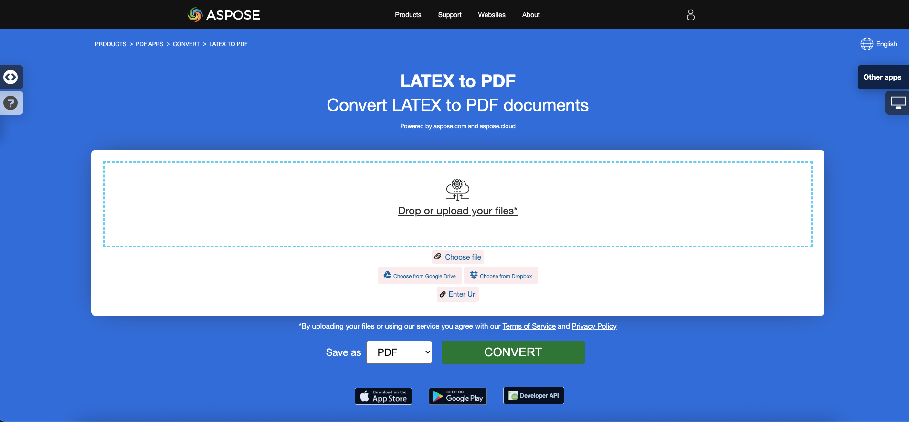

<script type="application/ld+json">
{
    "@context": "https://schema.org",
    "@type": "TechArticle",
    "headline": "Convert other file formats to PDF in .NET",
    "alternativeHeadline": "Convert Multiple File Formats to PDF in C#",
    "abstract": "Aspose.PDF for .NET 引入了一种多功能特性，允许用户无缝地将多种文件格式（包括 EPUB、Markdown、PCL、XPS、PS、XML 和 LaTeX）转换为高质量的 PDF 文档。此功能通过确保在各种平台上的兼容性和可访问性，同时保持原始内容的完整性，增强了文档管理。",
    "author": {
        "@type": "Person",
        "name": "Anastasiia Holub",
        "givenName": "Anastasiia",
        "familyName": "Holub",
        "url": "https://www.linkedin.com/in/anastasiia-holub-750430225/"
    },
    "genre": "pdf document generation",
    "wordcount": "2953",
    "proficiencyLevel": "Beginner",
    "publisher": {
        "@type": "Organization",
        "name": "Aspose.PDF for .NET",
        "url": "https://products.aspose.com/pdf",
        "logo": "https://www.aspose.cloud/templates/aspose/img/products/pdf/aspose_pdf-for-net.svg",
        "alternateName": "Aspose",
        "sameAs": [
            "https://facebook.com/aspose.pdf/",
            "https://twitter.com/asposepdf",
            "https://www.youtube.com/channel/UCmV9sEg_QWYPi6BJJs7ELOg/featured",
            "https://www.linkedin.com/company/aspose",
            "https://stackoverflow.com/questions/tagged/aspose",
            "https://aspose.quora.com/",
            "https://aspose.github.io/"
        ],
        "contactPoint": [
            {
                "@type": "ContactPoint",
                "telephone": "+1 903 306 1676",
                "contactType": "sales",
                "areaServed": "US",
                "availableLanguage": "en"
            },
            {
                "@type": "ContactPoint",
                "telephone": "+44 141 628 8900",
                "contactType": "sales",
                "areaServed": "GB",
                "availableLanguage": "en"
            },
            {
                "@type": "ContactPoint",
                "telephone": "+61 2 8006 6987",
                "contactType": "sales",
                "areaServed": "AU",
                "availableLanguage": "en"
            }
        ]
    },
    "url": "/net/convert-other-files-to-pdf/",
    "mainEntityOfPage": {
        "@type": "WebPage",
        "@id": "/net/convert-other-files-to-pdf/"
    },
    "dateModified": "2025-04-04",
    "description": "Aspose.PDF 不仅可以执行简单和容易的任务，还可以应对更复杂的目标。请查看下一部分以获取高级用户和开发人员的信息。"
}
</script>

## 概述

本文解释了如何使用 **C# 将各种其他类型的文件格式转换为 PDF**。它涵盖以下主题。

以下代码片段也适用于 [Aspose.PDF.Drawing](/pdf/zh/net/drawing/) 库。

- [将 EPUB 转换为 PDF](#csharp-convert-epub-to-pdf)
- [将 Markdown 转换为 PDF](#csharp-convert-markdown-to-pdf)
- [将 PCL 转换为 PDF](#csharp-convert-pcl-to-pdf)
- [将文本转换为 PDF](#csharp-convert-text-to-pdf)
- [将预格式化文本转换为 PDF](#csharp-convert-pre-formatted-text-to-pdf)
- [将 XPS 转换为 PDF](#csharp-convert-xps-to-pdf)
- [将 PostScript 转换为 PDF](#csharp-convert-ps-to-pdf)
- [将 XML 转换为 PDF](#csharp-convert-xml-to-pdf)
- [将 XLS-FO 转换为 PDF](#csharp-convert-xlsfo-to-pdf)
- [将 LaTeX/TeX 转换为 PDF](#csharp-convert-latex-to-pdf)
- [将 OFD 转换为 PDF](#csharp-convert-ofd-to-pdf)

## 将 EPUB 转换为 PDF

**Aspose.PDF for .NET** 允许您简单地将 EPUB 文件转换为 PDF 格式。

<abbr title="电子出版物">EPUB</abbr>（电子出版物的缩写）是国际数字出版论坛（IDPF）推出的免费开放电子书标准。文件扩展名为 .epub。EPUB 旨在支持可重排内容，这意味着 EPUB 阅读器可以针对特定显示设备优化文本。

EPUB 还支持固定布局内容。该格式旨在作为出版商和转换公司可以在内部使用的单一格式，以及用于分发和销售。它取代了开放电子书标准。EPUB 3 版本也得到了图书行业研究小组（BISG）的支持，该组织是一个领先的图书贸易协会，致力于标准化最佳实践、研究、信息和活动，以便内容的打包。

{}
**尝试在线将 EPUB 转换为 PDF**

Aspose.PDF for .NET 为您提供在线免费应用程序 ["EPUB to PDF"](https://products.aspose.app/pdf/conversion/epub-to-pdf)，您可以尝试探索其功能和质量。

[](https://products.aspose.app/pdf/conversion/epub-to-pdf)
{}

<a name="csharp-convert-epub-to-pdf" id="csharp-convert-epub-to-pdf"><strong>将 EPUB 转换为 PDF</strong></a>

1. 创建 [EpubLoadOptions](https://reference.aspose.com/pdf/zh/net/aspose.pdf/epubloadoptions) 类的实例。
2. 创建 [Document](https://reference.aspose.com/pdf/zh/net/aspose.pdf/document) 类的实例，并提及源文件名和选项。
3. 使用所需的文件名保存文档。

接下来的代码片段向您展示了如何使用 C# 将 EPUB 文件转换为 PDF 格式。

```csharp
// For complete examples and data files, visit https://github.com/aspose-pdf/Aspose.PDF-for-.NET
private static void ConvertEPUBtoPDF()
{
    // The path to the documents directory
    var dataDir = RunExamples.GetDataDir_AsposePdf_DocumentConversion();
    // Convert options
    var options = new Aspose.Pdf.EpubLoadOptions();

    // Open PDF document
    using (var document = new Aspose.Pdf.Document(dataDir + "EPUBToPDF.epub", options))
    {
        // Save PDF document
        document.Save(dataDir + "ConvertEPUBtoPDF_out.pdf");
    }
}
```

您还可以设置转换的页面大小。要定义新的页面大小，您需要 `SizeF` 对象并将其传递给 [EpubLoadOptions](https://reference.aspose.com/pdf/zh/net/aspose.pdf/epubloadoptions/constructors/main) 构造函数。

```csharp
// For complete examples and data files, visit https://github.com/aspose-pdf/Aspose.PDF-for-.NET
private static void ConvertEPUBtoPDFAdv()
{
    // The path to the documents directory
    var dataDir = RunExamples.GetDataDir_AsposePdf_DocumentConversion();
    // Convert options
    var options = new Aspose.Pdf.EpubLoadOptions(new SizeF(1190, 1684));

    // Open PDF document
    using (var document = new Aspose.Pdf.Document(dataDir + "EPUBToPDF.epub", options))
    {
        // Save PDF document
        document.Save(dataDir + "ConvertEPUBtoPDFAdv_out.pdf");
    }
}
```

## 将 Markdown 转换为 PDF

**此功能支持版本 19.6 或更高版本。**

{}
**尝试在线将 Markdown 转换为 PDF**

Aspose.PDF for .NET 为您提供在线免费应用程序 ["Markdown to PDF"](https://products.aspose.app/pdf/conversion/md-to-pdf)，您可以尝试探索其功能和质量。

[](https://products.aspose.app/pdf/conversion/md-to-pdf)
{}

Aspose.PDF for .NET 提供基于输入 [Markdown](https://daringfireball.net/projects/markdown/syntax) 数据文件创建 PDF 文档的功能。为了将 Markdown 转换为 PDF，您需要使用 [MdLoadOptions](https://reference.aspose.com/pdf/zh/net/aspose.pdf/mdloadoptions) 初始化 [Document](https://reference.aspose.com/pdf/zh/net/aspose.pdf/document)。

以下代码片段展示了如何使用 Aspose.PDF 库实现此功能：

<a name="csharp-convert-markdown-to-pdf" id="csharp-convert-markdown-to-pdf"><strong>将 Markdown 转换为 PDF</strong></a>

1. 创建 [MdLoadOptions ](https://reference.aspose.com/pdf/zh/net/aspose.pdf/mdloadoptions/) 类的实例。
2. 创建 [Document](https://reference.aspose.com/pdf/zh/net/aspose.pdf/document) 类的实例，并提及源文件名和选项。
3. 使用所需的文件名保存文档。

```csharp
// For complete examples and data files, visit https://github.com/aspose-pdf/Aspose.PDF-for-.NET
private static void ConvertMarkdownToPDF()
{
    // The path to the documents directory
    var dataDir = RunExamples.GetDataDir_AsposePdf_DocumentConversion();
    // Convert options
    var options = new Aspose.Pdf.MdLoadOptions();

    // Open PDF document
    using (var document = new Aspose.Pdf.Document(dataDir + "sample.md", options))
    {
        // Save PDF document
        document.Save(dataDir + "ConvertMarkdownToPDF_out.pdf");
    }
}
```

## 将 PCL 转换为 PDF

<abbr title="打印机命令语言">PCL</abbr>（打印机命令语言）是惠普开发的打印机语言，用于访问标准打印机功能。PCL 级别 1 到 5e/5c 是基于命令的语言，使用控制序列按接收顺序处理和解释。在消费者层面，PCL 数据流由打印驱动程序生成。PCL 输出也可以由自定义应用程序轻松生成。

{}
**尝试在线将 PCL 转换为 PDF**

Aspose.PDF for .NET 为您提供在线免费应用程序 ["PCL to PDF"](https://products.aspose.app/pdf/conversion/pcl-to-pdf)，您可以尝试探索其功能和质量。

[](https://products.aspose.app/pdf/conversion/pcl-to-pdf)
{}

**目前仅支持 PCL5 及更早版本**

<table>
    <thead>
        <tr>
            <th>
                命令集
            </th>
            <th>
                支持
            </th>
            <th>
                异常
            </th>
            <th>
                描述
            </th>
        </tr>
    </thead>
    <tbody>
        <tr>
            <td>
                作业控制命令
            </td>
            <td>
                +
            </td>
            <td>
                双面打印模式
            </td>
            <td>
                控制打印过程：副本数量、输出箱、单面/双面打印、左侧和顶部偏移等。
            </td>
        </tr>
        <tr>
            <td>
                页面控制命令
            </td>
            <td>
                +
            </td>
            <td>
                穿孔跳过命令
            </td>
            <td>
                指定页面大小、边距、页面方向、行间距、字符间距等。
            </td>
        </tr>
        <tr>
            <td>
                光标定位命令
            </td>
            <td>
                +
            </td>
            <td>
                &nbsp;
            </td>
            <td>
                指定光标位置，从而确定文本、光栅或矢量图像和细节的起点。
            </td>
        </tr>
        <tr>
            <td>
                字体选择命令
            </td>
            <td>
                +
            </td>
            <td>
                <ol>
                    <li>透明打印数据命令。</li>
                    <li>嵌入的软字体。在当前版本中，我们的库选择目标机器上已安装的现有“硬” TrueType 字体中的合适字体，而不是创建软字体。<br/>
                        适用性由宽度/高度比定义。<br/>
                        此功能仅适用于位图和 TrueType 字体，并不保证使用软字体打印的文本与源文件中的文本相关。<br/>
                        因为软字体中的字符代码可能与默认代码不匹配。
                    </li>
                    <li>用户定义的符号集。</li>
                </ol>
            </td>
            <td>
                允许从 PCL 文件加载软（嵌入）字体并在内存中管理它们。
            </td>
        </tr>
        <tr>
            <td>
                光栅图形命令
            </td>
            <td>
                +
            </td>
            <td>
                仅支持黑白
            </td>
            <td>
                允许从 PCL 文件加载光栅图像到内存，指定光栅参数。<br>
                例如宽度、高度、压缩类型、分辨率等。
            </td>
        </tr>
        <tr>
            <td>
                颜色命令
            </td>
            <td>
                +
            </td>
            <td>
                &nbsp;
            </td>
            <td>
                允许为所有可打印对象上色。
            </td>
        </tr>
        <tr>
            <td>
                打印模型命令
            </td>
            <td>
                +
            </td>
            <td>
                &nbsp;
            </td>
            <td>
                允许使用光栅预定义和用户定义的模式填充文本、光栅图像和矩形区域，指定模式和源光栅图像的透明度模式。<br> 预定义模式包括阴影、交叉阴影和阴影模式。
            </td>
        </tr>
        <tr>
            <td>
                矩形区域填充命令
            </td>
            <td>
                +
            </td>
            <td>
                &nbsp;
            </td>
            <td>
                允许创建和填充带有模式的矩形区域。
            </td>
        </tr>
        <tr>
            <td>
                HP-GL/2 矢量图形命令
            </td>
            <td>
                +
            </td>
            <td>
                屏幕矢量命令（SV）、透明模式命令（TR）、透明数据命令（TD）、RO（旋转坐标系统）、可缩放或位图字体命令（SB）、字符倾斜命令（SL）和额外空间（ES）未实现，DV（定义变量文本路径）命令在测试版中实现。
            </td>
            <td>
                允许从 PCL 文件加载 HP-GL/2 矢量图像到内存。矢量图像的原点位于可打印区域的左下角，可以缩放、平移、旋转和裁剪。<br>
                矢量图像可以包含文本（作为标签）和几何图形，如矩形、圆、椭圆、线、弧、贝塞尔曲线和由简单图形组成的复杂图形。<br> 闭合图形（包括标签的字母）可以用实心填充或矢量模式填充。<br> 模式可以是阴影、交叉阴影、阴影、光栅用户定义、PCL 阴影或交叉阴影和 PCL 用户定义。PCL 模式是光栅的。标签可以单独旋转、缩放，并朝四个方向：上、下、左和右。左右方向涉及逐个字母排列。上下方向涉及上下排列字母。
            </td>
        </tr>
        <tr>
            <td>
                宏
            </td>
            <td>
                ―
            </td>
            <td>
                &nbsp;
            </td>
            <td>
                允许将一系列 PCL 命令加载到内存中，并多次使用该序列，例如打印页面标题或为一组页面设置一种格式。
            </td>
        </tr>
        <tr>
            <td>
                Unicode 文本
            </td>
            <td>
                ―
            </td>
            <td>
                &nbsp;
            </td>
            <td>
                允许打印非 ASCII 字符。由于缺乏包含 Unicode 文本的示例文件，因此未实现。
            </td>
        </tr>
        <tr>
            <td>
                PCL6 (PCL-XL)
            </td>
            <td>
                &nbsp;
            </td>
            <td>
                由于缺乏测试文件，仅在测试版中实现。嵌入字体也不受支持。<br> JetReady 扩展不受支持，因为无法获得 JetReady 规范。
            </td>
            <td>
                二进制文件格式。
            </td>
        </tr>
    </tbody>
</table>

### 将 PCL 文件转换为 PDF 格式

为了允许从 PCL 转换为 PDF，Aspose.PDF 提供了 [`PclLoadOptions`](https://reference.aspose.com/pdf/zh/net/aspose.pdf/pclloadoptions) 类，用于初始化 LoadOptions 对象。随后，该对象作为参数传递给 Document 对象的初始化，帮助 PDF 渲染引擎确定源文档的输入格式。

以下代码片段展示了将 PCL 文件转换为 PDF 格式的过程。

<a name="csharp-convert-pcl-to-pdf" id="csharp-convert-pcl-to-pdf"><strong>将 PCL 转换为 PDF</strong></a>

1. 创建 [PclLoadOptions](https://reference.aspose.com/pdf/zh/net/aspose.pdf/pclloadoptions/) 类的实例。
2. 创建 [Document](https://reference.aspose.com/pdf/zh/net/aspose.pdf/document/) 类的实例，并提及源文件名和选项。
3. 使用所需的文件名保存文档。

```csharp
// For complete examples and data files, visit https://github.com/aspose-pdf/Aspose.PDF-for-.NET
private static void ConvertPCLtoPDF()
{
    // The path to the documents directory
    var dataDir = RunExamples.GetDataDir_AsposePdf_DocumentConversion();
    // Convert options
    var options = new Aspose.Pdf.PclLoadOptions();

    // Open PDF document
    using (var document = new Aspose.Pdf.Document(dataDir + "ConvertPCLtoPDF.pcl", options))
    {
        // Save PDF document
        document.Save(dataDir + "ConvertPCLtoPDF_out.pdf");
    }
}
```

您还可以监控转换过程中的错误检测。为此，您需要配置 PclLoadOptions 对象：设置或取消设置 SupressErrors。

```csharp
// For complete examples and data files, visit https://github.com/aspose-pdf/Aspose.PDF-for-.NET
private static void ConvertPCLtoPDFAdvanced()
{
    // The path to the documents directory
    var dataDir = RunExamples.GetDataDir_AsposePdf_DocumentConversion();
    // Convert options
    var options = new Aspose.Pdf.PclLoadOptions { SupressErrors = true };

    // Open PDF document
    using (var document = new Aspose.Pdf.Document(dataDir + "ConvertPCLtoPDFAdvanced.pcl", options))
    {
        if (options.Exceptions != null)
        {
            foreach (var ex in options.Exceptions)
            {
                Console.WriteLine(ex.Message);
            }
        }
        // Save PDF document
        document.Save(dataDir + "ConvertPCLtoPDFAdvanced_out.pdf");
    }
}
```

### 已知问题

1. 如果打印方向不是 0°，文本字符串和图像的原点可能与源 PCL 文件中的原点略有不同。矢量图像也是如此，如果矢量绘图的坐标系统被旋转（RO 命令在前）。
2. 如果标签受到一系列命令的影响（标签原点（LO）、定义变量文本路径（DV）、绝对方向（DI）或相对方向（DR），则矢量图像中标签的原点可能与源 PCL 文件中的原点不同。
3. 如果文本必须使用位图或 TrueType 软（嵌入）字体呈现，则可能会错误读取文本，因为目前这些字体仅部分支持（请参见“支持的功能表”中的异常）。在这种情况下，只有当软字体中的字符代码与默认代码相对应时，文本才能被正确读取。读取文本的样式也可能与源 PCL 文件中的样式不同，因为不必在软字体头中设置样式。
4. 如果解析的 PCL 文件包含 Intellifont 或 Universal 软字体，将抛出异常，因为 Intellifont 和 Universal 字体根本不受支持。
5. 如果解析的 PCL 文件包含宏命令，则解析结果将与源文件大相径庭，因为宏命令不受支持。

## 将文本转换为 PDF

**Aspose.PDF for .NET** 支持将纯文本和预格式化文本文件转换为 PDF 格式的功能。

将文本转换为 PDF 意味着将文本片段添加到 PDF 页面。对于文本文件，我们处理两种类型的文本：预格式化文本（例如，每行 80 个字符的 25 行）和非格式化文本（纯文本）。根据我们的需要，我们可以自己控制这个添加过程，或者将其委托给库的算法。

{}
**尝试在线将文本转换为 PDF**

Aspose.PDF for .NET 为您提供在线免费应用程序 ["Text to PDF"](https://products.aspose.app/pdf/conversion/txt-to-pdf)，您可以尝试探索其功能和质量。

[](https://products.aspose.app/pdf/conversion/txt-to-pdf)
{}

### 将纯文本文件转换为 PDF

在处理纯文本文件时，我们可以使用以下技术：

<a name="csharp-convert-text-to-pdf" id="csharp-convert-text-to-pdf"><strong>将文本转换为 PDF</strong></a>

1. 使用 _TextReader_ 读取整个文本。
2. 实例化 [Document](https://reference.aspose.com/pdf/zh/net/aspose.pdf/document/) 对象并在页面集合中添加新页面。
3. 创建 [TextFragment](https://reference.aspose.com/pdf/zh/net/aspose.pdf.text/textfragment/) 的新对象，并将 _TextReader_ 对象传递给其构造函数。
4. 将 _TextFragment_ 对象作为段落添加到 _Paragraphs_ 集合中。如果文本量大于页面，库算法会自动添加额外页面。
5. 使用 [Document](https://reference.aspose.com/pdf/zh/net/aspose.pdf/document/) 类的 **Save** 方法。

```csharp
// For complete examples and data files, visit https://github.com/aspose-pdf/Aspose.PDF-for-.NET
private static void ConvertPlainTextFileToPDF()
{
    // The path to the documents directory
    var dataDir = RunExamples.GetDataDir_AsposePdf_DocumentConversion();

    // Read the source text file
    using (var streamReader = new StreamReader(dataDir + "TextToPDFInput.txt"))
    {
        // // Create PDF document
        using (var document = new Aspose.Pdf.Document())
        {
            // Add page
            var page = document.Pages.Add();
            // Create an instance of TextFragment and pass the text from reader object to its constructor as argument
            var text = new Aspose.Pdf.Text.TextFragment(streamReader.ReadToEnd());
            // Add a new text paragraph in paragraphs collection and pass the TextFragment object
            page.Paragraphs.Add(text);
            // Save PDF document
            document.Save(dataDir + "TextToPDF_out.pdf");
        }
    }
}
```

### 将预格式化文本文件转换为 PDF

将预格式化文本转换为 PDF 类似于纯文本，但您需要进行一些额外的操作，例如设置边距、字体类型和大小。显然，字体应该是等宽字体（例如 Courier New）。

按照以下步骤使用 C# 将预格式化文本转换为 PDF：

<a name="csharp-convert-pre-formatted-text-to-pdf" id="csharp-convert-pre-formatted-text-to-pdf"><strong>将预格式化 TXT 转换为 PDF</strong></a>

1. 将整个文本作为字符串数组读取。
2. 实例化 [Document](https://reference.aspose.com/pdf/zh/net/aspose.pdf/document/) 对象，并在 [Pages](https://reference.aspose.com/pdf/zh/net/aspose.pdf/document/pages/) 集合中添加新页面。
3. 遍历字符串数组，并将每个字符串作为段落添加到 [Paragraphs](https://reference.aspose.com/pdf/zh/net/aspose.pdf/paragraphs/) 集合中。

在这种情况下，库的算法也会添加额外页面，但我们可以自己控制这个过程。
以下示例展示了如何将预格式化文本文件转换为 A4 页面大小的 PDF 文档。

```csharp
// For complete examples and data files, visit https://github.com/aspose-pdf/Aspose.PDF-for-.NET
private static void ConvertPreFormattedTextToPdf()
{
    // The path to the documents directory
    var dataDir = RunExamples.GetDataDir_AsposePdf_DocumentConversion();
    // Read the text file as array of string
    var lines = File.ReadAllLines(dataDir + "ConvertPreFormattedTextToPdf.txt");

    // Create PDF document
    using (var document = new Aspose.Pdf.Document())
    {
        // Add page
        var page = document.Pages.Add();
        // Set left and right margins for better presentation
        page.PageInfo.Margin.Left = 20;
        page.PageInfo.Margin.Right = 10;
        page.PageInfo.DefaultTextState.Font = Aspose.Pdf.Text.FontRepository.FindFont("Courier New");
        page.PageInfo.DefaultTextState.FontSize = 12;

        foreach (var line in lines)
        {
            // check if line contains "form feed" character
            // see https://en.wikipedia.org/wiki/Page_break
            if (line.StartsWith("\x0c"))
            {
                page = document.Pages.Add();
                page.PageInfo.Margin.Left = 20;
                page.PageInfo.Margin.Right = 10;
                page.PageInfo.DefaultTextState.Font = Aspose.Pdf.Text.FontRepository.FindFont("Courier New");
                page.PageInfo.DefaultTextState.FontSize = 12;
            }
            else
            {
                // Create an instance of TextFragment and pass the line to its constructor as argument
                var text = new Aspose.Pdf.Text.TextFragment(line);
                // Add a new text paragraph in paragraphs collection and pass the TextFragment object
                page.Paragraphs.Add(text);
            }
        }
        // Save PDF document
        document.Save(dataDir + "PreFormattedTextToPDF_out.pdf");
    }
}
```

## 将 XPS 转换为 PDF

**Aspose.PDF for .NET** 支持将 <abbr title="XML 纸张规范">XPS</abbr> 文件转换为 PDF 格式的功能。请查看本文以解决您的任务。

XPS 文件类型主要与微软公司的 XML 纸张规范相关。XML 纸张规范（XPS），以前代号为 Metro，并包含下一代打印路径（NGPP）营销概念，是微软将文档创建和查看集成到其 Windows 操作系统中的倡议。

{}

该文件格式基本上是一个压缩的 XML 文件，主要用于分发和存储。编辑非常困难，主要由微软实现。

{}

为了使用 Aspose.PDF for .NET 将 XPS 转换为 PDF，我们引入了一个名为 [XpsLoadOption](https://reference.aspose.com/pdf/zh/net/aspose.pdf/xpsloadoptions) 的类，用于初始化 [LoadOptions](https://reference.aspose.com/pdf/zh/net/aspose.pdf/loadoptions) 对象。随后，该对象作为参数传递给 Document 对象的初始化，帮助 PDF 渲染引擎确定源文档的输入格式。

{}

在 XP 和 Windows 7 中，如果您在控制面板中查看打印机，应该会找到预安装的 XPS 打印机。要创建这些文件，您可以使用该打印机作为输出设备。在 Windows 7 中，您应该能够双击文件以在 XPS 查看器中打开它。您还可以从微软的网站下载 XPS 查看器。

{}

以下代码片段展示了使用 C# 将 XPS 文件转换为 PDF 格式的过程。

<a name="csharp-convert-xps-to-pdf" id="csharp-convert-xps-to-pdf"><strong>将 XPS 转换为 PDF</strong></a>

1. 创建 [XpsLoadOptions](https://reference.aspose.com/pdf/zh/net/aspose.pdf/xpsloadoptions/) 类的实例。
2. 创建 [Document](https://reference.aspose.com/pdf/zh/net/aspose.pdf/document/) 类的实例，并提及源文件名和选项。
3. 使用所需的文件名将文档保存为 PDF 格式。

```csharp
// For complete examples and data files, visit https://github.com/aspose-pdf/Aspose.PDF-for-.NET
private static void ConvertXPSToPDF()
{
    // The path to the documents directory
    var dataDir = RunExamples.GetDataDir_AsposePdf_DocumentConversion();
    // Instantiate Options object
    var options = new Aspose.Pdf.XpsLoadOptions();

    // Open PDF document
    using (var document = new Aspose.Pdf.Document(dataDir + "XPSToPDF.xps", options))
    {
        // Save PDF document
        document.Save(dataDir + "ConvertXPSToPDF_out.pdf");
    }
}
```

{}
**尝试在线将 XPS 格式转换为 PDF**

Aspose.PDF for .NET 为您提供在线免费应用程序 ["XPS to PDF"](https://products.aspose.app/pdf/conversion/xps-to-pdf/)，您可以尝试探索其功能和质量。

[](https://products.aspose.app/pdf/conversion/xps-to-pdf/)
{}

## 将 PostScript 转换为 PDF

<a name="csharp-convert-ps-to-pdf" id="csharp-convert-ps-to-pdf"><strong>将 PostScript 转换为 PDF</strong></a>

**Aspose.PDF for .NET** 支持将 PostScript 文件转换为 PDF 格式的功能。Aspose.PDF 的一个功能是您可以在转换过程中设置一组字体文件夹。

为了将 PostScript 文件转换为 PDF 格式，Aspose.PDF for .NET 提供了 [PsLoadOptions](https://reference.aspose.com/pdf/zh/net/aspose.pdf/psloadoptions) 类，用于初始化 LoadOptions 对象。随后，该对象可以作为参数传递给 Document 对象的构造函数，这将帮助 PDF 渲染引擎确定源文档的格式。

以下代码片段可用于将 PostScript 文件转换为 PDF 格式：

```csharp
// For complete examples and data files, visit https://github.com/aspose-pdf/Aspose.PDF-for-.NET
private static void ConvertPostScriptToPDF()
{
    // The path to the documents directory
    var dataDir = RunExamples.GetDataDir_AsposePdf_DocumentConversion();
    // Convert options
    var options = new PsLoadOptions();

    // Open PDF document
    using (var document = new Aspose.Pdf.Document(dataDir + "ConvertPostscriptInput.ps", options))
    {
        // Save PDF document
        document.Save(dataDir + "PSToPDF_out.pdf");
    }
}
```

此外，您可以设置一组在转换过程中使用的字体文件夹：

```csharp
// For complete examples and data files, visit https://github.com/aspose-pdf/Aspose.PDF-for-.NET
private static void ConvertPostscriptToPDFAdvanced()
{
    // The path to the documents directory
    var dataDir = RunExamples.GetDataDir_AsposePdf_DocumentConversion();
    // Convert options with custom font folders
    var options = new Aspose.Pdf.PsLoadOptions
    {
        FontsFolders = new[] { dataDir + @"\fonts1", dataDir + @"\fonts2" }
    };

    // Open PDF document
    using (var document = new Aspose.Pdf.Document(dataDir + "ConvertPostscriptInput.ps", options))
    {
        // Save PDF document
        document.Save(dataDir + "ConvertPostscriptToPDFAdvanced_out.pdf");
    }
}
```

## 将 XML 转换为 PDF

<a name="csharp-convert-xml-to-pdf" id="csharp-convert-xml-to-pdf"><strong>将 XML 转换为 PDF</strong></a>

XML 格式用于存储结构化数据。可以通过几种方式将 <abbr title="可扩展标记语言">XML</abbr> 转换为 PDF，使用 Aspose.PDF：

1. 使用 XSLT 将任何 XML 数据转换为 HTML，然后将 HTML 转换为 PDF，如下所述。
2. 使用 Aspose.PDF XSD 模式生成 XML 文档。
3. 使用基于 XSL-FO 标准的 XML 文档。

{}
**尝试在线将 XML 转换为 PDF**

Aspose.PDF for .NET 为您提供在线免费应用程序 ["XML to PDF"](https://products.aspose.app/pdf/conversion/xml-to-pdf)，您可以尝试探索其功能和质量。

[](https://products.aspose.app/pdf/conversion/xml-to-pdf)
{}

## 将 XSL-FO 转换为 PDF

<a name="csharp-convert-xslfo-to-pdf" id="csharp-convert-xslfo-to-pdf"><strong>将 XSL-FO 转换为 PDF</strong></a>

将 XSL-FO 文件转换为 PDF 可以使用传统的 Aspose.PDF 技术实现 - 使用 [XslFoLoadOptions](https://reference.aspose.com/pdf/zh/net/aspose.pdf/xslfoloadoptions) 实例化 [Document](https://reference.aspose.com/page/net/aspose.page/document) 对象。但有时您可能会遇到不正确的文件结构。在这种情况下，XSL-FO 转换器允许设置错误处理策略。您可以选择 `ThrowExceptionImmediately`、`TryIgnore` 或 `InvokeCustomHandler`。

```csharp
// For complete examples and data files, visit https://github.com/aspose-pdf/Aspose.PDF-for-.NET
private static void Convert_XSLFO_to_PDF()
{
    // The path to the documents directory
    var dataDir = RunExamples.GetDataDir_AsposePdf_DocumentConversion();
    // Convert options
    var options = new Aspose.Pdf.XslFoLoadOptions(dataDir + "XSLFOToPdfInput.xslt");
    // Set error handling strategy
    options.ParsingErrorsHandlingType = Aspose.Pdf.XslFoLoadOptions.ParsingErrorsHandlingTypes.ThrowExceptionImmediately;

    // Open PDF document
    using (var document = new Aspose.Pdf.Document(dataDir + "XSLFOToPdfInput.xml", options))
    {
        // Save PDF document
        document.Save(dataDir + "XSLFOToPdf_out.pdf");
    }
}
```

## 将 LaTeX/TeX 转换为 PDF

<a name="csharp-convert-latex-to-pdf" id="csharp-convert-latext-to-pdf"><strong>将 LaTeX/TeX 转换为 PDF</strong></a>

LaTeX 文件格式是一种带有标记的文本文件格式，属于 TeX 语言家族的 LaTeX 派生格式，LaTeX 是 TeX 系统的派生格式。LaTeX（ˈleɪtɛk/lay-tek 或 lah-tek）是一种文档准备系统和文档标记语言。它广泛用于许多领域的科学文档的交流和出版，包括数学、物理和计算机科学。它在准备和出版包含复杂多语言材料的书籍和文章（如梵文和阿拉伯文，包括批判版）中也发挥着重要作用。LaTeX 使用 TeX 排版程序格式化其输出，并且本身是用 TeX 宏语言编写的。

{}
**尝试在线将 LaTeX/TeX 转换为 PDF**

Aspose.PDF for .NET 为您提供在线免费应用程序 ["LaTex to PDF"](https://products.aspose.app/pdf/conversion/tex-to-pdf)，您可以尝试探索其功能和质量。

[](https://products.aspose.app/pdf/conversion/tex-to-pdf)
{}

Aspose.PDF for .NET 支持将 TeX 文件转换为 PDF 格式的功能，为了满足这一需求，Aspose.Pdf 命名空间中有一个名为 [LatexLoadOptions](https://reference.aspose.com/pdf/zh/net/aspose.pdf/latexloadoptions) 的类，提供加载 LaTex 文件并使用 [Document class](https://reference.aspose.com/pdf/zh/net/aspose.pdf/document) 将输出呈现为 PDF 格式的能力。
以下代码片段展示了使用 C# 将 LaTex 文件转换为 PDF 格式的过程。

```csharp
// For complete examples and data files, visit https://github.com/aspose-pdf/Aspose.PDF-for-.NET
private static void ConvertTeXtoPDF()
{
    // The path to the documents directory
    var dataDir = RunExamples.GetDataDir_AsposePdf_DocumentConversion();
    // Convert options
    var options = new Aspose.Pdf.TeXLoadOptions();
    // Open PDF document
    using (var document = new Aspose.Pdf.Document(dataDir + "samplefile.tex", options))
    {
        // Save PDF document
        document.Save(dataDir + "TeXToPDF_out.pdf");
    }
}
```

## 将 OFD 转换为 PDF

<a name="csharp-convert-ofd-to-pdf" id="csharp-convert-ofd-to-pdf"><strong>将 OFD 转换为 PDF</strong></a>

OFD 格式指的是“开放固定布局文档”，作为中国的国家标准用于电子文件存储，作为流行 PDF 格式的替代方案。它支持固定布局文档，确保在不同平台上的一致显示。OFD 文件用于各种目的，包括数字文档和商业应用。

Aspose.PDF for .NET 支持将 OFD 文件转换为 PDF 格式的功能，为了满足这一需求，Aspose.Pdf 命名空间中有一个名为 [OfdLoadOptions](https://reference.aspose.com/pdf/zh/net/aspose.pdf/ofdloadoptions/) 的类，提供加载 OFD 文件并使用 [Document class](https://reference.aspose.com/pdf/zh/net/aspose.pdf/document) 将输出呈现为 PDF 格式的能力。

以下代码片段展示了使用 C# 将 OFD 文件转换为 PDF 格式的过程。

```csharp
// For complete examples and data files, visit https://github.com/aspose-pdf/Aspose.PDF-for-.NET
private static void ConvertOFDToPDF()
{
    // The path to the documents directory
    var dataDir = RunExamples.GetDataDir_AsposePdf_DocumentConversion();
    // Convert options
    var options = new Aspose.Pdf.OfdLoadOptions();

    // Open PDF document
    using (var document = new Aspose.Pdf.Document(dataDir + "ConvertOFDToPDF.ofd", options))
    {
        // Save PDF document
        document.Save(dataDir + "ConvertOFDToPDF_out.pdf");
    }
}
```