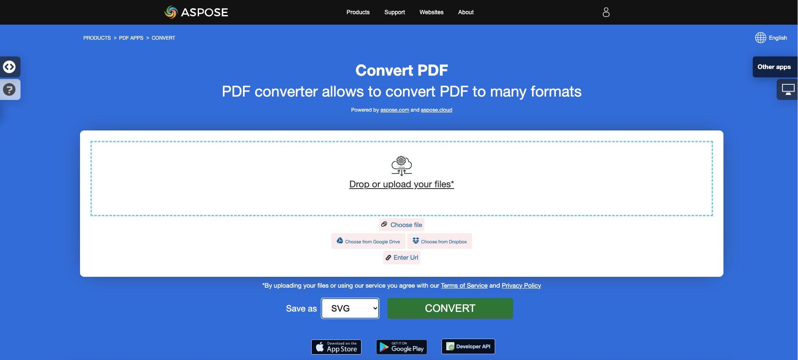

<script type="application/ld+json">
{
    "@context": "https://schema.org",
    "@type": "TechArticle",
    "headline": "Convert PDF to Different Image Formats in C#",
    "alternativeHeadline": "Convert PDF Files to Multiple Image Formats in C#",
    "abstract": "Aspose.PDF for .NET 中的功能允许用户无缝地将 PDF 文件转换为多种图像格式，如 TIFF、BMP、EMF、JPEG、PNG、GIF 和 SVG。此功能通过仅使用几行 C# 代码简化了文档处理，使其成为希望通过多功能 PDF 处理能力增强其应用程序的开发人员的必备工具。",
    "author": {
        "@type": "Person",
        "name": "Anastasiia Holub",
        "givenName": "Anastasiia",
        "familyName": "Holub",
        "url": "https://www.linkedin.com/in/anastasiia-holub-750430225/"
    },
    "genre": "pdf document generation",
    "wordcount": "1541",
    "proficiencyLevel": "Beginner",
    "publisher": {
        "@type": "Organization",
        "name": "Aspose.PDF for .NET",
        "url": "https://products.aspose.com/pdf",
        "logo": "https://www.aspose.cloud/templates/aspose/img/products/pdf/aspose_pdf-for-net.svg",
        "alternateName": "Aspose",
        "sameAs": [
            "https://facebook.com/aspose.pdf/",
            "https://twitter.com/asposepdf",
            "https://www.youtube.com/channel/UCmV9sEg_QWYPi6BJJs7ELOg/featured",
            "https://www.linkedin.com/company/aspose",
            "https://stackoverflow.com/questions/tagged/aspose",
            "https://aspose.quora.com/",
            "https://aspose.github.io/"
        ],
        "contactPoint": [
            {
                "@type": "ContactPoint",
                "telephone": "+1 903 306 1676",
                "contactType": "sales",
                "areaServed": "US",
                "availableLanguage": "en"
            },
            {
                "@type": "ContactPoint",
                "telephone": "+44 141 628 8900",
                "contactType": "sales",
                "areaServed": "GB",
                "availableLanguage": "en"
            },
            {
                "@type": "ContactPoint",
                "telephone": "+61 2 8006 6987",
                "contactType": "sales",
                "areaServed": "AU",
                "availableLanguage": "en"
            }
        ]
    },
    "url": "/net/convert-pdf-to-images-format/",
    "mainEntityOfPage": {
        "@type": "WebPage",
        "@id": "/net/convert-pdf-to-images-format/"
    },
    "dateModified": "2025-04-09",
    "description": "Aspose.PDF 不仅可以执行简单易行的任务，还可以应对更复杂的目标。请查看下一部分以获取高级用户和开发人员的信息。"
}
</script>

## 概述

本文解释了如何使用 C# 将 PDF 转换为不同的图像格式。它涵盖以下主题。

- [将 PDF 转换为 TIFF](#csharp-pdf-to-tiff)
- [将 PDF 转换为 BMP](#csharp-pdf-to-bmp)
- [将 PDF 转换为 EMF](#csharp-pdf-to-emf)
- [将 PDF 转换为 JPG](#csharp-pdf-to-jpg)
- [将 PDF 转换为 PNG](#csharp-pdf-to-png)
- [将 PDF 转换为 GIF](#csharp-pdf-to-gif)
- [将 PDF 转换为 SVG](#csharp-pdf-to-svg)

## C# 将 PDF 转换为图像

以下代码片段也适用于 [Aspose.PDF.Drawing](/pdf/zh/net/drawing/) 库。

**Aspose.PDF for .NET** 使用几种方法将 PDF 转换为图像。一般来说，我们使用两种方法：使用设备方法进行转换和使用 SaveOption 进行转换。本节将向您展示如何使用这些方法之一将 PDF 文档转换为 BMP、JPEG、GIF、PNG、EMF、TIFF 和 SVG 格式的图像。

库中有几个类允许您使用虚拟设备转换图像。DocumentDevice 旨在转换整个文档，而 ImageDevice 则用于特定页面。

## 使用 DocumentDevice 类转换 PDF

**Aspose.PDF for .NET** 使得将 PDF 页面转换为 TIFF 图像成为可能。

TiffDevice（基于 DocumentDevice）类允许您将 PDF 页面转换为 TIFF 图像。该类提供了一个名为 `Process` 的方法，允许您将 PDF 文件中的所有页面转换为单个 TIFF 图像。

{}
**尝试在线将 PDF 转换为 TIFF**

Aspose.PDF for .NET 向您展示在线免费应用程序 ["PDF to TIFF"](https://products.aspose.app/pdf/conversion/pdf-to-tiff)，您可以尝试探索其功能和工作质量。

[](https://products.aspose.app/pdf/conversion/pdf-to-tiff)
{}

### 将 PDF 页面转换为一个 TIFF 图像

Aspose.PDF for .NET 解释了如何将 PDF 文件中的所有页面转换为单个 TIFF 图像：

<a name="csharp-pdf-to-tiff"><strong>将 PDF 转换为 TIFF</strong></a>

1. 创建 **Document** 类的对象。
2. 创建 **TiffSettings** 和 **TiffDevice** 对象。
3. 调用 **TiffDevice.Process()** 方法将 PDF 文档转换为 TIFF。
4. 要设置输出文件的属性，请使用 **TiffSettings** 类。

以下代码片段演示了如何将所有 PDF 页面转换为单个 TIFF 图像。

```csharp
// For complete examples and data files, visit https://github.com/aspose-pdf/Aspose.PDF-for-.NET
private static void ConvertPDFtoTIFF()
{
    // The path to the documents directory
    var dataDir = RunExamples.GetDataDir_AsposePdf_WorkingDocuments();

    // Open PDF document
    using (var document = new Aspose.Pdf.Document(dataDir + "PDFtoTIFF.pdf"))
    {
        // Create Resolution object
        var resolution = new Aspose.Pdf.Devices.Resolution(300);

        // Create TiffSettings object
        var tiffSettings = new Aspose.Pdf.Devices.TiffSettings
        {
            Compression = Aspose.Pdf.Devices.CompressionType.None,
            Depth = Aspose.Pdf.Devices.ColorDepth.Default,
            Shape = Aspose.Pdf.Devices.ShapeType.Landscape,
            SkipBlankPages = false
        };

        // Create TIFF device
        var tiffDevice = new Aspose.Pdf.Devices.TiffDevice(resolution, tiffSettings);

        // Convert a particular page and save the image to stream
        tiffDevice.Process(document, dataDir + "PDFtoTIFF_out.tif");
    }
}
```

### 将一页转换为 TIFF 图像

Aspose.PDF for .NET 允许将 PDF 文件中的特定页面转换为 TIFF 图像，使用重载的 Process(..) 方法，该方法将页面编号作为参数进行转换。以下代码片段演示了如何将 PDF 的第一页转换为 TIFF 格式。

1. 创建 **Document** 类的对象。
2. 创建 **TiffSettings** 和 **TiffDevice** 对象。
3. 调用重载的 **TiffDevice.Process()** 方法，使用 **fromPage** 和 **toPage** 参数将 PDF 文档页面转换为 TIFF。

```csharp
// For complete examples and data files, visit https://github.com/aspose-pdf/Aspose.PDF-for-.NET
private static void ConvertPDFtoTiffSinglePage()
{
    // The path to the documents directory
    var dataDir = RunExamples.GetDataDir_AsposePdf_WorkingDocuments();

    // Open PDF document
    using (var document = new Aspose.Pdf.Document(dataDir + "PDFtoTiffSinglePage.pdf"))
    {
        // Create Resolution object
        var resolution = new Aspose.Pdf.Devices.Resolution(300);

        // Create TiffSettings object
        var tiffSettings = new Aspose.Pdf.Devices.TiffSettings
        {
            Compression = Aspose.Pdf.Devices.CompressionType.None,
            Depth = Aspose.Pdf.Devices.ColorDepth.Default,
            Shape = Aspose.Pdf.Devices.ShapeType.Landscape,
        };

        // Create TIFF device
        var tiffDevice = new Aspose.Pdf.Devices.TiffDevice(resolution, tiffSettings);

        // Convert a particular page and save the image to stream
        tiffDevice.Process(document, 1, 1, dataDir + "PDFtoTiffSinglePage_out.tif");
    }
}
```

### 在转换过程中使用 Bradley 算法

Aspose.PDF for .NET 一直支持使用 LZW 压缩将 PDF 转换为 TIF 的功能，然后使用 AForge 应用二值化。然而，一位客户请求对于某些图像，他们需要使用 Otsu 获取阈值，因此他们还希望使用 Bradley。

```csharp
// For complete examples and data files, visit https://github.com/aspose-pdf/Aspose.PDF-for-.NET
private static void ConvertPDFtoTiffBradleyBinarization()
{
    // The path to the documents directory
    var dataDir = RunExamples.GetDataDir_AsposePdf_WorkingDocuments();

    // Open PDF document
    using (var document = new Aspose.Pdf.Document(dataDir + "PDFtoTiffBradleyBinarization.pdf"))
    {
        string outputImageFile = dataDir + "PDFtoTiffBradleyBinarization_out.tif";
        string outputBinImageFile = dataDir + "PDFtoTiffBradleyBinarization-bin_out.tif";

        // Create Resolution object
        var resolution = new Aspose.Pdf.Devices.Resolution(300);

        // Create TiffSettings object
        var tiffSettings = new Aspose.Pdf.Devices.TiffSettings
        {
            Compression = Aspose.Pdf.Devices.CompressionType.LZW,
            Depth = Aspose.Pdf.Devices.ColorDepth.Format1bpp
        };

        // Create TIFF device
        var tiffDevice = new Aspose.Pdf.Devices.TiffDevice(resolution, tiffSettings);

        // Convert a particular page and save the image to stream
        tiffDevice.Process(document, outputImageFile);

        // Binarize the image using Bradley method
        using (var inStream = new FileStream(outputImageFile, FileMode.Open))
        {
            using (var outStream = new FileStream(outputBinImageFile, FileMode.Create))
            {
                tiffDevice.BinarizeBradley(inStream, outStream, 0.1);
            }
        }
    }
}
```

## 使用 ImageDevice 类转换 PDF

`ImageDevice` 是 `BmpDevice`、`JpegDevice`、`GifDevice`、`PngDevice` 和 `EmfDevice` 的祖先。

- [BmpDevice](https://reference.aspose.com/pdf/zh/net/aspose.pdf.devices/bmpdevice) 类允许您将 PDF 页面转换为 <abbr title="位图图像文件">BMP</abbr> 图像。
- [EmfDevice](https://reference.aspose.com/pdf/zh/net/aspose.pdf.devices/emfdevice) 类允许您将 PDF 页面转换为 <abbr title="增强型元文件">EMF</abbr> 图像。
- [JpegDevice](https://reference.aspose.com/pdf/zh/net/aspose.pdf.devices/jpegdevice) 类允许您将 PDF 页面转换为 JPEG 图像。
- [PngDevice](https://reference.aspose.com/pdf/zh/net/aspose.pdf.devices/pngdevice) 类允许您将 PDF 页面转换为 <abbr title="可移植网络图形">PNG</abbr> 图像。
- [GifDevice](https://reference.aspose.com/pdf/zh/net/aspose.pdf.devices/gifdevice) 类允许您将 PDF 页面转换为 <abbr title="图形交换格式">GIF</abbr> 图像。

让我们看看如何将 PDF 页面转换为图像。

`BmpDevice` 类提供了一个名为 [Process](https://reference.aspose.com/pdf/zh/net/aspose.pdf.devices/bmpdevice/methods/process) 的方法，允许您将 PDF 文件的特定页面转换为 BMP 图像格式。其他类也有相同的方法。因此，如果我们需要将 PDF 页面转换为图像，我们只需实例化所需的类。

<a name="csharp-pdf-to-bmp"></a>
<a name="csharp-pdf-to-emf"></a>
<a name="csharp-pdf-to-jpg"></a>
<a name="csharp-pdf-to-png"></a>
<a name="csharp-pdf-to-gif"></a>

1. 使用 **Document** 类加载 PDF 文件。
2. 创建 **ImageDevice** 的子类实例，即：
   * **BmpDevice**（将 PDF 转换为 BMP）。
   * **EmfDevice**（将 PDF 转换为 Emf）。
   * **JpegDevice**（将 PDF 转换为 JPG）。
   * **PngDevice**（将 PDF 转换为 PNG）。
   * **GifDevice**（将 PDF 转换为 GIF）。
3. 调用 **ImageDevice.Process()** 方法执行 PDF 到图像的转换。

```csharp
// For complete examples and data files, visit https://github.com/aspose-pdf/Aspose.PDF-for-.NET
private static void ConvertPDFusingImageDevice()
{
    // The path to the documents directory
    var dataDir = RunExamples.GetDataDir_AsposePdf_WorkingDocuments();

    // Create Resolution object            
    var resolution = new Aspose.Pdf.Devices.Resolution(300);
    var bmpDevice = new Aspose.Pdf.Devices.BmpDevice(resolution);
    var jpegDevice = new Aspose.Pdf.Devices.JpegDevice(resolution);
    var gifDevice = new Aspose.Pdf.Devices.GifDevice(resolution);
    var pngDevice = new Aspose.Pdf.Devices.PngDevice(resolution);
    var emfDevice = new Aspose.Pdf.Devices.EmfDevice(resolution);

    // Open PDF document
    using (var document = new Aspose.Pdf.Document(dataDir + "ConvertAllPagesToBmp.pdf"))
    {
        ConvertPDFtoImage(bmpDevice, "bmp", document, dataDir);
        ConvertPDFtoImage(jpegDevice, "jpeg", document, dataDir);
        ConvertPDFtoImage(gifDevice, "gif", document, dataDir);
        ConvertPDFtoImage(pngDevice, "png", document, dataDir);
        ConvertPDFtoImage(emfDevice, "emf", document, dataDir);
    }
}

private static void ConvertPDFtoImage(ImageDevice imageDevice,
        string ext, Document document, var dataDir)
{
    for (int pageCount = 1; pageCount <= document.Pages.Count; pageCount++)
    {
        using (FileStream imageStream =
            new FileStream($"{dataDir}image{pageCount}_out.{ext}",
            FileMode.Create))
        {
            // Convert a particular page and save the image to stream
            imageDevice.Process(document.Pages[pageCount], imageStream);
        }
    }
}
```

### 将 PDF 转换为具有透明背景的图像

PDF 页面可以转换为具有透明背景的 PNG 图像，而不是白色背景。



```csharp
// For complete examples and data files, visit https://github.com/aspose-pdf/Aspose.PDF-for-.NET
private static void ConvertPDFtoImageWithTransparentBackground()
{
    // The path to the documents directory
    var dataDir = RunExamples.GetDataDir_AsposePdf_WorkingDocuments();

    // Open PDF document
    using (var document = new Aspose.Pdf.Document(dataDir + "ConvertPDFtoImageWithTransparentBackground.pdf"))
    {
        var pngDevice = new Aspose.Pdf.Devices.PngDevice();
        pngDevice.TransparentBackground = true;
        using (var pngStream = new FileStream(dataDir + "ConvertPDFtoImageWithTransparentBackground.png", FileMode.Create))
        {
            // Convert page to PNG image
            pngDevice.Process(document.Pages[1], pngStream);
        }
    }
}
```



```csharp
// For complete examples and data files, visit https://github.com/aspose-pdf/Aspose.PDF-for-.NET
private static void ConvertPDFtoImageWithTransparentBackground()
{
    // The path to the documents directory
    var dataDir = RunExamples.GetDataDir_AsposePdf_WorkingDocuments();

    // Open PDF document
    using var document = new Aspose.Pdf.Document(dataDir + "ConvertPDFtoImageWithTransparentBackground.pdf");
    var pngDevice = new Aspose.Pdf.Devices.PngDevice()
    {
        TransparentBackground = true
    };
    using var pngStream = new FileStream(dataDir + "ConvertPDFtoImageWithTransparentBackground.png", FileMode.Create);
    // Convert page to PNG image
    pngDevice.Process(document.Pages[1], pngStream);
}
```



{}
**尝试在线将 PDF 转换为 PNG**

作为我们免费应用程序工作原理的示例，请查看下一个功能。

Aspose.PDF for .NET 向您展示在线免费应用程序 ["PDF to PNG"](https://products.aspose.app/pdf/conversion/pdf-to-png)，您可以尝试探索其功能和工作质量。

[](https://products.aspose.app/pdf/conversion/pdf-to-png)
{}

## 使用 SaveOptions 类转换 PDF

本文部分向您展示如何使用 C# 和 SaveOptions 类将 PDF 转换为 <abbr title="可缩放矢量图形">SVG</abbr>。

{}
**尝试在线将 PDF 转换为 SVG**

Aspose.PDF for .NET 向您展示在线免费应用程序 ["PDF to SVG"](https://products.aspose.app/pdf/conversion/pdf-to-svg)，您可以尝试探索其功能和工作质量。

[](https://products.aspose.app/pdf/conversion/pdf-to-svg)
{}

**可缩放矢量图形 (SVG)** 是一种基于 XML 的文件格式的规范系列，用于二维矢量图形，包括静态和动态（交互式或动画）。SVG 规范是一个开放标准，自 1999 年以来一直由万维网联盟 (W3C) 开发。

SVG 图像及其行为在 XML 文本文件中定义。这意味着它们可以被搜索、索引、脚本化，并在需要时进行压缩。作为 XML 文件，SVG 图像可以使用任何文本编辑器创建和编辑，但通常使用绘图程序（如 Inkscape）创建它们更方便。

Aspose.PDF for .NET 支持将 SVG 图像转换为 PDF 格式的功能，并且还提供将 PDF 文件转换为 SVG 格式的能力。为了实现这一要求，[`SvgSaveOptions`](https://reference.aspose.com/pdf/zh/net/aspose.pdf/svgsaveoptions/methods/index) 类已被引入到 Aspose.PDF 命名空间中。实例化一个 SvgSaveOptions 对象，并将其作为第二个参数传递给 [`Document.Save(..)`](https://reference.aspose.com/pdf/zh/net/aspose.pdf/document/methods/save/index) 方法。

以下代码片段展示了将 PDF 文件转换为 SVG 格式的步骤。

<a name="csharp-pdf-to-svg"><strong>将 PDF 转换为 SVG</strong></a>

1. 创建 **Document** 类的对象。
2. 创建具有所需设置的 **SvgSaveOptions** 对象。
3. 调用 **Document.Save()** 方法，并传递 **SvgSaveOptions** 对象以将 PDF 文档转换为 SVG。

```csharp
// For complete examples and data files, visit https://github.com/aspose-pdf/Aspose.PDF-for-.NET
private static void ConvertPDFtoSVG()
{
    // The path to the documents directory
    var dataDir = RunExamples.GetDataDir_AsposePdf_WorkingDocuments();

    // Open PDF document
    using (var document = new Aspose.Pdf.Document(dataDir + "PDFtoSVG.pdf"))
    {
        // Instantiate an object of SvgSaveOptions
        var saveOptions = new Aspose.Pdf.SvgSaveOptions
        {
            // Do not compress SVG image to Zip archive
            CompressOutputToZipArchive = false,
            TreatTargetFileNameAsDirectory = true                
        };

        // Save SVG file
        document.Save(dataDir + "PDFToSVG_out.svg", saveOptions);
    }
}
```