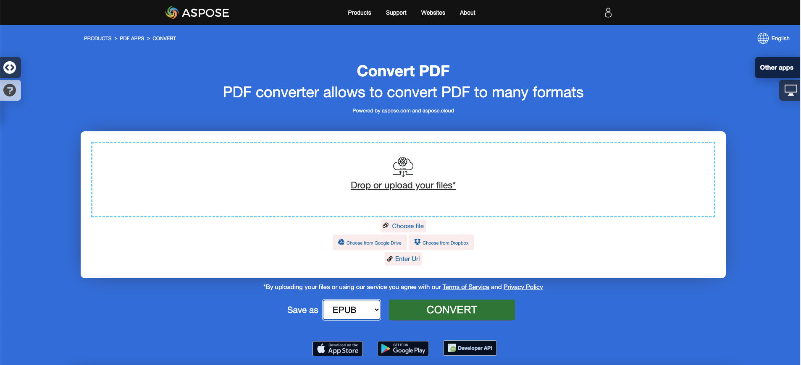

<script type="application/ld+json">
{
    "@context": "https://schema.org",
    "@type": "TechArticle",
    "headline": "Convert PDF to EPUB, LaTeX, Text, XPS in C#",
    "alternativeHeadline": "Add PDF format conversion to EPUB, LaTeX, Text, XPS in C#",
    "abstract": "Aspose.PDF for .NET 引入了一项强大的功能，允许无缝地将 PDF 文件转换为各种格式，包括 EPUB、LaTeX、文本、XPS 和 Markdown。此功能通过使开发人员能够轻松地将多种文件格式转换集成到他们的 C# 应用程序中，从而增强了文档的可访问性和可用性，满足更广泛的受众并优化不同平台的内容。",
    "author": {
        "@type": "Person",
        "name": "Anastasiia Holub",
        "givenName": "Anastasiia",
        "familyName": "Holub",
        "url": "https://www.linkedin.com/in/anastasiia-holub-750430225/"
    },
    "genre": "pdf document generation",
    "wordcount": "1419",
    "proficiencyLevel": "Beginner",
    "publisher": {
        "@type": "Organization",
        "name": "Aspose.PDF for .NET",
        "url": "https://products.aspose.com/pdf",
        "logo": "https://www.aspose.cloud/templates/aspose/img/products/pdf/aspose_pdf-for-net.svg",
        "alternateName": "Aspose",
        "sameAs": [
            "https://facebook.com/aspose.pdf/",
            "https://twitter.com/asposepdf",
            "https://www.youtube.com/channel/UCmV9sEg_QWYPi6BJJs7ELOg/featured",
            "https://www.linkedin.com/company/aspose",
            "https://stackoverflow.com/questions/tagged/aspose",
            "https://aspose.quora.com/",
            "https://aspose.github.io/"
        ],
        "contactPoint": [
            {
                "@type": "ContactPoint",
                "telephone": "+1 903 306 1676",
                "contactType": "sales",
                "areaServed": "US",
                "availableLanguage": "en"
            },
            {
                "@type": "ContactPoint",
                "telephone": "+44 141 628 8900",
                "contactType": "sales",
                "areaServed": "GB",
                "availableLanguage": "en"
            },
            {
                "@type": "ContactPoint",
                "telephone": "+61 2 8006 6987",
                "contactType": "sales",
                "areaServed": "AU",
                "availableLanguage": "en"
            }
        ]
    },
    "url": "/net/convert-pdf-to-other-files/",
    "mainEntityOfPage": {
        "@type": "WebPage",
        "@id": "/net/convert-pdf-to-other-files/"
    },
    "dateModified": "2024-11-25",
    "description": "Aspose.PDF 不仅可以执行简单和容易的任务，还可以应对更复杂的目标。请查看下一部分以获取高级用户和开发人员的信息。"
}
</script>

## 将 PDF 转换为 EPUB

{}
**尝试在线将 PDF 转换为 EPUB**

Aspose.PDF for .NET 向您提供在线免费应用程序 ["PDF to EPUB"](https://products.aspose.app/pdf/conversion/pdf-to-epub)，您可以尝试探索其功能和工作质量。

[](https://products.aspose.app/pdf/conversion/pdf-to-epub)
{}

**<abbr title="电子出版物">EPUB</abbr>** 是国际数字出版论坛 (IDPF) 提出的免费开放电子书标准。文件扩展名为 .epub。
EPUB 旨在用于可重排内容，这意味着 EPUB 阅读器可以针对特定显示设备优化文本。EPUB 还支持固定布局内容。该格式旨在作为出版商和转换公司可以在内部使用的单一格式，以及用于分发和销售。它取代了开放电子书标准。

以下代码片段也适用于 [Aspose.PDF.Drawing](/pdf/net/drawing/) 库。

Aspose.PDF for .NET 还支持将 PDF 文档转换为 EPUB 格式的功能。Aspose.PDF for .NET 有一个名为 EpubSaveOptions 的类，可以作为 [`Document.Save(..)`](https://reference.aspose.com/pdf/net/aspose.pdf/document/methods/save/index) 方法的第二个参数，用于生成 EPUB 文件。
请尝试使用以下代码片段使用 C# 完成此要求。

```csharp
// For complete examples and data files, visit https://github.com/aspose-pdf/Aspose.PDF-for-.NET
private static void ConvertPDFtoEPUB()
{
    // The path to the documents directory
    var dataDir = RunExamples.GetDataDir_AsposePdf_DocumentConversion();

    // Open PDF document
    using (var document = new Aspose.Pdf.Document(dataDir + "PDFToEPUB.pdf"))
    {
        // Instantiate Epub Save options
        EpubSaveOptions options = new EpubSaveOptions();
        // Specify the layout for contents
        options.ContentRecognitionMode = EpubSaveOptions.RecognitionMode.Flow;

        // Save ePUB document
        document.Save(dataDir + "PDFToEPUB_out.epub", options);
    }
}
```

## 将 PDF 转换为 LaTeX/TeX

**Aspose.PDF for .NET** 支持将 PDF 转换为 LaTeX/TeX。
LaTeX 文件格式是一种带有特殊标记的文本文件格式，用于基于 TeX 的文档准备系统，以实现高质量排版。

{}
**尝试在线将 PDF 转换为 LaTeX/TeX**

Aspose.PDF for .NET 向您提供在线免费应用程序 ["PDF to LaTeX"](https://products.aspose.app/pdf/conversion/pdf-to-tex)，您可以尝试探索其功能和工作质量。

[](https://products.aspose.app/pdf/conversion/pdf-to-tex)
{}

要将 PDF 文件转换为 TeX，Aspose.PDF 提供了类 [LaTeXSaveOptions](https://reference.aspose.com/pdf/net/aspose.pdf/latexsaveoptions)，该类提供了属性 OutDirectoryPath，用于在转换过程中保存临时图像。

以下代码片段展示了如何使用 C# 将 PDF 文件转换为 TEX 格式的过程。

```csharp
// For complete examples and data files, visit https://github.com/aspose-pdf/Aspose.PDF-for-.NET
private static void ConvertPDFtoTeX()
{
    // The path to the documents directory
    var dataDir = RunExamples.GetDataDir_AsposePdf_DocumentConversion();

    // Open PDF document
    using (var document = new Aspose.Pdf.Document(dataDir + "PDFToTeX.pdf"))
    {
        // Instantiate LaTex save option          
        LaTeXSaveOptions saveOptions = new LaTeXSaveOptions();

        // Specify the output directory
        string pathToOutputDirectory = dataDir;

        // Set the output directory path for save option object
        saveOptions.OutDirectoryPath = pathToOutputDirectory;

        // Save PDF document into LaTex format           
        document.Save(dataDir + "PDFToTeX_out.tex", saveOptions);
    }
}
```

## 将 PDF 转换为文本

**Aspose.PDF for .NET** 支持将整个 PDF 文档和单个页面转换为文本文件。

### 将整个 PDF 文档转换为文本文件

您可以使用 [Visit](https://reference.aspose.com/pdf/net/aspose.pdf.text/textabsorber/methods/visit/index) 方法将 PDF 文档转换为 TXT 文件，方法属于 [TextAbsorber](https://reference.aspose.com/pdf/net/aspose.pdf.text/textabsorber) 类。

以下代码片段解释了如何从所有页面中提取文本。

```csharp
// For complete examples and data files, visit https://github.com/aspose-pdf/Aspose.PDF-for-.NET
private static void ConvertPDFtoTXT()
{
    // The path to the documents directory
    var dataDir = RunExamples.GetDataDir_AsposePdf_DocumentConversion();

    // Open PDF document
    using (var document = new Aspose.Pdf.Document(dataDir + "demo.pdf"))
    {
        var ta = new Aspose.Pdf.Text.TextAbsorber();
        ta.Visit(document);

        // Save the extracted text in text file
        File.WriteAllText(dataDir + "input_Text_Extracted_out.txt",ta.Text);
    }
}
```

{}
**尝试在线将 PDF 转换为文本**

Aspose.PDF for .NET 向您提供在线免费应用程序 ["PDF to Text"](https://products.aspose.app/pdf/conversion/pdf-to-txt)，您可以尝试探索其功能和工作质量。

[](https://products.aspose.app/pdf/conversion/pdf-to-txt)
{}

### 将 PDF 页面转换为文本文件

您可以使用 Aspose.PDF for .NET 将 PDF 文档转换为 TXT 文件。您应该使用 `Visit` 方法的 `TextAbsorber` 类来解决此任务。

以下代码片段解释了如何从特定页面中提取文本。

```csharp
// For complete examples and data files, visit https://github.com/aspose-pdf/Aspose.PDF-for-.NET
private static void ConvertPDFtoTXT()
{
    // The path to the documents directory
    var dataDir = RunExamples.GetDataDir_AsposePdf_DocumentConversion();

    // Open PDF document
    using (var document = new Aspose.Pdf.Document(dataDir + "demo.pdf"))
    {
        var ta = new Aspose.Pdf.Text.TextAbsorber();
        var pages = new [] {1, 3, 4};
        foreach (var page in pages)
        {
            ta.Visit(document.Pages[page]);
        }
    
        // Save the extracted text in text file
        File.WriteAllText(dataDir + "input_Text_Extracted_out.txt", ta.Text);
    }
}
```

## 将 PDF 转换为 XPS

**Aspose.PDF for .NET** 提供将 PDF 文件转换为 <abbr title="XML Paper Specification">XPS</abbr> 格式的可能性。让我们尝试使用所提供的代码片段将 PDF 文件转换为 XPS 格式，使用 C#。

{}
**尝试在线将 PDF 转换为 XPS**

Aspose.PDF for .NET 向您提供在线免费应用程序 ["PDF to XPS"](https://products.aspose.app/pdf/conversion/pdf-to-xps)，您可以尝试探索其功能和工作质量。

[](https://products.aspose.app/pdf/conversion/pdf-to-xps)
{}

XPS 文件类型主要与微软公司的 XML Paper Specification 相关。XML Paper Specification (XPS)，前称 Metro，并包含下一代打印路径 (NGPP) 营销概念，是微软将文档创建和查看集成到 Windows 操作系统中的倡议。

要将 PDF 文件转换为 XPS，Aspose.PDF 提供了类 [XpsSaveOptions](https://reference.aspose.com/net/pdf/aspose.pdf/xpssaveoptions)，该类用作 [Document.Save(..)](https://reference.aspose.com/pdf/net/aspose.pdf/document/methods/save/index) 方法的第二个参数，以生成 XPS 文件。

自 24.2 版本以来，Aspose.PDF 实现了将可搜索 PDF 转换为 XPS，同时保持结果 XPS 中的文本可选择。为了保留文本，必须将 XpsSaveOptions.SaveTransparentTexts 属性设置为 true。

以下代码片段展示了将 PDF 文件转换为 XPS 格式的过程。

```csharp
// For complete examples and data files, visit https://github.com/aspose-pdf/Aspose.PDF-for-.NET
private static void ConvertPDFtoXPS()
{
    // The path to the documents directory
    var dataDir = RunExamples.GetDataDir_AsposePdf_DocumentConversion();

    using (var document = new Aspose.Pdf.Document(dataDir + "demo.pdf"))
    {
        var xpsOptions = new XpsSaveOptions
        {
            SaveTransparentTexts = true
        };

        // Save XPS document
        document.Save(dataDir + "PDFtoXPS_out.xps", xpsOptions);
    }
}
```

## 将 PDF 转换为 Markdown

**Aspose.PDF for .NET** 提供将 PDF 文件转换为 <abbr title="Markdown">MD</abbr> 格式的可能性。让我们尝试使用所提供的代码片段将 PDF 文件转换为 MD 格式，使用 C#。

Markdown 是一种轻量级标记语言，旨在以最大的人类可读性和机器可读性表示纯文本格式，并用于高级出版语言。

### 通过 PDF 到 Markdown 转换器优化图像使用

您可能会注意到，在包含图像的目录中，图像的数量少于 PDF 文件中的图像数量。

由于 markdown 文件无法设置图像大小，因此在没有 MarkdownSaveOptions.UseImageHtmlTag 选项的情况下，相同类型的不同大小的图片会被保存为不同的。

启用选项 MarkdownSaveOptions.UseImageHtmlTag 将保存唯一图像，这些图像在文档中通过 img 标签缩放。

该代码打开一个 PDF 文档，配置将其转换为 Markdown 文件的参数（将任何图像保存在名为“images”的文件夹中），并将生成的 Markdown 文件保存在指定的输出路径中。

以下代码片段展示了将 PDF 文件转换为 MD 格式的过程。

```csharp
// For complete examples and data files, visit https://github.com/aspose-pdf/Aspose.PDF-for-.NET
private static void ConvertPDFtoMarkup()
{
    // The path to the documents directory
    var dataDir = RunExamples.GetDataDir_AsposePdf_DocumentConversion();

    // Open PDF document
    using (var document = new Aspose.Pdf.Document(dataDir + "demo.pdf"))
    {
        // Create an instance of MarkdownSaveOptions to configure the Markdown export settings
        var saveOptions = new MarkdownSaveOptions()
        {
            // Set to false to prevent the use of HTML  tags for images in the Markdown output
            UseImageHtmlTag = false
        }
        
        // Specify the directory name where resources (like images) will be stored
        saveOptions.ResourcesDirectoryName = "images";

        // Save PDF document in Markdown format to the specified output file path using the defined save options   
        document.Save(dataDir + "PDFtoMarkup_out.md", saveOptions);
    }
}
```

### 将 PDF 转换为 MobiXml

MobiXML 是一种流行的电子书格式，旨在用于移动平台。
以下代码片段解释了如何将 PDF 文档转换为 MobiXML 文件。
```csharp
// For complete examples and data files, visit https://github.com/aspose-pdf/Aspose.PDF-for-.NET      
private static void ConvertPdfToMobiXml()
{
    // The path to the documents directory
    var dataDir = RunExamples.GetDataDir_AsposePdf_DocumentConversion();

    // Open PDF document
    using (var document = new Aspose.Pdf.Document(dataDir + "PDFToXML.pdf"))
    {
        // Save PDF document in XML format
        document.Save(dataDir + "PDFToXML_out.xml", Aspose.Pdf.SaveFormat.MobiXml);
    }
}
```