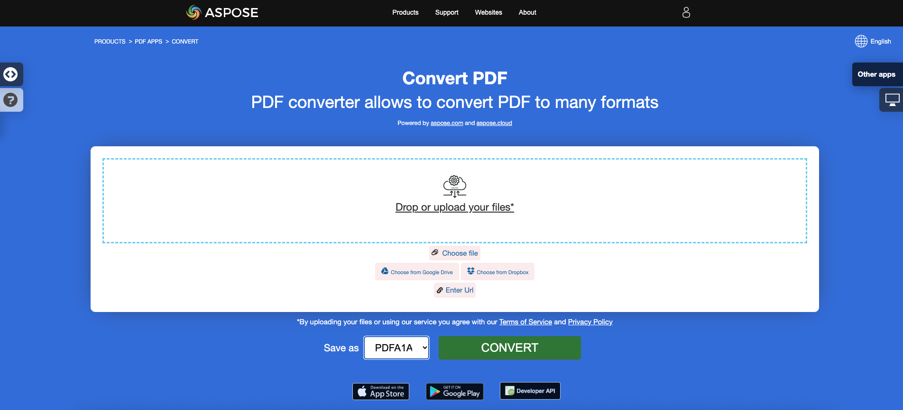

<script type="application/ld+json">
{
    "@context": "https://schema.org",
    "@type": "TechArticle",
    "headline": "Convert PDF to PDF/A formats",
    "alternativeHeadline": "Effortless PDF to PDF/A Conversion with Validation in C#",
    "abstract": "Aspose.PDF for .NET 中的功能实现了标准 PDF 文件无缝转换为各种符合 PDF/A 标准的格式，包括 PDF/A-1b、PDF/A-2u 和 PDF/A-3a。此功能不仅通过全面验证确保符合 PDF/A 标准，还允许附加其他文件和替换缺失的字体，从而增强文档的完整性和可访问性。探索 Aspose.PDF 的强大功能，以实现高效可靠的 PDF/A 转换。",
    "author": {
        "@type": "Person",
        "name": "Anastasiia Holub",
        "givenName": "Anastasiia",
        "familyName": "Holub",
        "url": "https://www.linkedin.com/in/anastasiia-holub-750430225/"
    },
    "genre": "pdf document generation",
    "wordcount": "1919",
    "proficiencyLevel": "Beginner",
    "publisher": {
        "@type": "Organization",
        "name": "Aspose.PDF for .NET",
        "url": "https://products.aspose.com/pdf",
        "logo": "https://www.aspose.cloud/templates/aspose/img/products/pdf/aspose_pdf-for-net.svg",
        "alternateName": "Aspose",
        "sameAs": [
            "https://facebook.com/aspose.pdf/",
            "https://twitter.com/asposepdf",
            "https://www.youtube.com/channel/UCmV9sEg_QWYPi6BJJs7ELOg/featured",
            "https://www.linkedin.com/company/aspose",
            "https://stackoverflow.com/questions/tagged/aspose",
            "https://aspose.quora.com/",
            "https://aspose.github.io/"
        ],
        "contactPoint": [
            {
                "@type": "ContactPoint",
                "telephone": "+1 903 306 1676",
                "contactType": "sales",
                "areaServed": "US",
                "availableLanguage": "en"
            },
            {
                "@type": "ContactPoint",
                "telephone": "+44 141 628 8900",
                "contactType": "sales",
                "areaServed": "GB",
                "availableLanguage": "en"
            },
            {
                "@type": "ContactPoint",
                "telephone": "+61 2 8006 6987",
                "contactType": "sales",
                "areaServed": "AU",
                "availableLanguage": "en"
            }
        ]
    },
    "url": "/net/convert-pdf-to-pdfa/",
    "mainEntityOfPage": {
        "@type": "WebPage",
        "@id": "/net/convert-pdf-to-pdfa/"
    },
    "dateModified": "2025-03-24",
    "description": "Aspose.PDF 不仅可以执行简单易行的任务，还能应对更复杂的目标。请查看下一部分以获取高级用户和开发人员的信息。"
}
</script>

**Aspose.PDF for .NET** 允许您将 PDF 文件转换为符合 <abbr title="可移植文档格式 / A">PDF/A</abbr> 的 PDF 文件。在此之前，必须对文件进行验证。本文将解释如何进行验证。

{}

请注意，我们遵循 Adobe Preflight 和 veraPDF 来验证 PDF/A 的符合性。市场上的所有工具都有自己对 PDF/A 符合性的“表示”。请查看本文关于 PDF/A 验证工具的参考。我们选择 Adobe 产品来验证 Aspose.PDF 生成 PDF 文件的方式，因为 Adobe 是与 PDF 相关的一切的中心。

{}

使用 Document 类的 Convert 方法转换文件。在将 PDF 转换为符合 PDF/A 的文件之前，使用 Validate 方法验证 PDF。验证结果存储在 XML 文件中，然后该结果也传递给 Convert 方法。您还可以使用 ConvertErrorAction 枚举指定无法转换的元素的操作。

{}
**尝试在线将 PDF 转换为 PDF/A**

Aspose.PDF for .NET 为您提供了在线免费应用程序 ["PDF to PDF/A-1A"](https://products.aspose.app/pdf/conversion/pdf-to-pdfa1a)，您可以尝试探索其功能和工作质量。

[](https://products.aspose.app/pdf/conversion/pdf-to-pdfa1a)
{}

以下代码片段也适用于 [Aspose.PDF.Drawing](/pdf/zh/net/drawing/) 库。

## 支持的标准
我们支持以下标准：PDF/A-1b、PDF/A-1a、PDF/A-2b、PDF/A-2u、PDF/A-2a、PDF/A-3b、PDF/A-3u、PDF/A-3a、PDF/A-4、PDF/A-4e、PDF/A-4f。

## 将 PDF 文件转换为 PDF/A-1b

以下代码片段演示如何将 PDF 文件转换为符合 PDF/A-1b 的 PDF。



```csharp
// For complete examples and data files, visit https://github.com/aspose-pdf/Aspose.PDF-for-.NET
private static void ConvertPdfToPdfA()
{
    // The path to the documents directory
    var dataDir = RunExamples.GetDataDir_AsposePdf_DocumentConversion();
    
    // Open PDF document
    using (var document = new Aspose.Pdf.Document(dataDir + "PDFToPDFA.pdf"))
    {
        // Convert to PDF/A compliant document
        // During conversion process, the validation is also performed
        document.Convert(dataDir + "PDFA1bConversionLog.xml", Aspose.Pdf.PdfFormat.PDF_A_1B, Aspose.Pdf.ConvertErrorAction.Delete);
        
        // Save PDF document
        document.Save(dataDir + "PDFToPDFA_out.pdf");
    }
}
```



```csharp
// For complete examples and data files, visit https://github.com/aspose-pdf/Aspose.PDF-for-.NET
private static void ConvertPdfToPdfA()
{
    // The path to the documents directory
    var dataDir = RunExamples.GetDataDir_AsposePdf_DocumentConversion();
    
    // Open PDF document
    using var document = new Aspose.Pdf.Document(dataDir + "PDFToPDFA.pdf");

    // Convert to PDF/A compliant document
    // During conversion process, the validation is also performed
    document.Convert(dataDir + "PDFA1bConversionLog.xml", Aspose.Pdf.PdfFormat.PDF_A_1B, Aspose.Pdf.ConvertErrorAction.Delete);
    
    // Save PDF document
    document.Save(dataDir + "PDFToPDFA_out.pdf");
}
```



要仅执行验证，请使用以下代码行：



```csharp
// For complete examples and data files, visit https://github.com/aspose-pdf/Aspose.PDF-for-.NET
private static void ValidatePdfAStandard()
{
    // The path to the documents directory
    var dataDir = RunExamples.GetDataDir_AsposePdf_WorkingDocuments();
    
    // Open PDF document
    using (var document = new Aspose.Pdf.Document(dataDir + "ValidatePDFAStandard.pdf"))
    {
        // Validate PDF for PDF/A-1a
        document.Validate(dataDir + "ValidationResultA1b.xml", Aspose.Pdf.PdfFormat.PDF_A_1B);
    }
}
```



```csharp
// For complete examples and data files, visit https://github.com/aspose-pdf/Aspose.PDF-for-.NET
private static void ValidatePdfAStandard()
{
    // The path to the documents directory
    var dataDir = RunExamples.GetDataDir_AsposePdf_WorkingDocuments();

    // Open PDF document
    using var document = new Aspose.Pdf.Document(dataDir + "ValidatePDFAStandard.pdf");

    // Validate PDF for PDF/A-1a
    document.Validate(dataDir + "ValidationResultA1b.xml", Aspose.Pdf.PdfFormat.PDF_A_1B);
}
```



## 将 PDF 文件转换为 PDF/A-3b

Aspose.PDF for .NET 还支持将 PDF 文件转换为 PDF/A-3b 格式的功能。



```csharp
// For complete examples and data files, visit https://github.com/aspose-pdf/Aspose.PDF-for-.NET
private static void ConvertPdfToPdfA3b()
{
    // The path to the documents directory
    var dataDir = RunExamples.GetDataDir_AsposePdf_DocumentConversion();
    
    // Open PDF document
    using (var document = new Aspose.Pdf.Document(dataDir + "PDFToPDFA.pdf"))
    {
        // Convert to PDF/A compliant document, log file is omitted
        document.Convert(Stream.Null, Aspose.Pdf.PdfFormat.PDF_A_3B, Aspose.Pdf.ConvertErrorAction.Delete);
        
        // Save PDF document
        document.Save(dataDir + "PDFToPDFA3b_out.pdf");
    }
}
```



```csharp
// For complete examples and data files, visit https://github.com/aspose-pdf/Aspose.PDF-for-.NET
private static void ConvertPdfToPdfA3b()
{
    // The path to the documents directory
    var dataDir = RunExamples.GetDataDir_AsposePdf_DocumentConversion();

    // Open PDF document
    using var document = new Aspose.Pdf.Document(dataDir + "PDFToPDFA.pdf");

    // Convert to PDF/A compliant document, log file is omitted
    document.Convert(Stream.Null, Aspose.Pdf.PdfFormat.PDF_A_3B, Aspose.Pdf.ConvertErrorAction.Delete);

    // Save PDF document
    document.Save(dataDir + "PDFToPDFA3b_out.pdf");
}
```



## 将 PDF 文件转换为 PDF/A-4

Aspose.PDF for .NET 还支持将 PDF 文件转换为 PDF/A-4 格式的功能。



```csharp
// For complete examples and data files, visit https://github.com/aspose-pdf/Aspose.PDF-for-.NET
private static void ConvertPdfToPdfA4()
{
    // The path to the documents directory
    var dataDir = RunExamples.GetDataDir_AsposePdf_DocumentConversion();
    
    // Open PDF document
    using (var document = new Aspose.Pdf.Document(dataDir + "PDFToPDFA.pdf"))
    {
        // If the document version is less than PDF-2.0, it must be converted to PDF-2.0
        document.Convert(Stream.Null, Aspose.Pdf.PdfFormat.v_2_0, Aspose.Pdf.ConvertErrorAction.Delete);
    
        // Convert to the PDF/A-4 format
        document.Convert(dataDir + "PDFA4ConversionLog.xml", Aspose.Pdf.PdfFormat.PDF_A_4, Aspose.Pdf.ConvertErrorAction.Delete);

        // Save PDF document
        document.Save(dataDir + "PDFToPDFA4_out.pdf");
    }
}
```



```csharp
// For complete examples and data files, visit https://github.com/aspose-pdf/Aspose.PDF-for-.NET
private static void ConvertPdfToPdfA4()
{
    // The path to the documents directory
    var dataDir = RunExamples.GetDataDir_AsposePdf_DocumentConversion();

    // Open PDF document
    using var document = new Aspose.Pdf.Document(dataDir + "PDFToPDFA.pdf");

    // If the document version is less than PDF-2.0, it must be converted to PDF-2.0
    document.Convert(Stream.Null, Aspose.Pdf.PdfFormat.v_2_0, Aspose.Pdf.ConvertErrorAction.Delete);

    // Convert to the PDF/A-4 format
    document.Convert(dataDir + "PDFA4ConversionLog.xml", Aspose.Pdf.PdfFormat.PDF_A_4, Aspose.Pdf.ConvertErrorAction.Delete);

    // Save PDF document
    document.Save(dataDir + "PDFToPDFA4_out.pdf");
}
```



## 向 PDF/A 文件添加附件

如果您需要向符合 PDF/A 的文档附加文件，则建议使用 Aspose.PDF.PdfFormat 枚举中的 PDF_A_3A 值。
PDF/A-3a 是提供将任何文件格式作为附件附加到符合 PDF/A 文件的格式。



```csharp
// For complete examples and data files, visit https://github.com/aspose-pdf/Aspose.PDF-for-.NET
private static void AddAttachmentToPdfA()
{
    // The path to the documents directory
    var dataDir = RunExamples.GetDataDir_AsposePdf_DocumentConversion();
    
    // Open PDF document
    using (var document = new Aspose.Pdf.Document(dataDir + "PDFToPDFA.pdf"))
    {
        // Setup new file to be added as attachment
        using (var fileSpecification = new Aspose.Pdf.FileSpecification(dataDir + "aspose-logo.jpg", "Large Image file"))
        {
            // Add attachment to document's attachment collection
            document.EmbeddedFiles.Add(fileSpecification);

            // Perform conversion to PDF/A-3a, so that the attachment is included in the resultant file
            document.Convert(dataDir + "PDFA3aConversionLog.xml", Aspose.Pdf.PdfFormat.PDF_A_3A, Aspose.Pdf.ConvertErrorAction.Delete);

            // Save PDF document
            document.Save(dataDir + "AddAttachmentToPDFA_out.pdf");
        }
    }
}
```



```csharp
// For complete examples and data files, visit https://github.com/aspose-pdf/Aspose.PDF-for-.NET
private static void AddAttachmentToPdfA()
{
    // The path to the documents directory
    var dataDir = RunExamples.GetDataDir_AsposePdf_DocumentConversion();

    // Open PDF document
    using var document = new Aspose.Pdf.Document(dataDir + "PDFToPDFA.pdf");

    // Setup new file to be added as attachment
    using var fileSpecification = new Aspose.Pdf.FileSpecification(dataDir + "aspose-logo.jpg", "Large Image file");

    // Add attachment to document's attachment collection
    document.EmbeddedFiles.Add(fileSpecification);

    // Perform conversion to PDF/A-3a, so that the attachment is included in the resultant file
    document.Convert(dataDir + "PDFA3aConversionLog.xml", Aspose.Pdf.PdfFormat.PDF_A_3A, Aspose.Pdf.ConvertErrorAction.Delete);

    // Save PDF document
    document.Save(dataDir + "AddAttachmentToPDFA_out.pdf");
}
```



## 用替代字体替换缺失的字体

根据 PDF/A 标准，字体应嵌入 PDF/A 文档中。然而，如果源文档中未嵌入字体且机器上不存在这些字体，则 PDF/A 转换将失败。在这种情况下，有必要用机器上存在的一些替代字体替换缺失的字体。在 PDF 到 PDF/A 转换过程中，可以使用 SimpleFontSubsitution 类替换缺失的字体。



```csharp
// For complete examples and data files, visit https://github.com/aspose-pdf/Aspose.PDF-for-.NET
private static void ReplaceMissingFonts()
{
    // The path to the documents directory
    var dataDir = RunExamples.GetDataDir_AsposePdf_DocumentConversion();

    try
    {
        // Check whether a font, used in the source document, is installed in the system
        Aspose.Pdf.Text.FontRepository.FindFont("AgencyFB");
    }
    catch (Aspose.Pdf.FontNotFoundException)
    {
        // Font is missing on the destination machine. Replace it with the Arial font installed in the system
        var fontSubstitution = new Aspose.Pdf.Text.SimpleFontSubstitution("AgencyFB", "Arial");
        Aspose.Pdf.Text.FontRepository.Substitutions.Add(fontSubstitution);
    }

    // Open PDF document
    using (var document = new Aspose.Pdf.Document(dataDir + "PDFToPDFA.pdf"))
    {
        // During the conversion, the missing font will be replaced with the substitution one
        document.Convert(dataDir + "ReplaceMissingFonts.xml", PdfFormat.PDF_A_1B, ConvertErrorAction.Delete);

        // Save PDF document
        document.Save(dataDir + "ReplaceMissingFonts_out.pdf");
    }
}
```



```csharp
// For complete examples and data files, visit https://github.com/aspose-pdf/Aspose.PDF-for-.NET
private static void ReplaceMissingFonts()
{
    // The path to the documents directory
    var dataDir = RunExamples.GetDataDir_AsposePdf_DocumentConversion();

    try
    {
        // Check whether a font, used in the source document, is installed in the system
        Aspose.Pdf.Text.FontRepository.FindFont("AgencyFB");
    }
    catch (Aspose.Pdf.FontNotFoundException)
    {
        // Font is missing on the destination machine. Replace it with the Arial font installed in the system
        var fontSubstitution = new Aspose.Pdf.Text.SimpleFontSubstitution("AgencyFB", "Arial");
        Aspose.Pdf.Text.FontRepository.Substitutions.Add(fontSubstitution);
    }

    // Open PDF document
    using var document = new Aspose.Pdf.Document(dataDir + "PDFToPDFA.pdf");

    // During the conversion, the missing font will be replaced with the substitution one
    document.Convert(dataDir + "ReplaceMissingFonts.xml", PdfFormat.PDF_A_1B, ConvertErrorAction.Delete);

    // Save PDF document
    document.Save(dataDir + "ReplaceMissingFonts_out.pdf");
}
```



## 自动创建文档逻辑结构标签

为了提高可访问性和逻辑结构，PDF 文档可以包含逻辑结构标签，这些标签框架文档内容并将其划分为逻辑部分、章节、段落等。Aspose.PDF 允许在文档转换为 PDF/A 时自动生成基本的逻辑结构标记。用户可以手动改进此基本逻辑结构，提供有关文档内容的额外见解。

要生成逻辑文档结构，请创建 [Aspose.Pdf.AutoTaggingSettings](https://reference.aspose.com/pdf/zh/net/aspose.pdf/autotaggingsettings/) 类的实例，将其 [AutoTaggingSettings.EnableAutoTagging](https://reference.aspose.com/pdf/zh/net/aspose.pdf/autotaggingsettings/enableautotagging/) 设置为 `true`，并将其分配给 [PdfFormatConversionOptions.AutoTaggingSettings](https://reference.aspose.com/pdf/zh/net/aspose.pdf/pdfformatconversionoptions/autotaggingsettings/) 属性。

{}
请注意，如果文档已经具有逻辑结构标签，则启用自动标记将破坏现有的逻辑结构并生成一个新的结构。
{}



```csharp
// For complete examples and data files, visit https://github.com/aspose-pdf/Aspose.PDF-for-.NET
private static void ConvertToPdfAWithAutomaticTagging()
{
    // The path to the documents directory
    string dataDir = RunExamples.GetDataDir_AsposePdf_DocumentConversion();

    // Open PDF document
    using (var document = new Aspose.Pdf.Document(dataDir + "PDFToPDFA.pdf"))
    {
        // Create conversion options
        Aspose.Pdf.PdfFormatConversionOptions options = new Aspose.Pdf.PdfFormatConversionOptions(dataDir + "ConvertToPdfAWithAutomaticTagging.xml", PdfFormat.PDF_A_1B, ConvertErrorAction.Delete);

        // Create auto-tagging settings
        // Aspose.Pdf.AutoTaggingSettings.Default may be used to set the same settings as given below
        Aspose.Pdf.AutoTaggingSettings autoTaggingSettings = new Aspose.Pdf.AutoTaggingSettings();

        // Enable auto-tagging during the conversion process
        autoTaggingSettings.EnableAutoTagging = true;

        // Use the heading recognition strategy that's optimal for the given document structure
        autoTaggingSettings.HeadingRecognitionStrategy = Aspose.Pdf.HeadingRecognitionStrategy.Auto;

        // Assign auto-tagging settings to be used during the conversion process
        options.AutoTaggingSettings = autoTaggingSettings;

        // During the conversion, the document logical structure will be automatically created
        document.Convert(options);

        // Save PDF document
        document.Save(dataDir + "ConvertToPdfAWithAutomaticTagging_out.pdf");
    }
}
```




```csharp
// For complete examples and data files, visit https://github.com/aspose-pdf/Aspose.PDF-for-.NET
private static void ConvertToPdfAWithAutomaticTagging()
{
    // The path to the documents directory
    string dataDir = RunExamples.GetDataDir_AsposePdf_DocumentConversion();

    // Open PDF document
    using var document = new Aspose.Pdf.Document(dataDir + "PDFToPDFA.pdf");

    // Create conversion options
    Aspose.Pdf.PdfFormatConversionOptions options = new Aspose.Pdf.PdfFormatConversionOptions(dataDir + "ConvertToPdfAWithAutomaticTagging.xml", PdfFormat.PDF_A_1B, ConvertErrorAction.Delete);

    // Create auto-tagging settings
    // Aspose.Pdf.AutoTaggingSettings.Default may be used to set the same settings as given below
    Aspose.Pdf.AutoTaggingSettings autoTaggingSettings = new Aspose.Pdf.AutoTaggingSettings
    {
        // Enable auto-tagging during the conversion process
        EnableAutoTagging = true,

        // Use the heading recognition strategy that's optimal for the given document structure
        HeadingRecognitionStrategy = Aspose.Pdf.HeadingRecognitionStrategy.Auto
    };

    // Assign auto-tagging settings to be used during the conversion process
    options.AutoTaggingSettings = autoTaggingSettings;

    // During the conversion, the document logical structure will be automatically created
    document.Convert(options);

    // Save PDF document
    document.Save(dataDir + "ConvertToPdfAWithAutomaticTagging_out.pdf");
}
```


