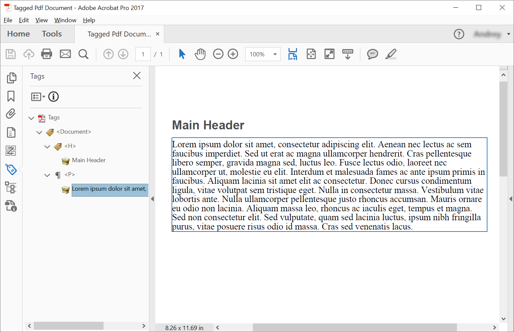

创建标签 PDF 意味着向文档中添加（或创建）特定元素，使文档能够根据 PDF/UA 要求进行验证。这些元素通常称为结构元素。

## 创建标签 PDF（简单场景）

为了在标签 PDF 文档中创建结构元素，Aspose.PDF 提供了使用 [ITaggedContent](https://reference.aspose.com/pdf/python-net/aspose.pdf.tagged/itaggedcontent/) 接口创建结构元素的方法。本示例创建了一个标签 PDF 文档——具有语义结构的 PDF，使其更易访问并符合 PDF/UA 等标准。
以下代码片段展示了如何创建包含 2 个元素：标题和段落的标签 PDF。

```python

    import aspose.pdf as ap

    # Create PDF Document
    document = ap.Document()

    # Get Content for working with TaggedPdf
    tagged_content = document.tagged_content
    root_element = tagged_content.root_element

    # Set Title and Language for Document
    tagged_content.set_title("Tagged Pdf Document")
    tagged_content.set_language("en-US")
    main_header = tagged_content.create_header_element()
    main_header.set_text("Main Header")
    paragraph_element = tagged_content.create_paragraph_element()
    paragraph_element.set_text("Lorem ipsum dolor sit amet, consectetur adipiscing elit. " +
                                "Aenean nec lectus ac sem faucibus imperdiet. Sed ut erat ac magna ullamcorper hendrerit. " +
                                "Cras pellentesque libero semper, gravida magna sed, luctus leo. Fusce lectus odio, laoreet" +
                                "nec ullamcorper ut, molestie eu elit. Interdum et malesuada fames ac ante ipsum primis in faucibus." +
                                "Aliquam lacinia sit amet elit ac consectetur. Donec cursus condimentum ligula, vitae volutpat" +
                                "sem tristique eget. Nulla in consectetur massa. Vestibulum vitae lobortis ante. Nulla ullamcorper" +
                                "pellentesque justo rhoncus accumsan. Mauris ornare eu odio non lacinia. Aliquam massa leo, rhoncus" +
                                "ac iaculis eget, tempus et magna. Sed non consectetur elit. Sed vulputate, quam sed lacinia luctus," +
                                "ipsum nibh fringilla purus, vitae posuere risus odio id massa. Cras sed venenatis lacus.")
    root_element.append_child(main_header, True)
    root_element.append_child(paragraph_element, True)

    # Save Tagged PDF Document
    document.save(path_outfile)
```

```python

    import aspose.pdf as ap

    # Create PDF Document
    document = ap.Document()

    # Get Content for working with TaggedPdf
    tagged_content = document.tagged_content
    root_element = tagged_content.root_element

    # Set Title and Language for Document
    tagged_content.set_title("Tagged Pdf Document")
    tagged_content.set_language("en-US")

    # Create Header Level 1
    header1 = tagged_content.create_header_element(1)
    header1.set_text("Header Level 1")

    # Create Paragraph with Quotes
    paragraph_with_quotes = tagged_content.create_paragraph_element()
    paragraph_with_quotes.structure_text_state.font = ap.text.FontRepository.find_font("Calibri")
    position_settings = ap.tagged.PositionSettings()
    position_settings.margin = ap.MarginInfo(10, 5, 10, 5)
    paragraph_with_quotes.adjust_position(position_settings)

    # Create Span Element
    span_element1 = tagged_content.create_span_element()
    span_element1.set_text(
        "Lorem ipsum dolor sit amet, consectetur adipiscing elit. Aenean nec lectus ac sem faucibus imperdiet. "
        "Sed ut erat ac magna ullamcorper hendrerit. Cras pellentesque libero semper, gravida magna sed, "
        "luctus leo. Fusce lectus odio, laoreet nec ullamcorper ut, molestie eu elit. Interdum et malesuada "
        "fames ac ante ipsum primis in faucibus. Aliquam lacinia sit amet elit ac consectetur. Donec cursus "
        "condimentum ligula, vitae volutpat sem tristique eget. Nulla in consectetur massa. Vestibulum vitae "
        "lobortis ante. Nulla ullamcorper pellentesque justo rhoncus accumsan. Mauris ornare eu odio non "
        "lacinia. Aliquam massa leo, rhoncus ac iaculis eget, tempus et magna. Sed non consectetur elit.")

    # Create Quote Element
    quote_element = tagged_content.create_quote_element()
    quote_element.set_text(
        "Sed vulputate, quam sed lacinia luctus, ipsum nibh fringilla purus, vitae posuere risus odio id massa.")
    quote_element.structure_text_state.font_style = ap.text.FontStyles.BOLD | ap.text.FontStyles.ITALIC

    # Create Another Span Element
    span_element2 = tagged_content.create_span_element()
    span_element2.set_text(" Sed non consectetur elit.")

    # Append Children to Paragraph
    paragraph_with_quotes.append_child(span_element1, True)
    paragraph_with_quotes.append_child(quote_element, True)
    paragraph_with_quotes.append_child(span_element2, True)

    # Append Header and Paragraph to Root Element
    root_element.append_child(header1, True)
    root_element.append_child(paragraph_with_quotes, True)

    # Save Tagged PDF Document
    document.save(path_outfile)
```

创建后我们将得到如下文档：



## 文本结构样式化

标签 PDF 是结构化文档，提供可访问性功能和内容的语义意义。

本示例通过使用标签内容结构创建了具备可访问性功能的 PDF 文档。它演示了如何使用自定义样式和适当的文档元数据创建段落元素。

```python

    import aspose.pdf as ap

    # Create PDF Document
    with ap.Document() as document:
        # Get Content for work with TaggedPdf
        tagged_content = document.tagged_content

        # Set Title and Language for Document
        tagged_content.set_title("Tagged Pdf Document")
        tagged_content.set_language("en-US")

        paragraph_element = tagged_content.create_paragraph_element()
        tagged_content.root_element.append_child(paragraph_element, True)

        paragraph_element.structure_text_state.font_size = 18.0
        paragraph_element.structure_text_state.foreground_color = ap.Color.red
        paragraph_element.structure_text_state.font_style = ap.text.FontStyles.ITALIC

        paragraph_element.set_text("Red italic text.")

        # Save Tagged PDF Document
        document.save(path_outfile)
```

## 结构元素示例

标签 PDF 对于可访问性合规至关重要，并提供结构化内容，可被屏幕阅读器和其他辅助技术正确解释。以下代码片段展示了如何创建包含嵌入图像的标签 PDF 文档：

1. 创建带图像的标签 PDF。
1. 配置文档。
1. 创建并配置图形。
1. 设置定位。
1. 保存文档。

```python

    import aspose.pdf as ap

    # Create PDF Document
    with ap.Document() as document:
        # Get Content for work with TaggedPdf
        tagged_content = document.tagged_content

        # Set Title and Language for Document
        tagged_content.set_title("Tagged Pdf Document")
        tagged_content.set_language("en-US")
        figure1 = tagged_content.create_figure_element()
        tagged_content.root_element.append_child(figure1, True)
        figure1.alternative_text = "Figure One"
        figure1.title = "Image 1"
        figure1.set_tag("Fig1")
        figure1.set_image(path_imagefile, 300)
        # Adjust position
        position_settings = ap.tagged.PositionSettings()
        margin_info = ap.MarginInfo()
        margin_info.left = 50
        margin_info.top = 20
        position_settings.margin = margin_info
        figure1.adjust_position(position_settings)

        # Save Tagged PDF Document
        document.save(path_outfile)
```

## 验证标签 PDF

Aspose.PDF for Python via .NET 提供了验证 PDF/UA 标签 PDF 文档的功能。'validate_tagged_pdf' 方法根据 PDF/UA-1 标准（ISO 14289 可访问 PDF 文档规范的一部分）验证 PDF 文档。这确保 PDF 对残障用户和辅助技术是可访问的。

- 文档结构。正确的语义标签和逻辑结构。
- 替代文本。图像和非文本元素的 Alt 文本。
- 阅读顺序。屏幕阅读器的逻辑顺序。
- 颜色和对比度。足够的对比度比例。
- 表单。可访问的表单字段和标签。
- 导航。正确的书签和导航结构。

```python

    import aspose.pdf as ap

    # Open PDF document
    with ap.Document(path_infile) as document:
        is_valid = document.validate(path_logfile, ap.PdfFormat.PDF_UA_1)
```

## 调整文本结构位置

以下代码片段展示了如何在标签 PDF 文档中调整文本结构的位置：

```python

    import aspose.pdf as ap

    # Create PDF Document
    with ap.Document() as document:
        # Get Content for work with TaggedPdf
        tagged_content = document.tagged_content

        # Set Title and Language for Document
        tagged_content.set_title("Tagged Pdf Document")
        tagged_content.set_language("en-US")

        # Create paragraph
        paragraph = tagged_content.create_paragraph_element()
        tagged_content.root_element.append_child(paragraph, True)
        paragraph.set_text("Text.")

        # Adjust position
        position_settings = ap.tagged.PositionSettings()
        margin_info = ap.MarginInfo()
        margin_info.left = 300
        margin_info.top = 20
        margin_info.right = 0
        margin_info.bottom = 0
        position_settings.margin = margin_info
        position_settings.horizontal_alignment = ap.HorizontalAlignment.NONE
        position_settings.vertical_alignment = ap.VerticalAlignment.NONE
        position_settings.is_first_paragraph_in_column = False
        position_settings.is_kept_with_next = False
        position_settings.is_in_new_page = False
        position_settings.is_in_line_paragraph = False
        paragraph.adjust_position(position_settings)

        # Save Tagged PDF Document
        document.save(path_outfile)
```

## 使用 PDF/UA-1 转换自动创建标签 PDF

Aspose.PDF 在将文档转换为 PDF/UA-1 时能够自动生成基本的逻辑结构标记。随后用户可以手动改进此基本逻辑结构，提供有关文档内容的更多洞见。

该代码片段将现有 PDF 文档转换为 PDF/UA-1 格式，这是一项 ISO 标准（ISO 14289-1），确保 PDF 文档对残障用户可访问。转换包括自动对文档元素进行标记，以创建逻辑结构。

```python

    import aspose.pdf as ap

    # Create PDF Document
    with ap.Document(path_infile) as document:
        # Create conversion options
        options = ap.PdfFormatConversionOptions(path_logfile, ap.PdfFormat.PDF_UA_1, ap.ConvertErrorAction.DELETE)
        # Create auto-tagging settings
        # aspose.pdf.AutoTaggingSettings.default may be used to set the same settings as given below
        auto_tagging_settings = ap.AutoTaggingSettings()
        # Enable auto-tagging during the conversion process
        auto_tagging_settings.enable_auto_tagging = True
        # Use the heading recognition strategy that's optimal for the given document structure
        auto_tagging_settings.heading_recognition_strategy = ap.HeadingRecognitionStrategy.AUTO
        # Assign auto-tagging settings to be used during the conversion process
        options.auto_tagging_settings = auto_tagging_settings
        # During the conversion, the document logical structure will be automatically created
        document.convert(options)
        # Save PDF document
        document.save(path_outfile)
```
