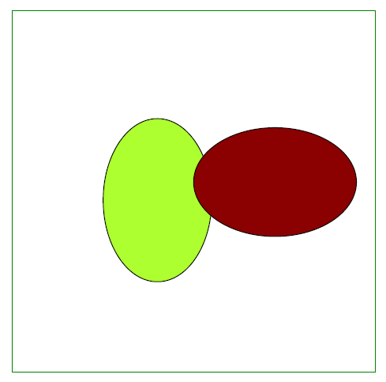
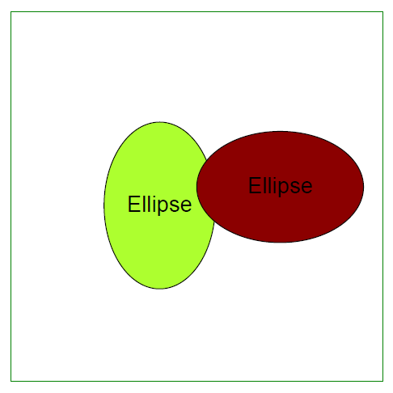

## 添加椭圆对象

Aspose.PDF for Python via .NET 支持向 PDF 文档中添加 [椭圆](https://reference.aspose.com/pdf/python-net/aspose.pdf.drawing/ellipse/) 对象。它还提供了用特定颜色填充椭圆对象的功能。

本示例说明了如何使用 Aspose.PDF for Python via .NET 编程方式在 PDF 文档中绘制和自定义椭圆。通过利用绘图模块，开发者可以创建具有外观和位置精确控制的复杂图形元素。这一功能对于需要在 PDF 中动态生成图形内容的应用至关重要，例如技术图表、图形或自定义插图。

```python

    import aspose.pdf as ap
    import aspose.pdf.drawing as drawing
    import datetime

    # Create PDF document
    document = ap.Document()

    # Add a page
    page = document.pages.add()

    # Create Drawing object with certain dimensions
    graph = drawing.Graph(400, 400)

    # Set border for Drawing object
    border_info = ap.BorderInfo(ap.BorderSide.ALL, ap.Color.green)
    graph.border = border_info

    # Create first ellipse with specified coordinates and radii
    ellipse1 = drawing.Ellipse(150, 100, 120, 60)
    ellipse1.graph_info.color = ap.Color.green_yellow
    ellipse1.text = ap.TextFragment("Ellipse")

    # Add first ellipse to graph
    graph.shapes.add(ellipse1)

    # Create second ellipse with different dimensions and color
    ellipse2 = drawing.Ellipse(50, 50, 18, 300)
    ellipse2.graph_info.color = ap.Color.dark_red

    # Add second ellipse to graph
    graph.shapes.add(ellipse2)

    # Add Graph object to paragraphs collection of page
    page.paragraphs.add(graph)

    # Save PDF document
    document.save(path_outfile)

```


## 创建已填充椭圆对象

下面的代码片段展示了如何添加一个已填充颜色的 [椭圆](https://reference.aspose.com/pdf/python-net/aspose.pdf.drawing/ellipse/) 对象。

```python

    import aspose.pdf as ap
    import aspose.pdf.drawing as drawing
    import datetime

    # Create PDF document
    document = ap.Document()

    # Add a page
    page = document.pages.add()

    # Create Drawing object with certain dimensions
    graph = drawing.Graph(400, 400)

    # Set border for Drawing object
    border_info = ap.BorderInfo(ap.BorderSide.ALL, ap.Color.green)
    graph.border = border_info

    # Create first ellipse and set its fill color
    ellipse1 = drawing.Ellipse(100, 100, 120, 180)
    ellipse1.graph_info.fill_color = ap.Color.green_yellow

    # Add first ellipse to graph
    graph.shapes.add(ellipse1)

    # Create second ellipse and set its fill color
    ellipse2 = drawing.Ellipse(200, 150, 180, 120)
    ellipse2.graph_info.fill_color = ap.Color.dark_red

    # Add second ellipse to graph
    graph.shapes.add(ellipse2)

    # Add Graph object to paragraphs collection of page
    page.paragraphs.add(graph)

    # Save PDF document
    document.save(path_outfile)
```



## 在椭圆内添加文本

Aspose.PDF for Python via .NET 支持在 Graph 对象内部添加文本。Graph 对象的 Text 属性提供了设置 Graph 对象文本的选项。下面的代码片段展示了如何在椭圆对象内部添加文本。

```python

    import aspose.pdf as ap
    import aspose.pdf.drawing as drawing
    import datetime

    # Create Document instance
    document = ap.Document()

    # Add page to pages collection of PDF file
    page = document.pages.add()

    # Create Graph instance
    graph = drawing.Graph(400, 400)

    # Set border for Drawing object
    border_info = ap.BorderInfo(ap.BorderSide.ALL, ap.Color.green)
    graph.border = border_info

    text_fragment = ap.text.TextFragment("Ellipse")
    text_fragment.text_state.font = ap.text.FontRepository.find_font("Helvetica")
    text_fragment.text_state.font_size = 24

    ellipse1 = ap.drawing.Ellipse(100, 100, 120, 180)
    ellipse1.graph_info.fill_color = ap.Color.green_yellow
    ellipse1.text = text_fragment
    graph.shapes.append(ellipse1)

    ellipse2 = ap.drawing.Ellipse(200, 150, 180, 120)
    ellipse2.graph_info.fill_color = ap.Color.dark_red
    ellipse2.text = text_fragment
    graph.shapes.append(ellipse2)

    # Add Graph object to paragraphs collection of page
    page.paragraphs.add(graph)

    # Save PDF file
    document.save(path_outfile)
```



