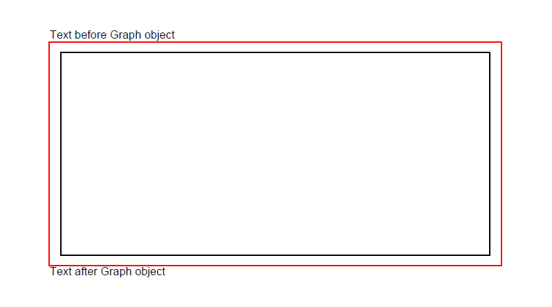
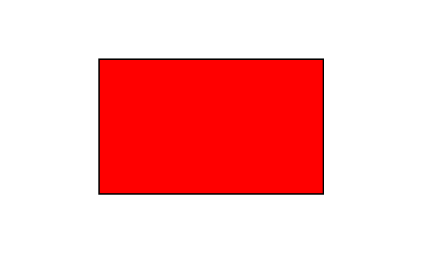

## 添加矩形对象

Aspose.PDF for Python via .NET 支持向 PDF 文档添加图形对象（例如图形、线条、矩形等）的功能。您还可以添加 [Rectangle](https://reference.aspose.com/pdf/python-net/aspose.pdf.drawing/rectangle/) 对象，并提供填充矩形对象的功能。

首先，让我们看看创建矩形对象的可能性。

请按照以下步骤操作：

1. 创建一个新的 PDF [Document](https://reference.aspose.com/pdf/python-net/aspose.pdf/document/)。
1. 向 PDF 文件的页面集合中添加 [Page](https://reference.aspose.com/pdf/python-net/aspose.pdf/page/)。
1. 向页面实例的段落集合中添加 [Text fragment](https://reference.aspose.com/pdf/python-net/aspose.pdf/texfragment/)。
1. 创建 [Graph](https://reference.aspose.com/pdf/python-net/aspose.pdf.drawing/graph/) 实例。
1. 为 [Drawing object](https://reference.aspose.com/pdf/python-net/aspose.pdf.drawing/) 设置边框。
1. 将 [Rectangle](https://reference.aspose.com/pdf/python-net/aspose.pdf.drawing/rectangle/) 对象添加到 Graph 对象的形状集合中。
1. 将图形对象添加到页面实例的段落集合中。
1. 向页面实例的段落集合中添加 [Text fragment](https://reference.aspose.com/pdf/python-net/aspose.pdf/texfragment/)。
1. 保存您的 PDF 文件

```python

    import aspose.pdf as ap
    import aspose.pdf.drawing as drawing
    import datetime

    # Create Document instance
    document = ap.Document()

    # Add page to pages collection of PDF file
    page = document.pages.add()
    text_fragment = ap.text.TextFragment("Rectangle")

    # Add Text fragment to paragraphs collection of page instance
    page.paragraphs.add(text_fragment)

    # Create Graph instance
    graph = drawing.Graph(400, 300)

    # Add graph object to paragraphs collection of page instance
    page.paragraphs.add(graph)

    # Set border for Drawing object
    border_info = ap.BorderInfo(ap.BorderSide.ALL, ap.Color.red)
    graph.border = border_info

    # Create Rectangle instance
    rect = drawing.Rectangle(20, 20, 350, 250)

    # Add rectangle object to shape collection of Graph object
    graph.shapes.append(rect)

    # Add Text fragment to paragraphs collection of page instance
    page.paragraphs.add(text_fragment)

    # Save PDF file
    document.save(path_outfile)
```



## 创建填充矩形对象

Aspose.PDF for Python via .NET 还提供了用特定颜色填充矩形对象的功能。

以下代码片段展示了如何添加一个填充颜色的 [Rectangle](https://reference.aspose.com/pdf/python-net/aspose.pdf.drawing/rectangle/) 对象。

```python

    import aspose.pdf as ap
    import aspose.pdf.drawing as drawing
    import datetime

    # Create PDF document
    document = ap.Document()

    # Add a page
    page = document.pages.add()

    # Create Graph instance
    graph = drawing.Graph(100, 400)

    # Add graph object to the paragraphs collection of the page instance
    page.paragraphs.add(graph)

    # Create Rectangle instance with specified dimensions
    rect = drawing.Rectangle(100, 100, 200, 120)

    # Specify fill color for the Rectangle object
    rect.graph_info.fill_color = ap.Color.red

    # Add rectangle object to the shapes collection of the Graph object
    graph.shapes.add(rect)

    # Save PDF document
    document.save(path_outfile)
```

查看填充纯色的矩形效果：



## 添加带渐变填充的绘图

Aspose.PDF for Python via .NET 支持向 PDF 文档添加图形对象，有时需要用渐变颜色填充图形对象。

以下代码片段展示了如何添加一个填充渐变颜色的 [Rectangle](https://reference.aspose.com/pdf/python-net/aspose.pdf.drawing/rectangle/) 对象。

```python

    import aspose.pdf as ap
    import aspose.pdf.drawing as drawing
    import datetime

    # Create Document instance
    document = ap.Document()

    # Add page to pages collection of PDF file
    page = document.pages.add()

    # Create Graph instance
    graph = drawing.Graph(400, 400)

    # Add graph object to paragraphs collection of page instance
    page.paragraphs.add(graph)

    # Create Rectangle instance
    rect = drawing.Rectangle(0, 0, 300, 300)

    # Specify fill color for Graph object
    gradient_color = ap.Color()
    gradient_settings = drawing.GradientAxialShading(ap.Color.red, ap.Color.blue)
    gradient_settings.start = ap.Point(0, 0)
    gradient_settings.end = ap.Point(350, 350)
    gradient_color.pattern_color_space = gradient_settings
    rect.graph_info.fill_color = gradient_color

    # Add rectangle object to shape collection of Graph object
    graph.shapes.append(rect)

    # Save PDF file
    document.save(output_file)
```


## 创建具有 Alpha 颜色通道的矩形

Aspose.PDF for Python .NET 支持用特定颜色填充矩形对象。矩形对象还可以拥有 Alpha 颜色通道以实现透明外观。以下代码片段展示了如何添加一个具有 Alpha 颜色通道的 [Rectangle](https://reference.aspose.com/pdf/python-net/aspose.pdf.drawing/rectangle/) 对象。

```python

    import aspose.pdf as ap
    import aspose.pdf.drawing as drawing
    import datetime

    # Create Document instance
    document = ap.Document()

    # Add page to pages collection of PDF file
    page = document.pages.add()

    # Create Graph instance
    graph = drawing.Graph(100, 400)

    # Add graph object to paragraphs collection of page instance
    page.paragraphs.add(graph)

    # Create Rectangle instance
    rect = drawing.Rectangle(100, 100, 200, 120)

    # Specify fill color for Graph object
    rect.graph_info.fill_color = ap.Color.from_argb(128, 244, 180, 0)

    # Add rectangle object to shape collection of Graph object
    graph.shapes.append(rect)

    # Create second rectangle object
    rect1 = drawing.Rectangle(200, 150, 200, 100)
    rect1.graph_info.fill_color = ap.Color.from_argb(160, 120, 0, 120)
    graph.shapes.append(rect1)

    # Save PDF file
    document.save(output_file)
```


## 控制形状的 Z 顺序

Aspose.PDF for .NET 支持向 PDF 文档添加图形对象（例如图形、线条、矩形等）的功能。当在 PDF 文件中添加多个相同对象时，我们可以通过指定 Z 顺序来控制它们的渲染顺序。在需要将对象相互覆盖时也会使用 Z 顺序。

以下代码片段展示了将 [Rectangle](https://reference.aspose.com/pdf/python-net/aspose.pdf.drawing/rectangle/) 对象相互叠加渲染的步骤。

```python

    import aspose.pdf as ap
    import aspose.pdf.drawing as drawing
    import datetime

    # Create Document instance
    document = ap.Document()

    # Add page to pages collection of PDF file
    page = document.pages.add()

    # Set size of PDF page
    page.set_page_size(375, 300)

    # Set left margin for page object as 0
    page.page_info.margin.left = 0

    # Set top margin of page object as 0
    page.page_info.margin.top = 0

    # Create a new rectangle with Color as Red, Z-Order as 0 and certain dimensions
    add_rectangle(page, 50, 40, 60, 40, ap.Color.red, 2)

    # Create a new rectangle with Color as Blue, Z-Order as 0 and certain dimensions
    add_rectangle_to_page(page, 20, 20, 30, 30, ap.Color.blue, 1)

    # Create a new rectangle with Color as Green, Z-Order as 0 and certain dimensions
    add_rectangle_to_page(page, 40, 40, 60, 30, ap.Color.green, 0)

    # Save resultant PDF file
    document.save(output_file)
```


