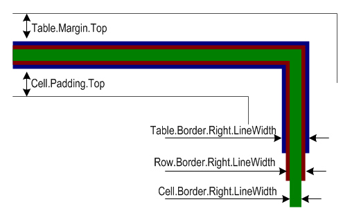

在现有 PDF 文档中添加表格是提升数据呈现、结构化信息或生成报告的常见需求。**Aspose.PDF for Python via .NET** 提供了全面的解决方案，使开发者能够无缝地将表格插入现有 PDF。

此指南提供了使用 Aspose.PDF for Python via .NET 向现有 PDF 文档添加表格的分步方法。它涵盖了表格的初始化、设置列宽、定义边框、填充行和单元格以及保存修改后的文档。此外，指南还探讨了高级功能，例如处理单元格边框、应用边距和填充，以及利用 AutoFit 设置动态调整表格尺寸。

无论您是想提升 PDF 的视觉效果还是更有效地组织数据，本文都是利用 Aspose.PDF for Python 强大表格操作功能的宝贵资源。

## 创建基础表格

## 创建表格

此示例演示了如何在 PDF 文档中创建带边框和多行的表格。

1. 创建一个新的 PDF 文档。
1. 向文档添加一个空白页。
1. 初始化表格。
1. 设置整体表格边框。
1. 设置各单元格的边框。
1. 添加行和单元格。
1. 将表格插入页面。
1. 将 PDF 保存到指定路径。

```python

    import aspose.pdf as ap
    from os import path

    path_outfile = path.join(self.data_dir, outfile)

    # Load source PDF document
    document = ap.Document()
    page = document.pages.add()
    # Initializes a new instance of the Table
    table = ap.Table()
    # Set the table border color as LightGray
    table.border = ap.BorderInfo(ap.BorderSide.ALL, 5, ap.Color.light_gray)
    # Set the border for table cells
    table.default_cell_border = ap.BorderInfo(
        ap.BorderSide.ALL, 5, ap.Color.light_gray
    )
    # Create a loop to add 10 rows
    for row_count in range(0, 10):
        # Add row to table
        row = table.rows.add()
        # Add table cells
        row.cells.add("Column (" + str(row_count) + ", 1)")
        row.cells.add("Column (" + str(row_count) + ", 2)")
        row.cells.add("Column (" + str(row_count) + ", 3)")
    # Add table object to first page of input document
    page.paragraphs.add(table)

    # Save updated document containing table object
    document.save(path_outfile)
```

### 向表格单元格添加图像

此代码片段展示了如何在 PDF 文档的表格单元格中插入图像。

1. 创建一个新的 PDF 文档。
1. 初始化表格。
1. 以磅为单位设置列宽。
1. 在第一个单元格中添加文本片段。
1. 在第二个单元格中添加一个 'ap.Image()' 实例。
1. 使用 'img.file' 设置图像文件的路径。
1. 'img.fix_width' 和 'img.fix_height' 控制单元格内图像的大小。
1. 将表格插入 PDF 页面。
1. 保存 PDF。

```python

    import aspose.pdf as ap
    from os import path

    # Instantiate Document object
    document = ap.Document()
    page = document.pages.add()
    # Instantiate a table object
    table = ap.Table()
    # Set width for table cells
    table.column_widths = "200 100"

    # Create row object and add it to table instance
    row = table.rows.add()
    # Create cell object and add it to row instance
    cell = row.cells.add()
    # Add textfragment to paragraphs collection of cell object
    cell.paragraphs.add(ap.text.TextFragment(image))
    # Create an image instance
    img = ap.Image()
    # Set image type as SVG
    # Path for source file
    img.file = path.join(self.data_dir, image)
    # Set width for image instance
    img.fix_width = 50
    # Set height for image instance
    img.fix_height = 50
    # Add another cell to row object
    cell = row.cells.add()
    # Add SVG image to paragraphs collection of recently added cell instance
    cell.paragraphs.add(img)

    # Add table to paragraphs collection of page object
    page.paragraphs.add(table)
    # Save PDF file
    document.save(path_outfile)
```

您可以在 PDF 文档的表格单元格中添加 SVG 图像：

```python

    import aspose.pdf as ap
    from os import path

    path_outfile = path.join(self.data_dir, outfile)

    # Instantiate Document object
    document = ap.Document()
    page = document.pages.add()
    # Instantiate a table object
    table = ap.Table()
    # Set width for table cells
    table.column_widths = "200 100"
    for image in images:
        # Create row object and add it to table instance
        row = table.rows.add()
        # Create cell object and add it to row instance
        cell = row.cells.add()
        # Add textfragment to paragraphs collection of cell object
        cell.paragraphs.add(ap.text.TextFragment(image))
        # Create an image instance
        img = ap.Image()
        # Set image type as SVG
        img.file_type = ap.ImageFileType.SVG
        # Path for source file
        img.file = path.join(self.data_dir, image)
        # Set width for image instance
        img.fix_width = 50
        # Set height for image instance
        img.fix_height = 50
        # Add another cell to row object
        cell = row.cells.add()
        # Add SVG image to paragraphs collection of recently added cell instance
        cell.paragraphs.add(img)

    # Add table to paragraphs collection of page object
    page.paragraphs.add(table)
    # Save PDF file
    document.save(path_outfile)
```

### 表格中的 ColSpan 和 RowSpan

此示例展示了如何垂直和水平合并表格单元格以创建复杂的表格布局。

1. 设置整体表格边框。
1. 设置默认单元格边框。
1. 将两个单元格水平合并为一个。
1. 将单元格垂直合并跨越两行。
1. 第 5 行通过跳过已合并的列来考虑 rowspan。
1. 将表格插入页面。
1. 保存 PDF。

```python

    import aspose.pdf as ap
    from os import path

    path_outfile = path.join(self.data_dir, outfile)

    # Load source PDF document
    document = ap.Document()
    page = document.pages.add()

    # Initializes a new instance of the Table
    table = ap.Table()
    # Set the table border color as LightGray
    table.border = ap.BorderInfo(ap.BorderSide.ALL, 0.5, ap.Color.black)
    # Set the border for table cells
    table.default_cell_border = ap.BorderInfo(
        ap.BorderSide.ALL, 0.5, ap.Color.black
    )
    # Add 1st row to table
    row1 = table.rows.add()
    for cellCount in range(1, 5):
        # Add table cells
        row1.cells.add("Test 1" + str(cellCount))

    # Add 2nd row to table
    row2 = table.rows.add()
    row2.cells.add("Test 2 1")
    cell = row2.cells.add("Test 2 2")
    cell.col_span = 2
    row2.cells.add("Test 2 4")

    # Add 3rd row to table
    row3 = table.rows.add()
    row3.cells.add("Test 3 1")
    row3.cells.add("Test 3 2")
    row3.cells.add("Test 3 3")
    row3.cells.add("Test 3 4")

    # Add 4th row to table
    row4 = table.rows.add()
    row4.cells.add("Test 4 1")
    cell = row4.cells.add("Test 4 2")
    cell.row_span = 2
    row4.cells.add("Test 4 3")
    row4.cells.add("Test 4 4")

    # Add 5th row to table
    row5 = table.rows.add()
    row5.cells.add("Test 5 1")
    row5.cells.add("Test 5 3")
    row5.cells.add("Test 5 4")

    # Add table object to first page of input document
    page.paragraphs.add(table)
    # Save updated document containing table object
    document.save(path_outfile)
```


### 为表格和单元格应用边框

此示例展示了如何设置单元格内边距、表格边距以及控制表格单元格中文本的自动换行。

1. 设置列的宽度。
1. 定义表格和单元格的边框。
1. 设置单元格内部的内边距以实现一致的间距。
1. 默认将内边距应用于所有单元格。
1. 添加文本并控制换行。
1. 添加行和单元格。
1. 保存 PDF。

```python

    import aspose.pdf as ap
    from os import path

    path_outfile = path.join(self.data_dir, outfile)
    # Load source PDF document
    document = ap.Document()
    page = document.pages.add()
    # Instantiate a table object
    tab1 = ap.Table()
    # Add the table in paragraphs collection of the desired section
    page.paragraphs.add(tab1)
    # Set with column widths of the table
    tab1.column_widths = "50 50 50"
    # Set default cell border using BorderInfo object
    tab1.default_cell_border = ap.BorderInfo(ap.BorderSide.ALL, 0.1)
    # Set table border using another customized BorderInfo object
    tab1.border = ap.BorderInfo(ap.BorderSide.ALL, 1)
    # Create MarginInfo object and set its left, bottom, right and top margins
    margin = ap.MarginInfo()
    margin.top = 5
    margin.left = 5
    margin.right = 5
    margin.bottom = 5
    # Set the default cell padding to the MarginInfo object
    tab1.default_cell_padding = margin
    # Create rows in the table and then cells in the rows
    row1 = tab1.rows.add()
    row1.cells.add("col1")
    row1.cells.add("col2")
    row1.cells.add()
    text = ap.text.TextFragment("col3 with large text string")
    # Row1.Cells.Add("col3 with large text string to be placed inside cell")
    row1.cells[2].paragraphs.add(text)
    row1.cells[2].is_word_wrapped = False
    row2 = tab1.rows.add()
    row2.cells.add("item1")
    row2.cells.add("item2")
    row2.cells.add("item3")
    # Save updated document containing table object
    document.save(path_outfile)
```


## 表格布局和尺寸

### 自动适配列和行

此代码片段展示了如何自动调整表格列宽以适应页面。
请注意，参数 table.column_widths = "50 50 50" 表示点数。但您也可以使用厘米 (cm)、英寸或百分比 (%).

1. 设置初始列宽。
1. 自动调整列以适应页面宽度。
1. 定义单元格和表格的边框。
1. “table.default_cell_padding” 使用 “MarginInfo()” 来实现单元格内部的一致间距。
1. 使用 'table.rows.add()' 添加行，并使用 'row.cells.add()' 添加单元格。
1. 保存 PDF。

```python

    import aspose.pdf as ap
    from os import path

    path_outfile = path.join(self.data_dir, outfile)

    # Load source PDF document
    document = ap.Document()
    page = document.pages.add()
    # Instantiate a table object
    table = ap.Table()

    page.paragraphs.add(table)

    table.column_widths = "50 50 50"
    table.column_adjustment = ap.ColumnAdjustment.AUTO_FIT_TO_WINDOW

    table.default_cell_border = ap.BorderInfo(ap.BorderSide.ALL, 0.1)

    table.border = ap.BorderInfo(ap.BorderSide.ALL, 1)

    margin = ap.MarginInfo()
    margin.top = 5
    margin.left = 5
    margin.right = 5
    margin.bottom = 5

    table.default_cell_padding = margin

    row1 = table.rows.add()
    row1.cells.add("col1")
    row1.cells.add("col2")
    row1.cells.add("col3")
    row2 = table.rows.add()
    row2.cells.add("item1")
    row2.cells.add("item2")
    row2.cells.add("item3")

    document.save(path_outfile)
```

### 调整内容周围的间距

此示例展示了如何创建跨多页的表格、处理单元格中的长文本，以及应用内边距和边框。

1. 使用 'page.paragraphs.add(table)' 将新表格添加到页面。
1. 使用 'table.column_widths' 定义列宽。
1. 使用 'table.default_cell_border' 设置各单元格的边框。
1. 使用 'table.border' 设置表格的整体边框。
1. 使用 'MarginInfo()' 定义单元格的默认内边距。
1. 使用 'TextFragment' 添加文本。
1. 再添加一行。
1. 保存 PDF。

```python

    import aspose.pdf as ap
    from os import path

    path_outfile = path.join(self.data_dir, outfile)

    # Create PDF document
    document = ap.Document()
    page = document.pages.add()

    # Instantiate a table object that will be nested inside outerTable that will break inside the same page
    table = ap.Table()
    # Add page
    page = document.pages.add()

    # Instantiate a table object
    table = ap.Table()

    # Add the table in paragraphs collection of the desired section
    page.paragraphs.add(table)

    # Set column widths of the table
    table.column_widths = "50 50 50"

    # Set default cell border using BorderInfo object
    table.default_cell_border = ap.BorderInfo(ap.BorderSide.ALL, 0.1)

    # Set table border using another customized BorderInfo object
    table.border = ap.BorderInfo(ap.BorderSide.ALL, 1)

    # Create MarginInfo object and set its left, bottom, right and top margins
    margin = ap.MarginInfo()
    margin.top = 5
    margin.left = 5
    margin.right = 5
    margin.bottom = 5

    # Set the default cell padding to the MarginInfo object
    table.default_cell_padding = margin

    # Create rows and cells
    row1 = table.rows.add()
    row1.cells.add("col1")
    row1.cells.add("col2")
    row1.cells.add()

    # Add a long text fragment into the third cell
    text = ap.text.TextFragment("col3 with large text string")
    row1.cells[2].paragraphs.add(text)
    row1.cells[2].is_word_wrapped = False

    # Add another row
    row2 = table.rows.add()
    row2.cells.add("item1")
    row2.cells.add("item2")
    row2.cells.add("item3")

    # Save PDF document
    document.save(path_outfile)
```



### 表格角的样式

Aspose.PDF for Python via .NET 展示了如何为表格应用圆角并自定义边框半径。

1. 创建一个新的表格实例。
1. 为所有侧面初始化边框。
1. 设置角半径。
1. 应用圆角样式。
1. 添加行和单元格。
1. 使用 'page.paragraphs.add(table)' 将表格插入 PDF 页面。
1. 保存 PDF 文档。

```python

    import aspose.pdf as ap
    from os import path

    path_outfile = path.join(self.data_dir, outfile)

    # Load source PDF document
    document = ap.Document()
    page = document.pages.add()
    # Initializes a new instance of the Table
    table = ap.Table()

    # Create a table
    table = ap.Table()

    # Create a blank BorderInfo object
    b_info = ap.BorderInfo(ap.BorderSide.ALL)

    # Set the border a rounded border where radius of round is 15
    b_info.rounded_border_radius = 15

    # Set the table corner style as Round
    table.corner_style = ap.BorderCornerStyle.ROUND

    # Set the table border information
    table.border = b_info

    # Create a loop to add 10 rows
    for row_count in range(0, 10):
        # Add row to table
        row = table.rows.add()
        # Add table cells
        row.cells.add("Column (" + str(row_count) + ", 1)")
        row.cells.add("Column (" + str(row_count) + ", 2)")
        row.cells.add("Column (" + str(row_count) + ", 3)")

    # Add table object to first page of input document
    page.paragraphs.add(table)
    # Save updated document containing table object
    document.save(path_outfile)
```

## 向表格添加内容

### 在单元格中使用 HTML 片段

此示例展示了如何将 HTML 格式的内容插入表格单元格。

1. 定义表格和单元格的边框。
1. 添加 HTML 内容。
1. 添加行。循环会在每个单元格中添加带有 HTML 格式的内容的多行。
1. 使用 'page.paragraphs.add(table)' 将表格插入 PDF 页面。
1. 保存 PDF 文档。

```python

    import aspose.pdf as ap
    from os import path

    path_outfile = path.join(self.data_dir, outfile)

    # Instantiate Document object
    document = ap.Document()
    page = document.pages.add()
    # Instantiate a table object
    table = ap.Table()

    # Set the table border color as LightGray
    table.border = ap.BorderInfo(ap.BorderSide.ALL, 0.5, ap.Color.light_gray)
    # Set the border for table cells
    table.default_cell_border = ap.BorderInfo(
        ap.BorderSide.ALL, 0.5, ap.Color.light_gray
    )
    # Create a loop to add 10 rows
    row_count = 1
    while row_count < 10:
        # Add row to table
        row = table.rows.add()
        # Add table cells
        cell = row.cells.add()
        cell.paragraphs.add(
            ap.HtmlFragment(f"Column <strong>({row_count}, 1)</strong>")
        )

        cell = row.cells.add()
        cell.paragraphs.add(
            ap.HtmlFragment(
                f"Column <span style='color:red'>({row_count}, 2)</span>"
            )
        )

        cell = row.cells.add()
        cell.paragraphs.add(
            ap.HtmlFragment(
                f"Column <span style='text-decoration: underline'>({row_count}, 3)</span>"
            )
        )
        row_count += 1

    # Add table object to first page of input document
    page.paragraphs.add(table)
    # Save updated document containing table object
    document.save(path_outfile)
```

### 在单元格中使用 LaTeX 片段

此示例展示了如何在表格单元格中插入 LaTeX 格式的内容，用于数学或样式化表达式。

1. 定义表格和单元格的边框。
1. 添加 LaTeX 内容。
1. 添加行。循环向每个单元格添加带 LaTeX 格式的内容的多行。
1. 使用 'page.paragraphs.add(table)' 将表格插入 PDF 页面。
1. 保存 PDF 文档。

```python

    import aspose.pdf as ap
    from os import path

    path_outfile = path.join(self.data_dir, outfile)

    # Instantiate Document object
    document = ap.Document()
    page = document.pages.add()
    # Instantiate a table object
    table = ap.Table()

    # Set the table border color as LightGray
    table.border = ap.BorderInfo(ap.BorderSide.ALL, 0.5, ap.Color.light_gray)
    # Set the border for table cells
    table.default_cell_border = ap.BorderInfo(
        ap.BorderSide.ALL, 0.5, ap.Color.light_gray
    )
    # Create a loop to add 10 rows
    row_count = 1
    while row_count < 10:
        # Add row to table
        row = table.rows.add()
        # Add table cells
        cell = row.cells.add()
        cell.paragraphs.add(
            ap.LatexFragment(f"Column $\\mathbf{{({row_count}, 1)}}$")
        )

        cell = row.cells.add()
        cell.paragraphs.add(
            ap.LatexFragment(
                f"Column $\\textcolor{{red}}{{({row_count}, 2)}}$"
            )
        )

        cell = row.cells.add()
        cell.paragraphs.add(
            ap.LatexFragment(
                f"Column $\\underline{{({row_count}, 3)}}$"
            )
        )
        row_count += 1

    # Add table object to first page of input document
    page.paragraphs.add(table)
    # Save updated document containing table object
    document.save(path_outfile)
```

## 高级表格功能

### 跨页插入表格

此示例展示了如何在 PDF 中创建多个表格、设置页面边距以及强制表格在新页面开始。

1. 使用 'page_info.margin' 设置页面边距。
1. 将页面方向设置为横向，使用 'page_info.is_landscape'。
1. 第一个表格：
- 定义两列并指定宽度。
- 使用 'row.fixed_row_height' 在循环中添加行。
- 用文本片段填充单元格。
1. 第二个表格：
- 使用 'table1.column_widths' 创建新表格。
- 强制表格在新页面开始。
1. 添加第一个表格。
1. 在新页面添加第二个表格。
1. 保存文档

```python

    import aspose.pdf as ap
    from os import path

    # The path to the documents directory
    path_outfile = path.join(self.data_dir, outfile)

    # Create PDF document
    document = ap.Document()

    # Set page and margin information
    page_info = document.page_info
    margin_info = page_info.margin

    margin_info.left = 37
    margin_info.right = 37
    margin_info.top = 37
    margin_info.bottom = 37
    page_info.is_landscape = True

    # First table with 120 rows
    table = ap.Table()
    table.column_widths = "50 100"

    cur_page = document.pages.add()

    for i in range(1, 121):
        row = table.rows.add()
        row.fixed_row_height = 15
        cell1 = row.cells.add()
        cell1.paragraphs.add(ap.text.TextFragment("Content 1"))
        cell2 = row.cells.add()
        cell2.paragraphs.add(ap.text.TextFragment("Content 2"))

    cur_page.paragraphs.add(table)

    # Second table with 10 rows
    table1 = ap.Table()
    table1.column_widths = "100 100"

    for i in range(1, 11):
        row = table1.rows.add()
        cell1 = row.cells.add()
        cell1.paragraphs.add(ap.text.TextFragment("Content 3"))
        cell2 = row.cells.add()
        cell2.paragraphs.add(ap.text.TextFragment("Content 4"))

    table1.is_in_new_page = True  # Force table to new page
    cur_page.paragraphs.add(table1)

    # Save updated document containing table object
    document.save(path_outfile)
```

### 创建无边框表格

此示例展示了如何创建一个可以在垂直方向跨页、重复列并为表头单元格应用不同背景颜色的大表格。

1. 初始化表格。
1. 为所有单元格设置默认边框。
1. 表头单元格使用 'col_span' 合并多列。
1. 使用 'background_color set' 设置单元格背景，以获得更好的视觉区分
1. 添加行。
1. 使用 'page.paragraphs.add(table)' 将表格插入 PDF 页面。
1. 保存 PDF 文档。

```python

    import aspose.pdf as ap
    from os import path

    # The path to the documents directory
    path_outfile = path.join(self.data_dir, outfile)

    # Create PDF document
    document = ap.Document()
    page = document.pages.add()

    table = ap.Table()
    table.broken = ap.TableBroken.VERTICAL
    table.default_cell_border = ap.BorderInfo(ap.BorderSide.ALL)
    table.repeating_columns_count = 2
    page.paragraphs.add(table)

    # Add header Row
    row = table.rows.add()
    cell = row.cells.add("header 1")
    cell.col_span = 2
    cell.background_color = ap.Color.light_gray
    row.cells.add("header 3")

    cell2 = row.cells.add("header 4")
    cell2.col_span = 2
    cell2.background_color = ap.Color.light_blue
    row.cells.add("header 6")

    cell3 = row.cells.add("header 7")
    cell3.col_span = 2
    cell3.background_color = ap.Color.light_green
    cell4 = row.cells.add("header 9")

    cell4.col_span = 3
    cell4.background_color = ap.Color.light_coral
    row.cells.add("header 12")
    row.cells.add("header 13")
    row.cells.add("header 14")
    row.cells.add("header 15")
    row.cells.add("header 16")
    row.cells.add("header 17")

    row_counter = 0
    while row_counter < 3:
        # Create rows in the table and then cells in the rows
        row1 = table.rows.add()
        row1.cells.add("col " + str(row_counter) + ", 1")
        row1.cells.add("col " + str(row_counter) + ", 2")
        row1.cells.add("col " + str(row_counter) + ", 3")
        row1.cells.add("col " + str(row_counter) + ", 4")
        row1.cells.add("col " + str(row_counter) + ", 5")
        row1.cells.add("col " + str(row_counter) + ", 6")
        row1.cells.add("col " + str(row_counter) + ", 7")
        row1.cells.add("col " + str(row_counter) + ", 8")
        row1.cells.add("col " + str(row_counter) + ", 9")
        row1.cells.add("col " + str(row_counter) + ", 10")
        row1.cells.add("col " + str(row_counter) + ", 11")
        row1.cells.add("col " + str(row_counter) + ", 12")
        row1.cells.add("col " + str(row_counter) + ", 13")
        row1.cells.add("col " + str(row_counter) + ", 14")
        row1.cells.add("col " + str(row_counter) + ", 15")
        row1.cells.add("col " + str(row_counter) + ", 16")
        row1.cells.add("col " + str(row_counter) + ", 17")
        row_counter += 1

    document.save(path_outfile)
```

### 在多页上重复表头行

此示例展示了如何创建跨多页的表格，并在每页保持表头行可见。

1. 初始化表格。
1. 重复表头行，包括字体、大小和颜色。
1. 设置列宽并为表格应用边框。
1. 添加表头行。
1. 添加大量数据行以强制表格跨页。
1. 使用 'page.paragraphs.add(table)' 将表格插入 PDF 页面。
1. 保存 PDF 文档。

```python

    import aspose.pdf as ap
    from os import path

    path_outfile = path.join(self.data_dir, outfile)

    # Create PDF document
    document = ap.Document()
    page = document.pages.add()

    # Instantiate a table object
    table = ap.Table()

    # Set the table to break across pages
    table.broken = ap.TableBroken.VERTICAL

    # Set number of repeating header rows
    table.repeating_rows_count = 2

    text_state = ap.text.TextState()
    text_state.font_size = 12
    text_state.font = ap.text.FontRepository.find_font("TimesNewRoman")
    text_state.foreground_color = ap.Color.red
    table.repeating_rows_style =  text_state

    # Set column widths
    table.column_widths = "100 100 100"

    # Set borders
    table.default_cell_border = ap.BorderInfo(ap.BorderSide.ALL, 0.5, ap.Color.black)
    table.border = ap.BorderInfo(ap.BorderSide.ALL, 1, ap.Color.black)

    # Add header rows that will repeat on each page
    header_row1 = table.rows.add()
    header_row1.cells.add("Header 1-1")
    header_row1.cells.add("Header 1-2")
    header_row1.cells.add("Header 1-3")

    # Set background color for header rows
    for cell in header_row1.cells:
        cell.background_color = ap.Color.light_gray

    header_row2 = table.rows.add()
    header_row2.cells.add("Header 2-1")
    header_row2.cells.add("Header 2-2")
    header_row2.cells.add("Header 2-3")

    for cell in header_row2.cells:
        cell.background_color = ap.Color.light_blue

    # Add many data rows to force table across multiple pages
    for i in range(1, 101):
        row = table.rows.add()
        row.cells.add(f"Data {i}-1")
        row.cells.add(f"Data {i}-2")
        row.cells.add(f"Data {i}-3")

    # Add table to page
    page.paragraphs.add(table)

    # Save document
    document.save(path_outfile)
```

### 重复列

函数 'add_repeating_columns' 创建一个带有重复列的表格的 PDF 文档。它设置带边框的表格，添加表头，填充数据行，并将生成的 PDF 文件保存到指定位置。设置此属性将导致表格按列方式在下一页换页，并在下一页开始时重复给定的列数。

1. 初始化新的 PDF 文档。
1. 添加具有自定义尺寸的页面。
1. 设置表格边框样式。
1. 初始化表格。
1. 将表格添加到 PDF 页面。
1. 添加表头行。
1. 添加数据行。
1. 保存 PDF 文档。

```python

    import aspose.pdf as ap
    from os import path

    path_outfile = path.join(self.data_dir, outfile)

    # Create PDF document
    document = ap.Document()

    # Add page
    page = document.pages.add()
    page.set_page_size(ap.PageSize.A5.height, ap.PageSize.A5.width)

    # Define border
    border = ap.BorderInfo(ap.BorderSide.ALL, 0.5, ap.Color.light_gray)

    # Create table
    table = ap.Table()
    table.broken = ap.TableBroken.VERTICAL
    table.column_adjustment = ap.ColumnAdjustment.AUTO_FIT_TO_CONTENT
    table.repeating_columns_count = 5
    table.border = border
    table.default_cell_border = border

    # Add table to page
    page.paragraphs.add(table)

    # Add header row
    row = table.rows.add()
    for i in range(1, 6):
        cell = row.cells.add(f"header {i}")
        cell.background_color = ap.Color.light_gray

    for i in range(6, 18):
        row.cells.add(f"header {i}")

    # Add data rows
    for row_counter in range(1, 6):
        row = table.rows.add()
        for i in range(1, 6):
            cell = row.cells.add(f"cell {row_counter},{i}")
            cell.background_color = ap.Color.light_gray
        for i in range(6, 18):
            row.cells.add(f"cell {row_counter},{i}")

    # Save PDF document
    document.save(path_outfile)
    print(f"File saved at: {path_outfile}")
```
