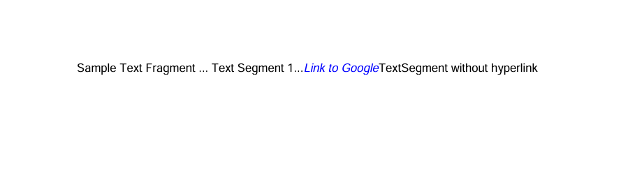
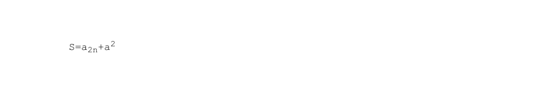
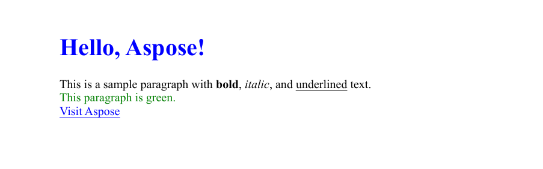
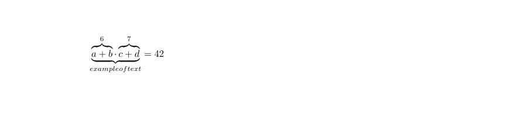

本指南解释了如何使用 Aspose.PDF for Python via .NET 向 PDF 文档添加文本内容。您将学习核心的文本插入技术——从在特定位置放置简单的文本片段，到对其进行样式设置（字体、大小、颜色、样式），处理从右到左（RTL）语言，嵌入超链接，以及使用段落布局、列表和透明效果。文章还涵盖了高级场景，如使用 HTML 或 LaTeX 片段、自定义字体以及行间距和字符间距等文本格式化选项。

无论您是构建简单的批注还是丰富的排版布局，本资源都为您提供使用 Aspose.PDF 在 PDF 中处理文本的基本构建块。

## 基本文本插入

Aspose.PDF for Python via .NET 提供了强大且灵活的 API，用于处理 PDF 文件中的文本。
无论您需要简单的静态标签、丰富的格式化内容、多语言文本或交互式超链接，该工具包都能通过简洁的 Python 代码实现所有功能。

### 添加文本 简单案例

Aspose.PDF for Python via .NET 演示了如何在页面的特定位置添加简单的文本片段。您将学习如何创建新的 PDF 文档、添加页面、在给定坐标插入文本，并保存生成的文件。

1. 创建一个新的[文档](https://reference.aspose.com/pdf/python-net/aspose.pdf/document/)对象。
1. 使用 `document.pages.add()` 创建一个新的空白[页面](https://reference.aspose.com/pdf/python-net/aspose.pdf/page/)。
1. 创建一个包含文本内容的[`TextFragment`](https://reference.aspose.com/pdf/python-net/aspose.pdf.text/textfragment/)。
1. 使用[`Position`](https://reference.aspose.com/pdf/python-net/aspose.pdf.text/position/)类设置文本位置。如果指定 `Position`，文本将在文档中从左到右定位并向下移动。
1. 自定义文本外观。您可以通过[`TextState`](https://reference.aspose.com/pdf/python-net/aspose.pdf/textstate/)设置字体大小、颜色、字体样式等。
1. 使用 `page.paragraphs.add(text_fragment)` 将 `TextFragment` 添加到页面的段落集合中。
1. 保存文档。

以下代码片段展示了如何在现有 PDF 文件中添加文本：

```python

import os
import aspose.pdf as ap

# Global configuration
DATA_DIR = "your path here"

def add_text_simple_case(outfile):
    """
    Add simple text to a PDF document.
    Creates a new PDF document with a single page and adds a text fragment
    "Hello, Aspose!" at position (100, 600) on the page.
    Args:
        outfile (str): The file path where the generated PDF document will be saved.
    Returns:
        None: The function saves the document to the specified output file.
    Example:
        >>> add_text_simple_case("output.pdf")
        # Creates a PDF file named "output.pdf" with "Hello, Aspose!" text
    """

    # Create a new document
    document = ap.Document()
    page = document.pages.add()

    # Add a text fragment at a specific position
    text_fragment = ap.text.TextFragment("Hello, Aspose!")
    text_fragment.position = ap.text.Position(100, 600)

    page.paragraphs.add(text_fragment)
    document.save(outfile)
```

此代码示例使用 TextFragment。但是您也可以使用 TextParagraph 向 PDF 页面添加文本。让我们来探讨一下区别。
**[TextFragment](https://reference.aspose.com/pdf/python-net/aspose.pdf.text/textfragment/)** 是单个文本片段。TextFragment 代表一个文本单元——本质上是一个可以独立放置、设置样式和定位的文本字符串。当您只需添加简单、少量的文本时，它是理想选择。

**[TextParagraph](https://reference.aspose.com/pdf/python-net/aspose.pdf.text/textparagraph/)** 是一组 TextFragment。它可以添加多行文本。TextParagraph 是一个或多个 TextFragment 对象的容器或集合。当您需要将多个片段组合在一起时，例如创建包含多行、多个单词或格式化元素的文本块，它是理想选择。
TextParagraph 还管理文本对齐、行间距以及页面上的自动布局。使用红线的功能仅在 TextParagraph 中可实现。

欲了解更多关于文本处理的信息，请查阅[PDF 内的文本格式化](/pdf/python-net/text-formatting-inside-pdf/)和[使用 Python 从 PDF 提取文本](/pdf/python-net/extract-text-from-pdf/)文档章节。

### 使用 TextParagraph 添加文本

Aspose.PDF for Python via .NET 可以使用[`TextBuilder`](https://reference.aspose.com/pdf/python-net/aspose.pdf.text/textbuilder/)和[`TextParagraph`](https://reference.aspose.com/pdf/python-net/aspose.pdf.text/textparagraph/)并结合换行选项来添加段落文本。

1. 使用 `document.pages.add()` 创建一个新的[文档](https://reference.aspose.com/pdf/python-net/aspose.pdf/document/)和一个空白[页面](https://reference.aspose.com/pdf/python-net/aspose.pdf/page/)。
1. 从文件读取文本或使用默认文本。
1. 创建一个[`TextBuilder`](https://reference.aspose.com/pdf/python-net/aspose.pdf.text/textbuilder/)以添加具有布局和换行控制的段落级内容。
1. 创建一个[`TextParagraph`](https://reference.aspose.com/pdf/python-net/aspose.pdf.text/textparagraph/)并设置换行模式（示例使用 `DISCRETIONARY_HYPHENATION`）。
1. 创建一个[`TextFragment`](https://reference.aspose.com/pdf/python-net/aspose.pdf.text/textfragment/)，应用样式，并将片段追加到段落中。
1. 使用 `TextBuilder` 将段落追加到页面。
1. 保存文档。

```python

import os
import aspose.pdf as ap

# Global configuration
DATA_DIR = "your path here"

def add_text_paragraph(outfile):
    """
    Add formatted text paragraph with indentation and wrapping to a PDF document.

    Creates a PDF document with a text paragraph that demonstrates advanced text
    formatting including first line indentation, text wrapping with discretionary
    hyphenation, and loading text content from an external file.

    Args:
        outfile (str): The file path where the generated PDF document will be saved.

    Returns:
        None: The function saves the document to the specified output file.

    Note:
        - Attempts to load text from "lorem.txt" file in DATA_DIR
        - Falls back to default message if file doesn't exist
        - Uses Times New Roman font at 12pt size
        - First line indent: 20 points
        - Rectangle bounds: (80, 800, 400, 200)
        - Text wrapping: DISCRETIONARY_HYPHENATION mode for better line breaks

    Example:
        >>> add_text_paragraph("paragraph_text.pdf")
        # Creates a PDF with formatted paragraph text
    """
    document = ap.Document()
    page = document.pages.add()

    lorem_path = os.path.join(DATA_DIR, "lorem.txt")
    if os.path.exists(lorem_path):
        with open(lorem_path, "r", encoding="utf-8") as file:
            text = file.read()
    else:
        text = "Lorem ipsum sample text not found."

    builder = ap.text.TextBuilder(page)
    paragraph = ap.text.TextParagraph()
    paragraph.first_line_indent = 20
    paragraph.rectangle = ap.Rectangle(80, 800, 400, 200, True)
    # paragraph.formatting_options.wrap_mode = TextFormattingOptions.WordWrapMode.BY_WORDS
    paragraph.formatting_options.wrap_mode = (
        ap.text.TextFormattingOptions.WordWrapMode.DISCRETIONARY_HYPHENATION
    )

    fragment = ap.text.TextFragment(text)
    fragment.text_state.font = ap.text.FontRepository.find_font("Times New Roman")
    fragment.text_state.font_size = 12

    paragraph.append_line(fragment)
    builder.append_paragraph(paragraph)

    document.save(outfile)
```


### 在 PDF 中添加带缩进的段落

以下代码片段展示了如何创建一个新的 PDF 文档并添加两个具有不同缩进样式的文本段落：

- 第一个段落演示了首行缩进（仅首行缩进）。

- 第二个段落演示了后续行缩进（首行之后的所有行都缩进）。

它使用 Aspose.PDF 的 'TextParagraph'、'TextBuilder' 和 'TextFragment' 类来精确控制布局和格式。

```python

import os
import aspose.pdf as ap

# Global configuration
DATA_DIR = "your path here"

def add_paragraphs_indents(output_file_name):
    """Add text with indents to a PDF document.
    Creates a PDF document with two text paragraphs demonstrating different
    indent styles. The first paragraph uses first line indent, while the
    second paragraph uses subsequent lines indent. Text content is loaded
    from a lorem.txt file if available, otherwise uses a fallback message.
    Args:
        output_file_name (str): The file path where the PDF document will be saved.
    Returns:
        None: The function saves the PDF document to the specified output file.
    Note:
        - Uses Times New Roman font at 12pt size
        - Text wrapping is set to wrap by words
        - First paragraph: 20pt first line indent, positioned at (80, 800, 300, 50)
        - Second paragraph: 20pt subsequent lines indent, positioned at (320, 800, 500, 50)
    """

    document = ap.Document()
    page = document.pages.add()

    lorem_path = os.path.join(DATA_DIR, "lorem.txt")
    if os.path.exists(lorem_path):
        with open(lorem_path, "r", encoding="utf-8") as file:
            text = file.read()
    else:
        text = "Lorem ipsum sample text not found."

    fragment = ap.text.TextFragment(text)
    fragment.text_state.font = ap.text.FontRepository.find_font("Times New Roman")
    fragment.text_state.font_size = 12

    builder = ap.text.TextBuilder(page)
    paragraph1 = ap.text.TextParagraph()
    paragraph1.first_line_indent = 20
    paragraph1.rectangle = ap.Rectangle(80, 800, 300, 50, True)
    paragraph1.formatting_options.wrap_mode = (
        ap.text.TextFormattingOptions.WordWrapMode.BY_WORDS
    )

    paragraph1.append_line(fragment)
    builder.append_paragraph(paragraph1)

    paragraph2 = ap.text.TextParagraph()
    paragraph2.subsequent_lines_indent = 20
    paragraph2.rectangle = ap.Rectangle(320, 800, 500, 50, True)
    paragraph2.formatting_options.wrap_mode = (
        ap.text.TextFormattingOptions.WordWrapMode.BY_WORDS
    )

    paragraph2.append_line(fragment)
    builder.append_paragraph(paragraph2)
    document.save(output_file_name)
```

### 在 PDF 中添加新行文本

Aspose.PDF for Python via .NET 允许您使用 TextFragment、TextParagraph 和 TextBuilder 类向 PDF 文档插入多行文本。

1. 创建新文档。
1. 定义包含换行符的 TextFragment。
1. 设置文本样式。
1. 将片段添加到段落中。
1. 定位段落。
1. 在页面上渲染段落。
1. 保存文档。

```python

import os
import aspose.pdf as ap

# Global configuration
DATA_DIR = "your path here"

def add_new_line(output_file):
    """Add a new line of text to a PDF document."""
    # Create PDF document
    document = ap.Document()
    page = document.pages.add()

    # Initialize new TextFragment with text containing required newline markers
    text_fragment = ap.text.TextFragment("Applicant Name: " + os.linesep + " Joe Smoe")

    # Set text fragment properties if necessary
    text_fragment.text_state.font_size = 12
    text_fragment.text_state.font = ap.text.FontRepository.find_font("TimesNewRoman")
    text_fragment.text_state.background_color = ap.Color.light_gray
    text_fragment.text_state.foreground_color = ap.Color.red

    # Create TextParagraph object
    par = ap.text.TextParagraph()

    # Add new TextFragment to paragraph
    par.append_line(text_fragment)

    # Set paragraph position
    par.position = ap.text.Position(100, 600)

    # Create TextBuilder object
    text_builder = ap.text.TextBuilder(page)

    # Add the TextParagraph using TextBuilder
    text_builder.append_paragraph(par)

    # Save PDF document
    document.save(output_file)
```

### 确定 PDF 中的换行和记录通知

它展示了如何创建包含多个文本片段的 PDF 文档，并启用 Aspose.PDF 通知日志，以在渲染期间监视布局事件——例如换行和文本换行——。

1. 创建新的 PDF 文档。
1. 启用通知日志。
1. 使用 document.pages.add() 创建第一页。
1. 添加多个文本片段。
1. 使用 page.paragraphs.add(text) 渲染每个文本片段。
1. 保存文档。

```python

import os
import aspose.pdf as ap

# Global configuration
DATA_DIR = "your path here"

def determine_line_break(output_file):
    """Create a PDF document with multiple text fragments and log notifications."""
    # Create PDF document
    document = ap.Document()

    # Enable notification logging
    document.enable_notification_logging = True

    page = document.pages.add()

    for i in range(4):
        text = ap.text.TextFragment(
            "Lorem ipsum \r\ndolor sit amet, consectetur adipiscing elit, "
            "sed do eiusmod tempor incididunt ut labore et dolore magna aliqua. "
            "Ut enim ad minim veniam, quis nostrud exercitation ullamco laboris "
            "nisi ut aliquip ex ea commodo consequat. Duis aute irure dolor in "
            "reprehenderit in voluptate velit esse cillum dolore eu fugiat nulla "
            "pariatur. Excepteur sint occaecat cupidatat non proident, sunt in "
            "culpa qui officia deserunt mollit anim id est laborum."
        )
        text.text_state.font_size = 20
        page.paragraphs.add(text)

    # Save PDF document
    document.save(output_file)

    notifications = document.pages[1].get_notifications()
    print(notifications)
```

### 在 PDF 中动态测量文本宽度

使用 Aspose.PDF for Python via .NET 动态测量特定字体中字符和字符串的宽度。它使用 'Font.measure_string()' 和 'TextState.measure_string()' 方法来验证测量的字符串宽度是一致且准确的。

1. 使用 'FontRepository.find_font()' 从仓库中检索 Arial 字体对象。
1. 创建一个 TextState 对象来管理字体属性。
1. 测量单个字符。
1. 对比两种方法在 'A' 到 'z' 之间所有字符的结果。
1. 确保两种测量方法得到相同的结果。

```python

import os
import aspose.pdf as ap

# Global configuration
DATA_DIR = "your path here"

def get_text_width_dynamically(output_file):

    font = ap.text.FontRepository.find_font("Arial")
    ts = ap.text.TextState()
    ts.font = font
    ts.font_size = 14

    if math.fabs(font.measure_string("A", 14) - 9.337) > 0.001:
        print("Unexpected font string measure!")

    if math.fabs(ts.measure_string("z") - 7.0) > 0.001:
        print("Unexpected font string measure!")

    c_code = ord("A")
    while c_code <= ord("z"):
        c = chr(c_code)

        fn_measure = font.measure_string(str(c), 14)
        ts_measure = ts.measure_string(str(c))

        if math.fabs(fn_measure - ts_measure) > 0.001:
            print("Font and state string measuring doesn't match!")

        c_code += 1
```

### 添加带超链接的文本

使用 Aspose.PDF for Python via .NET 在 PDF 中为文本添加可点击的超链接。我们的库演示了如何在单个 TextFragment 中添加多个文本段，并对特定段落应用超链接，以及单独设置文本段的样式（例如颜色、斜体字体）。

1. 使用 'Document()' 创建新文档和页面，并使用 'document.pages.add()' 添加空白页。
1. 创建一个 TextFragment。
1. 添加多个 TextSegment 对象。每个段落可以有自己的内容和样式。例如普通文本或超链接文本。
1. 为段落应用超链接。使用所需的 URL 创建 WebHyperlink 对象。
1. 设置段落样式。使用 text_state 定制颜色、字体样式、大小等。
1. 使用 'page.paragraphs.add()' 将片段添加到页面。
1. 保存 PDF。

```python

import os
import aspose.pdf as ap

# Global configuration
DATA_DIR = "your path here"

def add_text_with_hyperlink(outfile):
    """
    Add text with embedded hyperlinks to a PDF document.

    Creates a PDF document with a text fragment containing multiple segments,
    including one with a hyperlink to Aspose. Demonstrates how to create
    clickable links within PDF text content with different formatting.

    Args:
        outfile (str): The file path where the generated PDF document will be saved.

    Returns:
        None: The function saves the document to the specified output file.

    Note:
        - Creates 4 text segments within a single text fragment
        - One segment contains a hyperlink to "https://products.aspose.com/pdf"
        - Hyperlinked text is styled in blue italic font
        - Other segments are regular text without links

    Example:
        >>> add_text_with_hyperlink("hyperlink_text.pdf")
        # Creates a PDF with clickable Aspose link in the text
    """

    document = ap.Document()
    page = document.pages.add()

    fragment = ap.text.TextFragment(
        "Sample Text Fragment"
    )

    segment = ap.text.TextSegment(" ... Text Segment 1...")
    fragment.segments.append(segment)

    segment = ap.text.TextSegment("Link to Aspose")
    fragment.segments.append(segment)
    segment.hyperlink = ap.WebHyperlink("https://products.aspose.com/pdf")
    segment.text_state.foreground_color = ap.Color.blue
    segment.text_state.font_style = ap.text.FontStyles.ITALIC

    segment = ap.text.TextSegment("TextSegment without hyperlink")
    fragment.segments.append(segment)

    page.paragraphs.add(fragment)
    document.save(outfile)
```



### 向 PDF 文档添加从右到左 (RTL) 文本

RTL（从右到左）是一种属性，指示文本书写方向，即文本从右向左书写。
Aspose.PDF for Python via .NET 演示了如何向 PDF 文档添加从右到左（RTL）的文本，例如阿拉伯语或希伯来语。

1. 使用 'Document()' 创建新文档和页面，并使用 'document.pages.add()' 添加空白页。
1. 创建包含 RTL 内容的 TextFragment。将您的阿拉伯语、希伯来语或其他 RTL 语言文本作为片段内容插入。
设置字体和样式。选择支持 RTL 脚本的字体（例如 Tahoma、Arial Unicode MS）。根据需要设置 font_size 和 foreground_color。
1. 使用 'text_fragment.horizontal_alignment' 将水平对齐设置为右对齐。
1. 将文本片段添加到页面。
1. 保存 PDF 文档。

```python

import os
import aspose.pdf as ap

# Global configuration
DATA_DIR = "your path here"

def add_text_with_rtl_text(outfile):
    """
    Add right-to-left (RTL) text to a PDF document.

    Creates a PDF document with Arabic text that demonstrates right-to-left text
    rendering and alignment. The text uses the Tahoma font which supports Arabic
    characters and is aligned to the right side of the page.

    Args:
        outfile (str): The file path where the generated PDF document will be saved.

    Returns:
        None: The function saves the document to the specified output file.

    Note:
        - Uses Tahoma font at 14pt size for proper Arabic character support
        - Text color is set to blue
        - Horizontal alignment is set to RIGHT for proper RTL display
        - The Arabic text describes Nasreddin Hodja, a folklore character

    Example:
        >>> add_text_with_rtl_text("arabic_text.pdf")
        # Creates a PDF with right-to-left Arabic text
    """

    document = ap.Document()
    page = document.pages.add()
    # Styled text fragment
    text_fragment = ap.text.TextFragment(
        "يعتبر خوجا نصر الدين شخصية فولكلورية من الشرق الإسلامي وبعض شعوب البحر الأبيض المتوسط ​​والبلقان، وهو بطل القصص والحكايات القصيرة الفكاهية والساخرة، وأحيانًا الحكايات اليومية."
    )
    text_fragment.text_state.font = ap.text.FontRepository.find_font("Tahoma")
    text_fragment.text_state.font_size = 14
    text_fragment.text_state.foreground_color = ap.Color.blue
    text_fragment.horizontal_alignment = ap.HorizontalAlignment.RIGHT

    page.paragraphs.add(text_fragment)
    document.save(outfile)
```


## 文本样式

### 添加带字体样式的文本

这是一个更高级的示例，演示文本样式、字体定制以及混合格式文本（使用下标文本段）。Aspose.PDF 说明了如何对文本片段应用字体属性，如字体系列、大小、颜色、粗体、斜体和下划线。
此外，此代码片段展示了如何在单个片段中使用多个文本段，以创建复杂的文本表达式——例如包含下标或上标字符，这在公式或科学符号中常常需要。

1. 使用 'Document()' 创建新文档和页面，并使用 'document.pages.add()' 添加空白页。
1. 为简单样式文本创建 TextFragment。
1. 定义文本内容。
1. 使用 Position(x, y) 坐标设置位置。
1. 通过 'text_state' 属性应用样式——字体、font_size、foreground_color、font_style、underline。
1. 创建包含多个 TextSegment 对象的复杂表达式。每个 TextSegment 表示一段可以拥有独立样式的文本。这使您能够构建表达式，例如数学或化学公式。
1. 定义多个 TextState 对象。一个用于主文本 (text_state_letters)，另一个用于下标或上标文本 (text_state_index)。
1. 合并文本段。使用 'segments.append()' 将每个段追加到 'TextFragment'。
1. 将两个文本对象添加到页面。使用 'page.paragraphs.add()' 将它们放入文档。
1. 保存最终文档。

```python

import os
import aspose.pdf as ap

# Global configuration
DATA_DIR = "your path here"

def add_text_with_font_styling(outfile):
    """
    Add styled text fragments to a PDF document.
    Creates a new PDF document with a single page and adds a styled text fragment
    "Hello, Aspose!" at position (100, 600) and a formula with styled segments at position (100, 500).
    Args:
        outfile (str): The file path where the generated PDF document will be saved.
    Returns:
        None: The function saves the document to the specified output file.
    Example:
        >>> add_text_with_font_styling("styled_text.pdf")
        # Creates a PDF file named "styled_text.pdf" with styled text and a formula
    """

    document = ap.Document()
    page = document.pages.add()

    # Initialize an empty TextFragment to build a formula using segments
    formula = ap.text.TextFragment()
    text_fragment = ap.text.TextFragment("Hello, Aspose!")
    text_fragment.position = ap.text.Position(100, 600)
    text_fragment.text_state.font = ap.text.FontRepository.find_font("Arial")
    text_fragment.text_state.font_size = 14
    text_fragment.text_state.foreground_color = ap.Color.blue
    text_fragment.text_state.font_style = (
        ap.text.FontStyles.BOLD | ap.text.FontStyles.ITALIC
    )
    text_fragment.text_state.underline = True
    text_fragment.horizontal_alignment = ap.HorizontalAlignment.LEFT

    text_state_letters = ap.text.TextState()
    text_state_letters.font = ap.text.FontRepository.find_font("Arial")
    text_state_letters.font_size = 14
    text_state_letters.foreground_color = ap.Color.blue
    text_state_letters.font_style = ap.text.FontStyles.BOLD

    text_state_index = ap.text.TextState()
    text_state_index.font = ap.text.FontRepository.find_font("Arial")
    text_state_index.font_size = 14
    text_state_index.foreground_color = ap.Color.dark_red
    # text_state_index.superscript = True
    text_state_index.subscript = True

    position = ap.text.Position(100, 500)

    # Helper function to add segments
    def add_segment(text, state):
        seg = ap.text.TextSegment(text)
        seg.text_state = state
        seg.position = position
        formula.segments.append(seg)

    add_segment("S = a", text_state_letters)
    add_segment("2n", text_state_index)
    add_segment(" + a", text_state_letters)
    add_segment("2n+1", text_state_index)
    add_segment(" + a", text_state_letters)
    add_segment("2n+2", text_state_index)
    formula.horizontal_alignment = ap.HorizontalAlignment.LEFT

    page.paragraphs.add(text_fragment)
    page.paragraphs.add(formula)
    document.save(outfile)
```


## 添加透明文本

使用 Aspose.PDF for Python 向 PDF 文档添加半透明形状和文本。
它创建一个具有部分不透明度的彩色矩形，并覆盖一个前景色透明的 TextFragment。

1. 初始化 Document 对象并添加一个空白页用于绘制内容。
1. 使用 'ap.drawing.Graph' 创建一个可用于绘制形状的画布。
1. 添加一个半透明填充的矩形。
1. 防止画布位置偏移。
1. 将画布添加到页面。将图形形状插入页面的段落集合中。
1. 创建一个透明的文本片段。
1. 将文本片段插入页面的段落集合中。
1. 保存 PDF 文档。

```python

import os
import aspose.pdf as ap

# Global configuration
DATA_DIR = "your path here"

def add_text_transparent(outfile):
    """
    Add transparent text over a semi-transparent background to a PDF document.

    Creates a PDF document with a semi-transparent filled rectangle as background
    and transparent green text overlaid on top. This demonstrates how to create
    transparency effects in PDF documents using ARGB color values.

    Args:
        outfile (str): The file path where the generated PDF document will be saved.

    Returns:
        None: The function saves the document to the specified output file.

    Note:
        - Background rectangle: 128 alpha, light purple color (0xC5, 0xB5, 0xFF)
        - Text transparency: 30 alpha, green color (0, 255, 0)
        - The canvas is set to not change position to prevent layout shifts

    Example:
        >>> add_text_transparent("transparent_output.pdf")
        # Creates a PDF with transparent text effects
    """

    # Create PDF document
    document = ap.Document()
    page = document.pages.add()

    # Create Graph object
    canvas = ap.drawing.Graph(100.0, 400.0)

    # Create rectangle with semi-transparent fill
    rect = ap.drawing.Rectangle(100, 100, 400, 400)
    rect.graph_info.fill_color = ap.Color.from_argb(128, 0xC5, 0xB5, 0xFF)
    canvas.shapes.add(rect)

    # Prevent position shift
    canvas.is_change_position = False
    page.paragraphs.add(canvas)

    # Create transparent text
    text = ap.text.TextFragment(
        "This is the transparent text. "
        "This is the transparent text. "
        "This is the transparent text."
    )
    text.text_state.foreground_color = ap.Color.from_argb(30, 0, 255, 0)
    page.paragraphs.add(text)

    document.save(outfile)
```

### 向 PDF 添加不可见文本

此示例演示如何创建包含可见文本和不可见文本的 PDF 文档。不可见文本仍是文档结构的一部分，但在视图中隐藏，非常适合嵌入元数据、可访问性标签或可搜索内容而不影响布局。

1. 创建 PDF 文档和页面。
1. 创建一个包含重复可见内容的文本片段。
1. 添加第二个文本片段并将其标记为不可见。
1. 保存文档。

```python

import os
import aspose.pdf as ap

# Global configuration
DATA_DIR = "your path here"

def add_text_invisible(outfile):
    """
    Creates a PDF document with both visible and invisible text.
    This function generates a PDF file containing two text fragments:
    one visible text that will be displayed normally, and one invisible
    text that will be hidden from view but still present in the document.
    Args:
        outfile (str): The file path where the PDF document will be saved.
    Returns:
        None: The function saves the PDF to the specified file path.
    Example:
        add_text_invisible("output.pdf")
    """

    # Create PDF document
    document = ap.Document()
    page = document.pages.add()

    # Add visible text
    text1 = ap.text.TextFragment(
        "This is the visible text. "
        "This is the visible text. "
        "This is the visible text."
    )
    page.paragraphs.add(text1)

    # Create transparent text
    text2 = ap.text.TextFragment(
        "This is the invisible text. "
        "This is the invisible text. "
        "This is the invisible text."
    )
    text2.text_state.invisible = True
    page.paragraphs.add(text2)

    document.save(outfile)
```

### 在 PDF 中添加带边框样式的文本

Aspose.PDF 库展示了如何创建包含带可见边框的样式化文本片段的 PDF 文档。该方法对背景色、前景色、字体设置以及文本矩形的描边（边框）进行应用，以增强视觉强调。

1. 创建 PDF 文档和页面。
1. 创建并定位文本片段。添加带有信息的文本片段并设置其位置。
1. 应用文本样式。将字体设置为 Times New Roman，大小 12。使用浅灰色背景和红色前景（文本）颜色。
1. 配置边框样式。
1. 将文本添加到页面。使用 TextBuilder 将样式化文本追加到页面。
1. 保存文档。

```python

import os
import aspose.pdf as ap

# Global configuration
DATA_DIR = "your path here"

def add_text_border(output_file_name):
    """
    Add text with border styling to a PDF document.

    Creates a PDF document with a text fragment that has border styling applied.
    The text includes background color, foreground color, and a configurable
    border (stroke) around the text rectangle.

    Args:
        output_file_name (str): The file path where the generated PDF document will be saved.

    Returns:
        None: The function saves the document to the specified output file.

    Note:
        - Text: "This is sample text with border."
        - Font: Times New Roman, 12pt
        - Background: Light gray
        - Foreground: Red text
        - Border: Dark red stroke around text rectangle
        - Position: (10, 700)
        - Border is only visible when draw_text_rectangle_border is True

    Example:
        >>> add_text_border("bordered_text.pdf")
        # Creates a PDF with bordered text styling
    """
    # Create PDF document
    document = ap.Document()
    # Get particular page
    page = document.pages.add()
    # Create text fragment
    text_fragment = ap.text.TextFragment("This is sample text with border.")
    text_fragment.position = ap.text.Position(10, 700)

    # Set text properties
    text_fragment.text_state.font = ap.text.FontRepository.find_font("Times New Roman")
    text_fragment.text_state.font_size = 12
    text_fragment.text_state.background_color = ap.Color.light_gray
    text_fragment.text_state.foreground_color = ap.Color.red
    # Set StrokingColor property for drawing border (stroking) around text rectangle.
    # Note: This only affects the border if draw_text_rectangle_border is set to True.
    text_fragment.text_state.stroking_color = ap.Color.dark_red
    # Enable drawing of the text rectangle border
    text_fragment.text_state.draw_text_rectangle_border = True

    text_builder = ap.text.TextBuilder(page)
    text_builder.append_text(text_fragment)

    # Save PDF document
    document.save(output_file_name)
```

### 向 PDF 添加删除线文本

在 PDF 文档的文本片段中添加删除线（划线）格式。删除线文本可用于指示删除、修订或在注释文档中强调。

1. 使用 'Document()' 创建新文档和页面，并使用 'document.pages.add()' 添加空白页。
1. 创建并设置文本片段样式。
1. 应用颜色和删除线格式。将背景设为浅灰色，文本颜色设为红色，并启用删除线。
1. 定位文本。
1. 使用 'TextBuilder' 将样式化文本追加到页面。
1. 保存文档。

```python

import os
import aspose.pdf as ap

# Global configuration
DATA_DIR = "your path here"

def add_strikeout_text(output_file_name):
    """
    Add text with strikeout (strikethrough) formatting to a PDF document.

    Creates a PDF document with a text fragment that has strikeout formatting applied.
    The text appears with a line through it, along with additional styling including
    background color, foreground color, and bold font style.

    Args:
        output_file_name (str): The file path where the generated PDF document will be saved.

    Returns:
        None: The function saves the document to the specified output file.

    Note:
        - Text: "This is sample strikeout text."
        - Font: Times New Roman, 12pt, Bold
        - Background: Light gray
        - Foreground: Red text
        - Strikeout: Enabled (line through text)
        - Position: (100, 600)

    Example:
        >>> add_strikeout_text("strikeout_text.pdf")
        # Creates a PDF with strikethrough text formatting
    """
    # Create PDF document
    document = ap.Document()
    page = document.pages.add()

    # Create text fragment
    text_fragment = ap.text.TextFragment("This is sample strikeout text.")
    # Set text properties
    text_fragment.text_state.font_size = 12
    text_fragment.text_state.font = ap.text.FontRepository.find_font("TimesNewRoman")
    text_fragment.text_state.background_color = ap.Color.light_gray
    text_fragment.text_state.foreground_color = ap.Color.red
    text_fragment.text_state.strike_out = True
    text_fragment.text_state.font_style = ap.text.FontStyles.BOLD
    text_fragment.position = ap.text.Position(100, 600)

    # Create TextBuilder object
    text_builder = ap.text.TextBuilder(page)
    text_builder.append_text(text_fragment)

    # Save PDF document
    document.save(output_file_name)
```

## 高级颜色效果

### 在 PDF 中对文本应用轴向渐变

Aspose.PDF for Python via .NET 演示了如何在 PDF 文档的文本上应用线性渐变效果。轴向渐变在文本中从红色平滑过渡到蓝色，形成视觉上引人注目的标题。这一技术非常适用于样式化标题、品牌或 PDF 文档布局中的装饰元素。

1. 初始化新文档并添加空白页。
1. 创建并设置文本片段样式。添加标题，设置位置、字体和大小。
1. 使用 'GradientAxialShading' 应用轴向渐变着色。通过 GradientAxialShading 将前景色从红色设为蓝色。
1. 添加下划线样式。
1. 将样式化文本片段插入页面。
1. 保存文档。

```python

import os
import aspose.pdf as ap

# Global configuration
DATA_DIR = "your path here"

def apply_gradient_axial_shading_to_text(output_file_name):
    """
    Apply axial gradient shading to text in a PDF document.

    Creates a PDF document with large title text that has an axial (linear) gradient
    effect applied. The gradient transitions from red to blue in a linear fashion
    across the text. This demonstrates advanced text styling with gradient effects.

    Args:
        output_file_name (str): The file path where the generated PDF document will be saved.

    Returns:
        None: The function saves the document to the specified output file.

    Note:
        - Text: "PDF TITLE"
        - Font: Arial Bold, 36pt
        - Position: (100, 600)
        - Gradient: Linear gradient from red to blue
        - Additional styling: Underlined text
        - Uses GradientAxialShading for linear gradient effect

    Example:
        >>> apply_gradient_axial_shading_to_text("gradient_axial.pdf")
        # Creates a PDF with linear gradient text effect
    """
    # Create PDF document
    document = ap.Document()
    page = document.pages.add()

    text_fragment = ap.text.TextFragment("PDF TITLE")
    text_fragment.position = ap.text.Position(100, 600)
    text_fragment.text_state.font_size = 36
    text_fragment.text_state.font = ap.text.FontRepository.find_font("Arial Bold")

    text_fragment.text_state.foreground_color = ap.Color()
    text_fragment.text_state.foreground_color.pattern_color_space = (
        ap.drawing.GradientAxialShading(ap.Color.red, ap.Color.blue)
    )
    text_fragment.text_state.underline = True

    page.paragraphs.add(text_fragment)
    document.save(output_file_name)
```

### 在 PDF 中对文本应用径向渐变

径向渐变在文本中心向外辐射，创建圆形的颜色过渡，为标题、页眉或装饰元素提供视觉上动态的样式选项。

1. 初始化一个新文档并添加一个空白页。
1. 创建并设置文本片段的样式。添加标题，设置位置、字体和大小。
1. 使用 'GradientRadialShading' 应用径向渐变。使用 GradientRadialShading 将前景色从红色渐变到蓝色。
1. 添加下划线样式。
1. 将已设置样式的文本片段插入页面。
1. 保存文档。

```python

import os
import aspose.pdf as ap

# Global configuration
DATA_DIR = "your path here"

def apply_gradient_radial_shading_to_text(output_file_name):
    """
    Apply radial gradient shading to text in a PDF document.

    Creates a PDF document with large title text that has a radial (circular) gradient
    effect applied. The gradient radiates from the center outward, transitioning from
    red to blue. This demonstrates advanced text styling with radial gradient effects.

    Args:
        output_file_name (str): The file path where the generated PDF document will be saved.

    Returns:
        None: The function saves the document to the specified output file.

    Note:
        - Text: "PDF TITLE"
        - Font: Arial Bold, 36pt
        - Position: (100, 600)
        - Gradient: Radial gradient from red to blue
        - Additional styling: Underlined text
        - Uses GradientRadialShading for circular gradient effect

    Example:
        >>> apply_gradient_radial_shading_to_text("gradient_radial.pdf")
        # Creates a PDF with radial gradient text effect
    """
    # Create PDF document
    document = ap.Document()
    page = document.pages.add()

    text_fragment = ap.text.TextFragment("PDF TITLE")
    text_fragment.position = ap.text.Position(100, 600)
    text_fragment.text_state.font_size = 36
    text_fragment.text_state.font = ap.text.FontRepository.find_font("Arial Bold")

    # Apply radial gradient shading (red to blue)
    text_fragment.text_state.foreground_color = ap.Color()
    text_fragment.text_state.foreground_color.pattern_color_space = (
        ap.drawing.GradientRadialShading(ap.Color.red, ap.Color.blue)
    )
    text_fragment.text_state.underline = True

    page.paragraphs.add(text_fragment)
    document.save(output_file_name)
```


## HTML 和 LaTeX 片段

### 将 HTML 文本添加到 PDF 文档

Aspose.PDF for Python via .NET 库允许您使用 HtmlFragment 类将 HTML 格式的内容插入 PDF 文档。通过使用 HTML 标签，您可以直接在 PDF 中呈现带样式、结构化或类似公式的文本。

1. 使用 'Document()' 创建新文档和页面，并使用 'document.pages.add()' 添加空白页。
1. 创建 HtmlFragment 类的实例，并将您的 HTML 字符串作为参数传入。
1. 使用 'page.paragraphs.add()' 将片段添加到页面，以插入 HTML 内容。
1. 保存 PDF。

```python

import os
import aspose.pdf as ap

# Global configuration
DATA_DIR = "your path here"

def add_text_html_fragment(outfile):
    """
    Add HTML fragment with mathematical notation to a PDF document.

    Creates a PDF document containing an HTML fragment that displays mathematical
    notation using HTML tags including subscript and superscript elements.
    This demonstrates how to embed formatted HTML content directly into PDF.

    Args:
        outfile (str): The file path where the generated PDF document will be saved.

    Returns:
        None: The function saves the document to the specified output file.

    Note:
        - Uses HTML <pre> tags to preserve formatting
        - Includes <sub> for subscript (2n) and <sup> for superscript (2)
        - Formula displayed: S=a₂ₙ+a²
        - HTML is rendered as formatted content within the PDF

    Example:
        >>> add_text_html_fragment("html_math.pdf")
        # Creates a PDF with HTML mathematical notation
    """

    # Create a new document
    document = ap.Document()
    page = document.pages.add()

    # Add a text fragment at a specific position
    text_fragment = ap.HtmlFragment("<pre>S=a<sub>2n</sub>+a<sup>2</sup><pre>")

    page.paragraphs.add(text_fragment)
    document.save(outfile)
```



### 将带有各种格式的样式化 HTML 片段添加到 PDF 文档

我们可以定义 HTML 片段并直接使用 HTML 标签设置文本样式。将样式化的 HTML 内容嵌入 PDF 文档。此代码片段创建一个新的 PDF 文件，添加页面，插入包含各种格式元素（标题、段落、链接和内联样式）的 HTML 片段，并将结果保存到指定路径。

1. 初始化一个新的 Document 对象以表示 PDF。
1. 向文档追加一个空白页，HTML 内容将放置在该页上。
1. 准备 HTML 内容。HTML 字符串包含一个 h1 标题，一个绿色段落，内含粗体、斜体和下划线文本，以及一个字体放大的指向网站的超链接。
1. 创建 HTML 片段。将 HTML 字符串封装在 HtmlFragment 对象中。
1. 将 HTML 插入页面。将 HTML 片段添加到页面的段落集合中，将 HTML 渲染为原生 PDF 内容。
1. 保存文档。

```python

import os
import aspose.pdf as ap

# Global configuration
DATA_DIR = "your path here"

def add_html_fragment(outfile):
    """
    Add styled HTML fragment with various formatting to a PDF document.

    Creates a PDF document containing rich HTML content including headings,
    paragraphs with inline formatting, colored text, and hyperlinks.
    Demonstrates comprehensive HTML rendering capabilities in PDF.

    Args:
        outfile (str): The file path where the generated PDF document will be saved.

    Returns:
        None: The function saves the document to the specified output file.

    Note:
        - Includes HTML heading (h1) with blue color styling
        - Contains paragraph with bold, italic, and underlined text
        - Features green-colored paragraph text
        - Includes styled hyperlink to Aspose website
        - All HTML styling is preserved in the PDF output

    Example:
        >>> add_html_fragment("rich_html.pdf")
        # Creates a PDF with various HTML formatting elements
    """

    document = ap.Document()
    page = document.pages.add()
    html_content = """
        <h1 style='color:blue;'>Hello, Aspose!</h1>
        <p>This is a sample paragraph with <b>bold</b>, <i>italic</i>, and <u>underlined</u> text.</p>
        <p style='color:green;'>This paragraph is green.</p>
        <a href='https://www.aspose.com' style='font-size:16px;'>Visit Aspose</a>
    """
    html_fragment = ap.HtmlFragment(html_content)
    page.paragraphs.add(html_fragment)
    document.save(outfile)
```



### 添加带有覆盖文本状态的 HTML 片段

正如我们在前面的示例中看到的，直接在 HTML 代码中设置样式是可能的。这有其优势，但也存在一些缺点。假设我们正在处理客户的 HTML，并希望统一输出的外观。
在这种情况下，我们可以使用自己的 TextState 覆盖客户的样式，如下示例所示。

1. 使用 'Document()' 创建新文档和页面，并使用 'document.pages.add()' 添加空白页。
1. 准备 HTML 内容。HTML 字符串包含使用 Verdana 字体的 h1 标题，一个绿色段落，内含粗体、斜体和下划线文本，以及一个字体更大的指向网站的超链接。
1. 创建 HTML 片段。将 HTML 字符串封装在 HtmlFragment 对象中。
1. 覆盖文本格式。创建 TextState 对象并设置字体、字号和文本颜色。
1. 将 HTML 片段添加到页面的段落集合中。
1. 保存文档。

```python

import os
import aspose.pdf as ap

# Global configuration
DATA_DIR = "your path here"

def add_html_fragment_override_text_state(outfile):
    """
    Add HTML fragment with overridden text styling to a PDF document.

    Creates a PDF document with HTML content where the default text styling
    is overridden using TextState properties. This demonstrates how to apply
    global text formatting that supersedes HTML styling for consistent appearance.

    Args:
        outfile (str): The file path where the generated PDF document will be saved.

    Returns:
        None: The function saves the document to the specified output file.

    Note:
        - HTML includes heading, paragraphs, and links with original styling
        - TextState override applies: Arial font, 14pt size, red color
        - Override styling takes precedence over HTML inline styles
        - Useful for enforcing consistent document-wide text appearance
        - Original HTML styling is replaced by the TextState properties

    Example:
        >>> add_html_fragment_override_text_state("html_override.pdf")
        # Creates a PDF where HTML styling is overridden with red Arial text
    """

    document = ap.Document()
    page = document.pages.add()
    html_content = """
        <h1 style='color:blue;font-family:Verdana'>Hello, Aspose!</h1>
        <p>This is a sample paragraph with <b>bold</b>, <i>italic</i>, and <u>underlined</u> text.</p>
        <p style='color:green;'>This paragraph is green.</p>
        <a href='https://www.aspose.com' style='font-size:16px;'>Visit Aspose</a>
    """
    html_fragment = ap.HtmlFragment(html_content)
    html_fragment.text_state = ap.text.TextState()
    html_fragment.text_state.font = ap.text.FontRepository.find_font("Arial")
    html_fragment.text_state.font_size = 14
    html_fragment.text_state.foreground_color = ap.Color.red

    page.paragraphs.add(html_fragment)
    document.save(outfile)
```


### 将 LaTeX 文本添加到 PDF 文档

使用 Aspose.PDF for Python via .NET 中的 TeXFragment 类，将 LaTeX 格式的数学表达式添加到 PDF 文档中。
LaTeX 是一种功能强大的排版系统，广泛用于创建科学和数学文档。通过使用 TeXFragment，您可以直接在 PDF 页面中渲染 LaTeX 数学符号和符号。

1. 使用 'Document()' 创建新文档和页面，并使用 'document.pages.add()' 添加空白页。
1. 使用 TeXFragment 类直接渲染 LaTeX 语法。
1. 使用 'page.paragraphs.add()' 将 LaTeX 内容添加到 PDF 布局中。
1. 保存 PDF。

```python

import os
import aspose.pdf as ap

# Global configuration
DATA_DIR = "your path here"

def add_text_latex_fragment(outfile):
    """
    Add LaTeX mathematical expression to a PDF document.

    Creates a PDF document containing a complex mathematical expression rendered
    from LaTeX markup. This demonstrates advanced mathematical typesetting
    capabilities using LaTeX syntax within PDF documents.

    Args:
        outfile (str): The file path where the generated PDF document will be saved.

    Returns:
        None: The function saves the document to the specified output file.

    Note:
        - Uses LaTeX TeXFragment for mathematical expression rendering
        - Expression includes overbrace and underbrace notation
        - Formula: (a+b)⁶ · (c+d)⁷ with braces and labels = 42
        - LaTeX commands: \\overbrace, \\underbrace, \\text, \\cdot
        - Provides professional mathematical typography

    Example:
        >>> add_text_latex_fragment("latex_math.pdf")
        # Creates a PDF with complex LaTeX mathematical expression
    """

    # Create a new document
    document = ap.Document()
    page = document.pages.add()

    # Add a text fragment at a specific position
    text_fragment = ap.TeXFragment(
        "\\underbrace{\\overbrace{a+b}^6 \\cdot \\overbrace{c+d}^7}_\\text{example of text} = 42"
    )

    page.paragraphs.add(text_fragment)
    document.save(outfile)
```



## 自定义字体

### 从文件使用自定义字体

此示例演示如何在 Aspose.PDF for Python via .NET 中使用自定义 OpenType 字体向 PDF 文件添加文本。它展示了如何创建新 PDF 文档、在页面上精确定位文本，并应用自定义格式，如字体类型、大小、颜色和斜体样式。

1. 创建一个新的 PDF 文档并添加页面。
1. 定义要添加到 PDF 的文本内容。
1. 设置文本的位置。
1. 将 TextFragment 添加到页面。
1. 保存 PDF 文档。

此功能不仅适用于 OTF，还适用于 TTF 字体。

```python

import os
import aspose.pdf as ap

# Global configuration
DATA_DIR = "your path here"

def use_custom_font_from_file(outfile):
    """
    Creates a PDF document with text using a custom font loaded from a file.
    This function demonstrates how to load a custom OpenType font (.otf) from the file system
    and apply it to text in a PDF document. The text is styled with blue color, italic style,
    and positioned at specific coordinates on the page.
    Args:
        outfile (str): The output file path where the generated PDF document will be saved.
    Returns:
        None: The function saves the document to the specified output file path.
    Note:
        - Requires the "BriosoPro Italic.otf" font file to be present in the DATA_DIR directory
        - Uses Aspose.PDF library for PDF generation and text manipulation
        - The text fragment is positioned at coordinates (100, 600) on the page
        - Font size is set to 24 points with blue foreground color and italic style
    """

    font_path = os.path.join(DATA_DIR, "BriosoPro Italic.otf")
    document = ap.Document()
    page = document.pages.add()

    fragment = ap.text.TextFragment("Hello, Aspose!")
    fragment.position = ap.text.Position(100, 600)
    fragment.text_state.font = ap.text.FontRepository.open_font(font_path)
    fragment.text_state.font_size = 24
    fragment.text_state.foreground_color = ap.Color.blue
    fragment.text_state.font_style = ap.text.FontStyles.ITALIC

    page.paragraphs.add(fragment)
    document.save(outfile)
```


### 使用流加载自定义字体

此代码片段演示如何使用 Aspose.PDF for Python via .NET，使用自定义嵌入的 OpenType (OTF) 字体向 PDF 文档添加文本。它展示了如何将字体文件作为流打开，将其嵌入 PDF 以确保在不同系统上都能使用该字体，以及如何应用文本格式设置，如字体大小、颜色和斜体样式。这种方法非常适合创建在共享或在未安装该字体的设备上查看时仍能保持排版一致性的视觉一致的 PDF。

1. 将字体文件加载为二进制流。
1. 使用 'FontRepository.open_font' 打开并嵌入字体。
1. 创建新的 PDF 文档并添加页面。
1. 添加带样式的文本片段，使用：
- 嵌入的自定义字体。
- 斜体样式和蓝色。
- 指定的字体大小和位置。
1. 将最终文档保存到指定的输出路径。

```python

import os
import aspose.pdf as ap

# Global configuration
DATA_DIR = "your path here"

def use_custom_font_from_stream(outfile):
    """Use custom font from stream."""

    font_path = os.path.join(DATA_DIR, "BriosoPro Italic.otf")
    with open(font_path, "rb") as font_stream:
        font = ap.text.FontRepository.open_font(font_stream, ap.text.FontTypes.OTF)
        font.is_embedded = True

        document = ap.Document()
        page = document.pages.add()

        fragment = ap.text.TextFragment("Hello, Aspose!")
        fragment.position = ap.text.Position(100, 600)
        fragment.text_state.font = font
        fragment.text_state.font_size = 14
        fragment.text_state.foreground_color = ap.Color.blue
        fragment.text_state.font_style = ap.text.FontStyles.ITALIC

        page.paragraphs.add(fragment)
        document.save(outfile)
```

嵌入字体可确保跨平台的一致渲染，使此方法非常适合品牌塑造、设计保真以及多语言支持。

