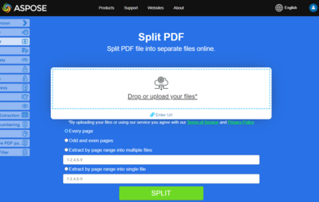

拆分 PDF 页面对于希望将大型文件拆分为单独页面或页面组的用户来说是一个有用的功能。

当您需要将大型 PDF 拆分为单页文件或更小的文档集合以进行分发、审阅或后续处理时，请使用此工作流。

## 实时示例

[Aspose.PDF 拆分器](https://products.aspose.app/pdf/splitter) 是一个在线免费网络应用程序，允许您调查演示拆分功能的工作原理。

[](https://products.aspose.app/pdf/splitter)

本主题展示了如何在您的 Python 应用程序中将 PDF 页面拆分为单独的 PDF 文件。要使用 Python 将 PDF 页面拆分为单页 PDF 文件，可按照以下步骤进行：

1. 循环遍历 PDF 文档的页面 [文档](https://reference.aspose.com/pdf/python-net/aspose.pdf/document/) 对象的 [页面集合](https://reference.aspose.com/pdf/python-net/aspose.pdf/pagecollection/) 集合
1. 对于每次迭代，创建一个新的 Document 对象并添加单个 [页面](https://reference.aspose.com/pdf/python-net/aspose.pdf/page/) 对象放入空文档
1. 使用以下方法保存新 PDF [save()](https://reference.aspose.com/pdf/python-net/aspose.pdf/document/#methods) 方法

## 在 Python 中将 PDF 拆分为多个文件或单独的 PDF

以下 Python 代码片段展示了如何将 PDF 页面拆分为单独的 PDF 文件。

```python

    import aspose.pdf as ap

    # Open document
    document = ap.Document(input_pdf)

    page_count = 1

    # Loop through all the pages
    for pdfPage in document.pages:
        new_document = ap.Document()
        new_document.pages.add(pdfPage)
        new_document.save(output_path + "_page_" + str(page_count) + ".pdf")
        page_count = page_count + 1
```

## 相关文档主题

- [使用 Python 处理 PDF 文档](/pdf/zh/python-net/working-with-documents/)
- [在 Python 中合并 PDF 文件](/pdf/zh/python-net/merge-pdf-documents/)
- [在 Python 中优化 PDF 文件](/pdf/zh/python-net/optimize-pdf/)
- [在 Python 中操作 PDF 文档](/pdf/zh/python-net/manipulate-pdf-document/)

