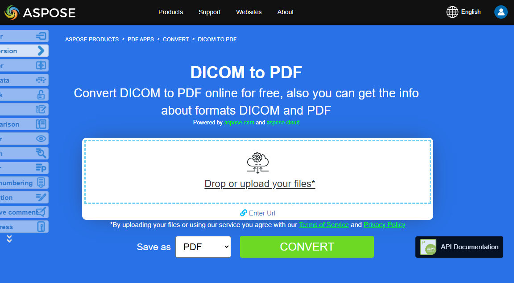
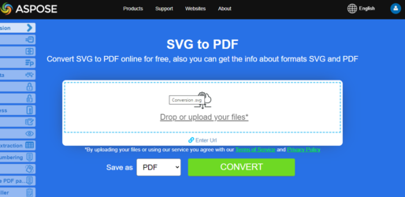

## Python 图像到 PDF 转换

**Aspose.PDF for Python via .NET** 允许您将不同格式的图像转换为 PDF 文件。我们的库展示了转换最流行的图像格式（如 BMP、CGM、DICOM、EMF、JPG、PNG、SVG 和 TIFF）的代码片段。

## 将 BMP 转换为 PDF

使用 **Aspose.PDF for Python via .NET** 库将 BMP 文件转换为 PDF 文档。

<abbr title="Bitmap Image File">BMP</abbr> 图像是具有该扩展名的文件。BMP 代表用于存储位图数字图像的位图图像文件。这些图像独立于显卡，也称为设备无关位图（DIB）文件格式。

您可以使用 Aspose.PDF for Python via .NET API 将 BMP 转换为 PDF 文件。因此，您可以遵循以下步骤来转换 BMP 图像：

在 Python 中将 BMP 转换为 PDF 的步骤：

1. 创建一个空的 PDF 文档。
1. 创建所需的页面，例如我们创建了 A4 页面，但您可以指定自己的格式。
1. 使用定义的矩形将图像（来自 infile）放置在页面内。
1. 将文档保存为 PDF。

以下代码片段遵循这些步骤，展示了如何使用 Python 将 BMP 转换为 PDF：

```python

    from io import FileIO
    from os import path
    import os
    import shutil
    import aspose.pdf as apdf
    import inspect

    path_infile = path.join(self.data_dir, infile)
    path_outfile = path.join(self.data_dir, "python", outfile)

    document = apdf.Document()
    rectangle = apdf.Rectangle(0, 0, 595, 842, True)  # A4 size in points
    page.add_image(path_infile, rectangle)
    document.save(path_outfile)

    print(infile + " converted into " + outfile)
```

{}
**尝试在线将 BMP 转换为 PDF**

Aspose 为您提供在线免费应用程序 ["BMP to PDF"](https://products.aspose.app/pdf/conversion/bmp-to-pdf/)，您可以尝试了解其功能和工作质量。

[](https://products.aspose.app/pdf/conversion/bmp-to-pdf/)
{}

## 将 CGM 转换为 PDF

使用 Aspose.PDF for Python via .NET 将 CGM（Computer Graphics Metafile）转换为 PDF（或其他支持的格式）。

<abbr title="Computer Graphics Metafile">CGM</abbr> 是一种常用于 CAD（计算机辅助设计）和演示图形应用的计算机图形元文件格式的文件扩展名。CGM 是一种矢量图形格式，支持三种不同的编码方式：二进制（最适合程序读取速度）、基于字符的（产生最小文件大小并允许更快的数据传输）或明文编码（允许用户使用文本编辑器读取和修改文件）。

查看下面的代码片段以将 CGM 文件转换为 PDF 格式。

在 Python 中将 CGM 转换为 PDF 的步骤：

1. 定义文件路径
1. 为 CGM 设置加载选项。
1. 将 CGM 转换为 PDF
1. 打印转换消息

```python

    from io import FileIO
    from os import path
    import os
    import shutil
    import aspose.pdf as apdf
    import inspect

    path_infile = path.join(self.data_dir, infile)
    path_outfile = path.join(self.data_dir, "python", outfile)

    options = apdf.CgmLoadOptions()

    # Open PDF document
    document = apdf.Document(path_infile, options)
    document.save(path_outfile)
    print(infile + " converted into " + outfile)
```

## 将 DICOM 转换为 PDF

<abbr title="Digital Imaging and Communications in Medicine">DICOM</abbr> 格式是医疗行业用于创建、存储、传输和可视化数字医学图像及患者检查文档的标准。

**Aspose.PDF for Python** 允许您转换 DICOM 和 SVG 图像，但出于技术原因，添加图像时需要指定要添加到 PDF 的文件类型。

以下代码片段展示了如何使用 Aspose.PDF 将 DICOM 文件转换为 PDF 格式。您需要加载 DICOM 图像，将图像放置在 PDF 文件的页面上，并将输出保存为 PDF。我们使用额外的 pydicom 库来设置该图像的尺寸。如果您想在页面上定位图像，可以跳过此代码片段。

1. 初始化一个新的 'ap.Document()' 并添加页面
1. 插入 DICOM 图像。创建一个 apdf.Image()，将其类型设置为 DICOM，并分配文件路径。
1. 调整页面大小。使 PDF 页面尺寸匹配 DICOM 图像大小，去除边距。
1. 将图像添加到页面，保存文档到输出文件。

1. 加载 DICOM 文件。
1. 提取图像尺寸。
1. 打印图像尺寸。
1. 创建一个新的 PDF 文档。
1. 为 PDF 准备 DICOM 图像。
1. 设置 PDF 页面尺寸和边距。
1. 将图像添加到页面。
1. 保存 PDF。
1. 打印转换消息。

```python

    from io import FileIO
    from os import path
    import os
    import shutil
    import aspose.pdf as apdf
    import inspect
    import pydicom


    path_infile = path.join(self.data_dir, infile)
    path_outfile = path.join(self.data_dir, "python", outfile)

    # Load the DICOM file
    dicom_file = pydicom.dcmread(path_infile)

    # Get the dimensions of the image
    rows = dicom_file.Rows
    columns = dicom_file.Columns

    # Print the dimensions
    print(f"DICOM image size: {rows} x {columns} pixels")

    # Initialize new Document
    document = apdf.Document()
    page = document.pages.add()
    image = apdf.Image()
    image.file_type = apdf.ImageFileType.DICOM
    image.file = path_infile

    # Set page dimensions

    page.page_info.height = rows
    page.page_info.width = columns
    page.page_info.margin.bottom = 0
    page.page_info.margin.top = 0
    page.page_info.margin.right = 0
    page.page_info.margin.left = 0
    page.paragraphs.add(image)

    document.save(path_outfile)
    print(infile + " converted into " + outfile)
```

{}
**尝试在线将 DICOM 转换为 PDF**

Aspose 为您提供在线免费应用程序 ["DICOM 转 PDF"](https://products.aspose.app/pdf/conversion/dicom-to-pdf/)，您可以尝试了解其功能和质量。

[](https://products.aspose.app/pdf/conversion/dicom-to-pdf/)
{}

## 将 EMF 转换为 PDF

<abbr title="Enhanced metafile format">EMF</abbr> 以设备无关的方式存储图形图像。EMF 的元文件由按时间顺序排列的可变长度记录组成，可在任何输出设备上解析后渲染存储的图像。

以下代码片段展示了如何使用 Python 将 EMF 转换为 PDF：

```python

    from io import FileIO
    from os import path
    import os
    import shutil
    import aspose.pdf as apdf
    import inspect
    import pydicom
    
    path_infile = path.join(self.data_dir, infile)
    path_outfile = path.join(self.data_dir, "python", outfile)

    document = apdf.Document()
    page = document.pages.add()
    rectangle = apdf.Rectangle(0, 0, 595, 842, True)  # A4 size in points
    # add image to new pdf page
    page.add_image(path_infile, rectangle)

    # Save the file into PDF format
    document.save(path_outfile)
    print(infile + " converted into " + outfile)
```

{}
**尝试在线将 EMF 转换为 PDF**

Aspose 为您提供在线免费应用程序 ["EMF 转 PDF"](https://products.aspose.app/pdf/conversion/emf-to-pdf/)，您可以尝试了解其功能和质量。

[](https://products.aspose.app/pdf/conversion/emf-to-pdf/)
{}

## 将 GIF 转换为 PDF

使用 **Aspose.PDF for Python via .NET** 库将 GIF 文件转换为 PDF 文档。

<abbr title="Graphics Interchange Format">GIF</abbr> 能够在不超过 256 种颜色的格式中存储无损压缩的数据。硬件无关的 GIF 格式于 1987 年（GIF87a）由 CompuServe 开发，用于在网络上传输位图图像。

因此以下代码片段遵循这些步骤，展示如何使用 Python 将 BMP 转换为 PDF：

```python

    from io import FileIO
    from os import path
    import os
    import shutil
    import aspose.pdf as apdf
    import inspect
    import pydicom

    path_infile = path.join(self.data_dir, infile)
    path_outfile = path.join(self.data_dir, "python", outfile)

    document = apdf.Document()
    page = document.pages.add()
    rectangle = apdf.Rectangle(0, 0, 595, 842, True)  # A4 size in points
    page.add_image(path_infile, rectangle)

    document.save(path_outfile)
    print(infile + " converted into " + outfile)
```

{}
**尝试在线将 GIF 转换为 PDF**

Aspose 为您提供在线免费应用程序 ["GIF 转 PDF"](https://products.aspose.app/pdf/conversion/gif-to-pdf/)，您可以尝试了解其功能和质量。

[](https://products.aspose.app/pdf/conversion/gif-to-pdf/)
{}

## 将 PNG 转换为 PDF

**Aspose.PDF for Python via .NET** 支持将 PNG 图像转换为 PDF 格式的功能。查看下面的代码片段以实现您的任务。

<abbr title="Portable Network Graphics">PNG</abbr> 是一种使用无损压缩的光栅图像文件格式，因其压缩效率高而深受用户喜爱。

您可以使用以下步骤将 PNG 转换为 PDF 图像：

1. 创建一个新的 PDF 文档。
1. 定义图像放置位置。
1. 保存 PDF。
1. 打印转换消息。

此外，下面的代码片段展示了如何使用 Python 将 PNG 转换为 PDF：

```python

    from io import FileIO
    from os import path
    import os
    import shutil
    import aspose.pdf as apdf
    import inspect
    import pydicom

    path_infile = path.join(self.data_dir, infile)
    path_outfile = path.join(self.data_dir, "python", outfile)

    document = apdf.Document()
    page = document.pages.add()
    rectangle = apdf.Rectangle(0, 0, 595, 842, True)  # A4 size in points
    page.add_image(path_infile, rectangle)
    document.save(path_outfile)

    print(infile + " converted into " + outfile)
```

{}
**尝试在线将 PNG 转换为 PDF**

Aspose 为您提供在线免费应用程序 ["PNG 转 PDF"](https://products.aspose.app/pdf/conversion/png-to-pdf/)，您可以尝试了解其功能和质量。

[](https://products.aspose.app/pdf/conversion/png-to-pdf/)
{}

## 将 SVG 转换为 PDF

**Aspose.PDF for Python via .NET** 解释了如何将 SVG 图像转换为 PDF 格式以及如何获取源 SVG 文件的尺寸。

可缩放向量图形（SVG）是一套基于 XML 的二维矢量图形文件格式规范，包括静态和动态（交互式或动画）两种形式。自 1999 年起，SVG 规范作为开放标准由万维网联盟（W3C）持续开发。

<abbr title="Scalable Vector Graphics">SVG</abbr> 图像及其行为在 XML 文本文件中定义。这意味着它们可以被搜索、索引、脚本化，必要时还能压缩。作为 XML 文件，SVG 图像可以使用任何文本编辑器创建和编辑，但使用诸如 Inkscape 的绘图程序通常更为方便。

{}
**尝试在线将 SVG 格式转换为 PDF**

Aspose.PDF for Python via .NET 为您提供在线免费应用程序 ["SVG 转 PDF"](https://products.aspose.app/pdf/conversion/svg-to-pdf)，您可以尝试了解其功能和质量。

[](https://products.aspose.app/pdf/conversion/svg-to-pdf)
{}

以下代码片段展示了使用 Aspose.PDF for Python 将 SVG 文件转换为 PDF 格式的过程。

```python

    from io import FileIO
    from os import path
    import os
    import shutil
    import aspose.pdf as apdf
    import inspect
    import pydicom

    path_infile = path.join(self.data_dir, infile)
    path_outfile = path.join(self.data_dir, "python", outfile)

    load_options = apdf.SvgLoadOptions()
    document = apdf.Document(path_infile, load_options)
    document.save(path_outfile)

    print(infile + " converted into " + outfile)
```

## 转换 TIFF 为 PDF

**Aspose.PDF** 文件格式受支持，无论是单帧还是多帧 TIFF 图像。这意味着您可以将 TIFF 图像转换为 PDF。

TIFF 或 TIF（Tagged Image File Format）表示用于在各种符合此文件格式标准的设备上使用的光栅图像。TIFF 图像可以包含多个具有不同图像的帧。Aspose.PDF 文件格式也受支持，无论是单帧还是多帧 TIFF 图像。

您可以像处理其他光栅文件格式图形一样将 TIFF 转换为 PDF：

```python

    from io import FileIO
    from os import path
    import os
    import shutil
    import aspose.pdf as apdf
    import inspect
    import pydicom

    path_infile = path.join(self.data_dir, infile)
    path_outfile = path.join(self.data_dir, "python", outfile)

    document = apdf.Document()
    page = document.pages.add()
    rectangle = apdf.Rectangle(0, 0, 595, 842, True)  # A4 size in points
    page.add_image(path_infile, rectangle)
    document.save(path_outfile)

    print(infile + " converted into " + outfile)
```

## 转换 CDR 为 PDF

以下代码片段展示了如何加载 CorelDRAW（CDR）文件并使用 Aspose.PDF for Python via .NET 中的 'CdrLoadOptions' 将其保存为 PDF。

1. 创建 'CdrLoadOptions()' 以配置 CDR 文件的加载方式。
1. 使用 CDR 文件和加载选项初始化 Document 对象。
1. 将文档保存为 PDF。

```python

    from io import FileIO
    from os import path
    import os
    import shutil
    import aspose.pdf as apdf
    import inspect
    import pydicom

    path_infile = path.join(self.data_dir, infile)
    path_outfile = path.join(self.data_dir, "python", outfile)

    load_options = apdf.CdrLoadOptions()
    document = apdf.Document(path_infile, load_options)
    document.save(path_outfile)

    print(infile + " converted into " + outfile)
```

## 转换 JPEG 为 PDF

此示例展示了如何使用 Aspose.PDF for Python via .NET 将 JPEG 转换为 PDF 文件。

1. 创建一个新的 PDF 文档。
1. 添加一个新页面。
1. 定义放置矩形（A4 大小：595x842 点）。
1. 将图像插入页面。
1. 保存 PDF。

```python

    from io import FileIO
    from os import path
    import os
    import shutil
    import aspose.pdf as apdf
    import inspect
    import pydicom

    path_infile = path.join(self.data_dir, infile)
    path_outfile = path.join(self.data_dir, "python", outfile)

    document = apdf.Document()
    page = document.pages.add()
    rectangle = apdf.Rectangle(0, 0, 595, 842, True)  # A4 size in points
    page.add_image(path_infile, rectangle)

    document.save(path_outfile)
    print(infile + " converted into " + outfile)
```

