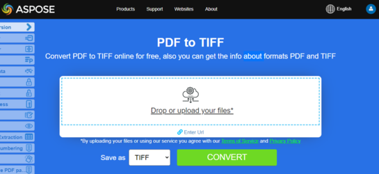
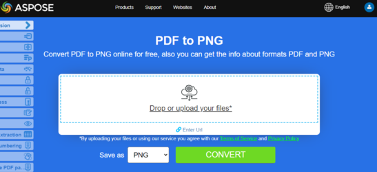

## 在 Python 中将 PDF 转换为图像

**Aspose.PDF for Python** 使用多种方法将 PDF 转换为图像。一般来说，我们使用两种方法：使用 Device 方法的转换和使用 SaveOption 的转换。本节将向您展示如何使用这些方法之一将 PDF 文档转换为 BMP、JPEG、GIF、PNG、EMF、TIFF 和 SVG 等图像格式。

库中有多个类允许您使用虚拟设备来转换图像。`DocumentDevice` 旨在转换整个文档，而 `ImageDevice` 用于特定页面的转换。

## 使用 DocumentDevice 类转换 PDF

**Aspose.PDF for Python** 能够将 PDF 页面转换为 TIFF 图像。

The [TiffDevice](https://reference.aspose.com/pdf/python-net/aspose.pdf.devices/tiffdevice/) (基于 DocumentDevice) 类允许您将 PDF 页面转换为 TIFF 图像。该类提供了名为 [process](https://reference.aspose.com/pdf/python-net/aspose.pdf.devices/tiffdevice/#methods) 的方法，可将 PDF 文件中的所有页面转换为单个 TIFF 图像。

{}
**尝试在线将 PDF 转换为 TIFF**

Aspose.PDF for Python via .NET 为您提供在线免费应用 ["PDF 转 TIFF"](https://products.aspose.app/pdf/conversion/pdf-to-tiff)，您可以尝试调查其功能和质量。

[](https://products.aspose.app/pdf/conversion/pdf-to-tiff)
{}

### 将 PDF 页面转换为单个 TIFF 图像

Aspose.PDF for Python 说明如何将 PDF 文件的所有页面转换为单个 TIFF 图像：

步骤：在 Python 中将 PDF 转换为 TIFF

1. 创建一个 [Document](https://reference.aspose.com/pdf/python-net/aspose.pdf/document/) 类的对象。
1. 创建 [TiffSettings](https://reference.aspose.com/pdf/python-net/aspose.pdf.devices/tiffsettings/) 和 [TiffDevice](https://reference.aspose.com/pdf/python-net/aspose.pdf.devices/tiffdevice/) 对象
1. 调用 [process](https://reference.aspose.com/pdf/python-net/aspose.pdf.devices/tiffdevice/#methods) 方法将 PDF 文档转换为 TIFF。
1. 要设置输出文件的属性，请使用 [TiffSettings](https://reference.aspose.com/pdf/python-net/aspose.pdf.devices/tiffsettings/) 类。

下面的代码片段展示了如何将所有 PDF 页面转换为单个 TIFF 图像。

```python

    from os import path
    import aspose.pdf as apdf
    from io import FileIO

    path_infile = path.join(self.data_dir, infile)
    path_outfile = path.join(self.data_dir, "python", outfile)

    document = apdf.Document(path_infile)

    resolution = apdf.devices.Resolution(300)
    tiffSettings = apdf.devices.TiffSettings()
    tiffSettings.compression = apdf.devices.CompressionType.LZW
    tiffSettings.depth = apdf.devices.ColorDepth.DEFAULT
    tiffSettings.skip_blank_pages = False

    tiffDevice = apdf.devices.TiffDevice(resolution, tiffSettings)
    tiffDevice.process(document, path_outfile)

    print(infile + " converted into " + outfile)
```

## 使用 ImageDevice 类转换 PDF

`ImageDevice` 是 `BmpDevice`、`JpegDevice`、`GifDevice`、`PngDevice` 和 `EmfDevice` 的祖先。

- The [BmpDevice](https://reference.aspose.com/pdf/python-net/aspose.pdf.devices/bmpdevice/) 类允许您将 PDF 页面转换为 <abbr title="Bitmap Image File">BMP</abbr> 图像。
- The [EmfDevice](https://reference.aspose.com/pdf/python-net/aspose.pdf.devices/emfdevice/) 类允许您将 PDF 页面转换为 <abbr title="Enhanced Meta File">EMF</abbr> 图像。
- The [JpegDevice](https://reference.aspose.com/pdf/python-net/aspose.pdf.devices/jpegdevice/) 类允许您将 PDF 页面转换为 JPEG 图像。
- The [PngDevice](https://reference.aspose.com/pdf/python-net/aspose.pdf.devices/pngdevice/) 类允许您将 PDF 页面转换为 <abbr title="Portable Network Graphics">PNG</abbr> 图像。
- The [GifDevice](https://reference.aspose.com/pdf/python-net/aspose.pdf.devices/gifdevice/) 类允许您将 PDF 页面转换为 <abbr title="Graphics Interchange Format">GIF</abbr> 图像。

让我们看看如何将 PDF 页面转换为图像。

[BmpDevice](https://reference.aspose.com/pdf/python-net/aspose.pdf.devices/bmpdevice/) 类提供了名为 [process](https://reference.aspose.com/pdf/python-net/aspose.pdf.devices/bmpdevice/#methods) 的方法，允许您将 PDF 文件的特定页面转换为 BMP 图像格式。其他类拥有相同的方法。因此，如果我们需要将 PDF 页面转换为图像，只需实例化所需的类即可。

以下步骤和 Python 代码片段展示了此可能性：

- [在 Python 中将 PDF 转换为 BMP](#python-pdf-to-image)
- [在 Python 中将 PDF 转换为 EMF](#python-pdf-to-image)
- [在 Python 中将 PDF 转换为 JPG](#python-pdf-to-image)
- [在 Python 中将 PDF 转换为 PNG](#python-pdf-to-image)
- [在 Python 中将 PDF 转换为 GIF](#python-pdf-to-image)

步骤：在 Python 中将 PDF 转换为图像（BMP、EMF、JPG、PNG、GIF）

1. 使用 [Document](https://reference.aspose.com/pdf/python-net/aspose.pdf/document/) 类加载 PDF 文件。
1. 创建 [ImageDevice](https://reference.aspose.com/pdf/python-net/aspose.pdf.devices/imagedevice/) 子类的实例，即。
* [BmpDevice](https://reference.aspose.com/pdf/python-net/aspose.pdf.devices/bmpdevice/) （将 PDF 转换为 BMP）
* [EmfDevice](https://reference.aspose.com/pdf/python-net/aspose.pdf.devices/emfdevice/) （将 PDF 转换为 Emf）
* [JpegDevice](https://reference.aspose.com/pdf/python-net/aspose.pdf.devices/jpegdevice/) （将 PDF 转换为 JPG）
* [PngDevice](https://reference.aspose.com/pdf/python-net/aspose.pdf.devices/pngdevice/) （将 PDF 转换为 PNG）
* [GifDevice](https://reference.aspose.com/pdf/python-net/aspose.pdf.devices/gifdevice/) （将 PDF 转换为 GIF）
1. 调用 [ImageDevice.process()](https://reference.aspose.com/pdf/python-net/aspose.pdf.devices/imagedevice/#methods) 方法执行 PDF 到图像的转换。

### 将 PDF 转换为 BMP

```python

    from os import path
    import aspose.pdf as apdf
    from io import FileIO

    path_infile = path.join(self.data_dir, infile)
    path_outfile = path.join(self.data_dir, "python", outfile)

    document = apdf.Document(path_infile)
    resolution = apdf.devices.Resolution(300)
    device = apdf.devices.BmpDevice(resolution)
    page_count = 1
    while page_count <= len(document.pages):
        image_stream = FileIO(path_outfile + str(page_count) + "_out.bmp", "w")
        device.process(document.pages[page_count], image_stream)
        image_stream.close()
        page_count = page_count + 1

    print(infile + " converted into " + outfile)
```

### 将 PDF 转换为 EMF

```python

    from os import path
    import aspose.pdf as apdf
    from io import FileIO

    path_infile = path.join(self.data_dir, infile)
    path_outfile = path.join(self.data_dir, "python", outfile)

    document = apdf.Document(path_infile)
    resolution = apdf.devices.Resolution(300)
    device = apdf.devices.EmfDevice(resolution)
    page_count = 1
    while page_count <= len(document.pages):
        image_stream = FileIO(path_outfile + str(page_count) + "_out.emf", "w")
        device.process(document.pages[page_count], image_stream)
        image_stream.close()
        page_count = page_count + 1

    print(infile + " converted into " + outfile)
```  

### 将 PDF 转换为 JPEG

```python

    from os import path
    import aspose.pdf as apdf
    from io import FileIO

    path_infile = path.join(self.data_dir, infile)
    path_outfile = path.join(self.data_dir, "python", outfile)

    document = apdf.Document(path_infile)
    resolution = apdf.devices.Resolution(300)
    device = apdf.devices.JpegDevice(resolution)
    page_count = 1

    while page_count <= len(document.pages):
        image_stream = FileIO(path_outfile + str(page_count) + "_out.jpeg", "w")
        device.process(document.pages[page_count], image_stream)
        image_stream.close()
        page_count = page_count + 1

    print(infile + " converted into " + outfile)
```


### 将 PDF 转换为 PNG

```python

    from os import path
    import aspose.pdf as apdf
    from io import FileIO

    path_infile = path.join(self.data_dir, infile)
    path_outfile = path.join(self.data_dir, "python", outfile)

    document = apdf.Document(path_infile)
    resolution = apdf.devices.Resolution(300)

    device = apdf.devices.PngDevice(resolution)
    page_count = 1
    while page_count <= len(document.pages):
        image_stream = FileIO(path_outfile + str(page_count) + "_out.png", "w")
        device.process(document.pages[page_count], image_stream)
        image_stream.close()
        page_count = page_count + 1

    print(infile + " converted into " + outfile)
```

### 将 PDF 转换为 PNG（使用默认字体）

```python

    from os import path
    import aspose.pdf as ap
    from io import FileIO


    path_infile = path.join(self.data_dir, infile)
    path_outfile = path.join(self.data_dir, "python", outfile)

    document = ap.Document(path_infile)
    resolution = ap.devices.Resolution(300)

    rendering_options = ap.RenderingOptions()
    rendering_options.default_font_name = "Arial"

    device = ap.devices.PngDevice(resolution)
    device.rendering_options = rendering_options

    page_count = 1
    while page_count <= len(document.pages):
        image_stream = FileIO(path_outfile + str(page_count) + "_out.png", "w")
        device.process(document.pages[page_count], image_stream)
        image_stream.close()
        page_count = page_count + 1

    print(infile + " converted into " + outfile)
```

### 将 PDF 转换为 GIF

```python

    from os import path
    import aspose.pdf as apdf
    from io import FileIO

    path_infile = path.join(self.data_dir, infile)
    path_outfile = path.join(self.data_dir, "python", outfile)

    document = apdf.Document(path_infile)
    resolution = apdf.devices.Resolution(300)
    device = apdf.devices.GifDevice(resolution)
    page_count = 1
    while page_count <= len(document.pages):
        image_stream = FileIO(path_outfile + str(page_count) + "_out.gif", "w")
        device.process(document.pages[page_count], image_stream)
        image_stream.close()
        page_count = page_count + 1

    print(infile + " converted into " + outfile)
```

{}
**尝试在线将 PDF 转换为 PNG**

作为我们免费应用程序工作方式的示例，请查看以下功能。

Aspose.PDF for Python 为您提供在线免费应用程序 ["PDF to PNG"](https://products.aspose.app/pdf/conversion/pdf-to-png)，您可以在此尝试调查其功能和质量。

[](https://products.aspose.app/pdf/conversion/pdf-to-png)
{}

## 使用 SaveOptions 类转换 PDF

本文的这一部分向您展示如何使用 Python 和 SaveOptions 类将 PDF 转换为 <abbr title="Scalable Vector Graphics">SVG</abbr>。

{}
**尝试在线将 PDF 转换为 SVG**

Aspose.PDF for Python via .NET 为您提供在线免费应用程序 ["PDF to SVG"](https://products.aspose.app/pdf/conversion/pdf-to-svg)，您可以在此尝试调查其功能和质量。

[](https://products.aspose.app/pdf/conversion/pdf-to-svg)
{}

**可伸缩矢量图形 (SVG)** 是一种基于 XML 的文件格式规范族，用于二维矢量图形，包括静态和动态（交互式或动画）图形。SVG 规范是一项自 1999 年起由万维网联盟 (W3C) 开发的开放标准。

SVG 图像及其行为被定义在 XML 文本文件中。这意味着它们可以被搜索、索引、脚本化，必要时还可以压缩。作为 XML 文件，SVG 图像可以使用任何文本编辑器创建和编辑，但使用诸如 Inkscape 等绘图程序往往更为便利。

Aspose.PDF for Python 支持将 SVG 图像转换为 PDF 格式的功能，同时也提供将 PDF 文件转换为 SVG 格式的能力。为实现此需求，已在 Aspose.PDF 命名空间中引入了 [SvgSaveOptions](https://reference.aspose.com/pdf/python-net/aspose.pdf/svgsaveoptions/) 类。实例化 SvgSaveOptions 对象并将其作为第二个参数传递给 [document.save()](https://reference.aspose.com/pdf/python-net/aspose.pdf/document/#methods) 方法。

以下代码片段展示了使用 Python 将 PDF 文件转换为 SVG 格式的步骤。

步骤：使用 Python 将 PDF 转换为 SVG

1. 创建一个 [Document](https://reference.aspose.com/pdf/python-net/aspose.pdf/document/) 类的对象。
1. 使用所需设置创建 [SvgSaveOptions](https://reference.aspose.com/pdf/python-net/aspose.pdf/svgsaveoptions/) 对象。
1. 调用 [document.save()](https://reference.aspose.com/pdf/python-net/aspose.pdf/document/#methods) 方法，并传入 [SvgSaveOptions](https://reference.aspose.com/pdf/python-net/aspose.pdf/svgsaveoptions/) 对象，以将 PDF 文档转换为 SVG。

### 将 PDF 转换为 SVG

```python

    from os import path
    import aspose.pdf as apdf
    from io import FileIO

    path_infile = path.join(self.data_dir, infile)
    path_outfile = path.join(self.data_dir, "python", outfile)

    document = apdf.Document(path_infile)

    save_options = apdf.SvgSaveOptions()
    save_options.compress_output_to_zip_archive = False
    save_options.treat_target_file_name_as_directory = True

    document.save(path_outfile, save_options)
    print(infile + " converted into " + outfile)
```

