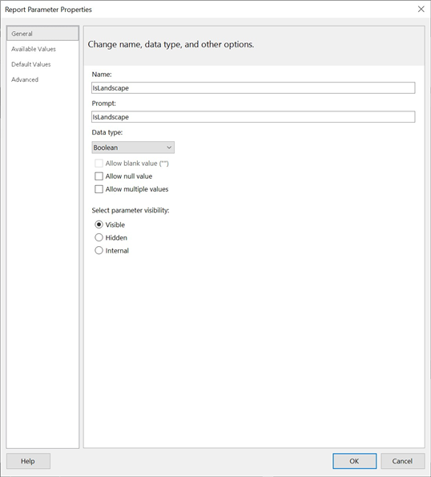

{}

您可以指定某些配置参数，这些参数会影响 Aspose.Pdf for Reporting Services 生成文档的方式。本节将描述此过程。

{}

要配置 Aspose.Pdf for Reporting Services，您需要编辑 C:\\Program Files\\Microsoft SQL Server\\<Instance>\\Reporting Services\\ReportServer\\rsreportserver.config 文件。该文件是 XML 文件，渲染器配置位于其中的 ```<Extension>``` 对应于 Aspose.PDF 渲染器的元素。

**示例**



<Render>
…
<Extension Name="APPDF" Type="Aspose.Pdf.ReportingServices.Renderer,Aspose.Pdf.ReportingServices">
<!--Insert configuration elements for exporting to PDF here. The following is an example
For PageOrientation -->
    <Configuration>
    <IsLandscape>True</IsLandscape>
    </Configuration>
</Extension>
</Render>



{}

如果您想为特定的报表文件设置参数，而不是为服务器上的每个报表设置参数，您可以在 Report Builder 中为该特定报表添加报表参数，按照以下步骤操作（例如，我们将添加前面显示的 ‘IsLandscape’ 参数）：

1. 在 Report Designer 中打开报表，右键单击 ‘Report Data’ 窗格中的 ‘Parameters’ 文件夹，然后选择 ‘Add Parameter…’（或者，您也可以下拉 ‘New’ 列表并选择 ‘Parameter…’）。
 


1. 在 ‘Report Parameter Properties’ 对话框中，创建名为 ‘IsLandscape’ 的参数，数据类型设置为 Boolean，并在 ‘Default Values’ 选项卡中添加值 True。



{}

