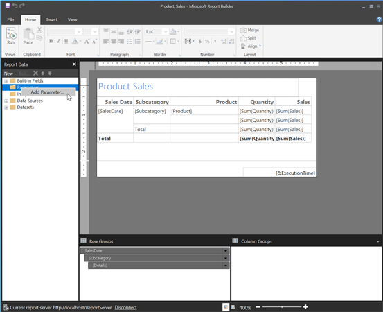

{}

您可以指定某些配置参数，这些参数会影响 Aspose.PDF for Reporting Services 生成文档的方式。本节描述了这个过程。

{}

要为 Reporting Services 配置 Aspose.Pdf，您需要编辑 `C:\Program Files\Microsoft SQL Server\<Instance>\Reporting Services\ReportServer\rsreportserver.config` 文件。这是一个 XML 文件，渲染器配置位于与 Aspose.PDF 渲染器对应的 `<Extension>` 元素内。

## 例子

```xml
<Render>
…
<Extension Name="APPDF" Type="Aspose.Pdf.ReportingServices.Renderer,Aspose.Pdf.ReportingServices">
<!--Insert configuration elements for exporting to PDF here. The following is an example
For PageOrientation -->
    <Configuration>
    <IsLandscape>True</IsLandscape>
    </Configuration>
</Extension>
</Render>
```

{}

如果您想为特定报表文件设置参数，而不是为服务器上的每个报表设置参数，您可以按照以下步骤在报表生成器中为特定报表添加报表参数（例如，我们将添加前面显示的“IsLandscape”参数）：

1. 在报表设计器中打开报表，右键单击“报表数据”窗格中的“参数”文件夹，然后选择“添加参数...”（或者，下拉“新建”列表并选择“参数...”）。



1. 在“报告参数属性”对话框中，创建名为“IsLandscape”的参数，数据类型为布尔值，并在“默认值”选项卡中添加值 True。


{}
