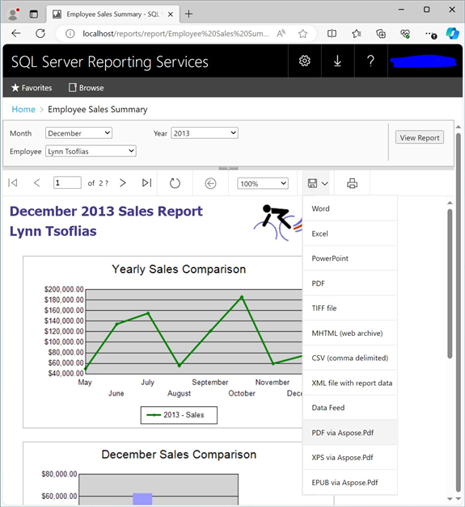

{}

只有在手动安装 Aspose.PDF for Reporting Services（而非使用 MSI 安装程序）时，您才需要按照以下步骤进行。MSI 安装程序会自动执行所有必要的安装和注册操作。

{}

在以下步骤中，您需要复制并修改 Microsoft SQL Server Reporting Services 所在目录中的文件。zip 包中的 SSRS 2016 程序集位于 \Bin\SSRS2016 目录；SSRS 2017 程序集位于 \Bin\SSRS2017 目录；SSRS 2019 程序集位于 \Bin\SSRS2019 目录；SSRS 2022 程序集位于 \Bin\SSRS2022 目录；Power BI Report Server 程序集位于 \Bin\PowerBI 目录。 

{}

**Step 1.** 定位 Report Server 安装目录。Microsoft SQL Server 的根目录通常是 C:\Program Files\Microsoft SQL Server。后续处理在 Reporting Services 2016、Reporting Services 2017 及以后版本，以及 Power BI Report Server 中略有不同：

- Report Server 2016 默认安装在 C:\\Program Files\\Microsoft SQL Server\\MSRS13.MSSQLSERVER\\Reporting Services\\ReportServer 目录。如果您使用自定义命名实例而不是默认实例，则默认路径为 C:\\Program Files\\Microsoft SQL Server\\MSRS13.[SSRSInstanceName]\\Reporting Services\\ReportServer
- Report Server 2017 及以后版本默认安装在 C:\\Program Files\\Microsoft SQL Server Reporting Services\\SSRS\\ReportServer 目录。
- Power BI Report Server 默认安装在 C:\\Program Files\\Microsoft Power BI Report Server\\PBIRS\\ReportServer 目录。

在以下文本中，报告服务的安装目录（上述路径之一）将被引用为 ```<Instance>```.
{}

{}
**Step 2.** 复制相应 SSRS 版本的 Aspose.Pdf.ReportingServices.dll 到 ```<Instance>```\bin 文件夹。
{}

{}
**第3步。** 将 Aspose.Pdf for Reporting Services 注册为渲染扩展。打开 ```<Instance>```\rsreportserver.config 文件并将以下行添加到 ```<Render>``` 元素：
{}

**示例**



 <Render>
...
<!--Start here.-->

<Extension Name="APPDF" Type="Aspose.Pdf.ReportingServices.Renderer,Aspose.Pdf.ReportingServices"/>

</Render>



{}
**Step 4.** 为 Reporting Services 提供 Aspose.Pdf 并授予执行权限。打开 ```<Instance>```\\rssrvpolicy.config 文件，并将以下文本作为第二至外层的最后一项添加 ```<CodeGroup>``` 元素（应该是 ```<CodeGroup class="FirstMatchCodeGroup" version="1" PermissionSetName="Execution" Description="This code group grants MyComputer code Execution permission. ">):```
{}

**示例**



 <CodeGroup>
...

<CodeGroup>
...

<!--Start here.-->

<CodeGroup class="UnionCodeGroup" version="1" PermissionSetName="FullTrust"

Name="Aspose.Pdf_for_Reporting_Services" Description="This code group grants full trust to the AP4SSRS assembly.">

<IMembershipCondition class="StrongNameMembershipCondition" version="1" PublicKeyBlob="00240000048000009400000006020000002400005253413100040000010001005542e99cecd28842dad186257b2c7b6ae9b5947e51e0b17b4ac6d8cecd3e01c4d20658c5e4ea1b9a6c8f854b2d796c4fde740dac65e834167758cff283eed1be5c9a812022b015a902e0b97d4e95569eb8c0971834744e633d9cb4c4a6d8eda03c12f486e13a1a0cb1aa101ad94943236384cbbf5c679944b994de9546e493bf " />

</CodeGroup>

<!--End here. -->

</CodeGroup>

</CodeGroup>



{}
**步骤 5.** 验证 Aspose.Pdf for Reporting Services 已成功安装。打开 Reporting Services Web 门户并检查报告的可用导出格式列表。您可以通过启动 web 浏览器并在地址栏中键入 Reporting Services Web 门户的 URL 来启动该门户（默认情况下它是 http://```<Reporting_Services_server_name>```/reports/)。 在您的 Web 门户中选择一个可用的报表，然后展开 Export 下拉列表。您应该会看到包括 Aspose.Pdf for Reporting Services 扩展提供的导出格式列表。请选择 PDF via Aspose.PDF 项目。

 
{}



点击所选项。它将以所选格式生成报告，发送给客户端，并根据您的浏览器设置，要么显示保存文件对话框让您选择导出报告的保存位置，要么自动将文件下载到您的下载文件夹。

{}
恭喜，您已成功安装 Aspose.Pdf for Reporting Services 并将报告导出为 PDF 文档！
{}


