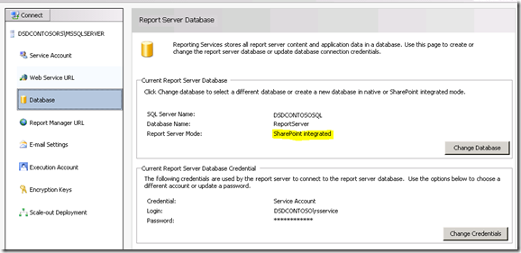
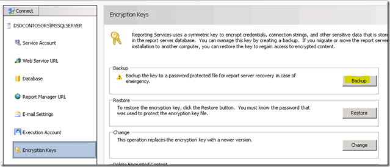

{}

我们在 Reporting Services 服务器的第一站是 Reporting Services 配置管理器。

{}

## 服务账户:

**确保了解您在报表服务中使用的服务账户。如果遇到问题，可能与您使用的服务账户有关。默认是 Network Service。当我们部署新构建时，总是使用域账户，因为这往往是问题的根源。对于此服务器实例，我们使用了名为 RSService 的域账户。**

**Image1:- 设置服务账户**

## Web Service URL：

{}

**我们需要配置 Web Service URL。这是承载 Reporting Services 使用的 Web Services 的 ReportServer 虚拟目录（vdir），也是 SharePoint 将要通信的对象。除非您想自定义 vdir 的属性（例如 SSL、端口、主机标头等），否则只需点击此处的“应用”，即可完成设置。**

**Image2:- 设置 Web Service URL 完成后，您应该能够看到以下结果**

**Image3:- Web Service URL 设置成功**
{}

## 数据库：

**我们需要创建 Reporting Services Catalog 数据库。它可以放置在任何 SQL 2008 或 SQL 2008 R2 数据库引擎上。SQL11 也可以正常工作，但仍处于 BETA 阶段。此操作默认会创建两个数据库：ReportServer 和 ReportServerTempDB。**

{}
**此过程的另一个重要步骤是确保为数据库类型选择 SharePoint Integrated。一旦做出此选择，就无法更改。**

**Image4:- 创建报告服务器数据库**

**Image5:- 设置数据库服务器和身份验证类型**

**Image6:- 设置数据库名称和模式**
{}

**对于凭据，这是报告服务器与 SQL Server 通信的方式。无论您选择哪个帐户，都将在 Catalog 数据库以及通过 RSExecRole 的几个系统数据库中赋予一定权限。MSDB 是其中一个用于订阅的数据库，因为我们使用 SQL Agent。**

**Image7:- 设置报告服务器数据库凭据**

{}

**一旦指定了数据库凭据，我们应该能够得到以下所示的结果。**

**Image8:- 报表服务器数据库创建进度**

**Image9:- 报表服务器数据库完成摘要**
{}

## 报表管理器 URL:

**我们可以跳过 Report Manager URL，因为在 SharePoint 集成模式下它不被使用。SharePoint 是我们的前端。Report Manager 无法工作。**

## 加密密钥：

{}
**备份您的加密密钥，并确保您知道它们保存位置。如果出现需要迁移数据库或恢复数据库的情况，您将需要这些密钥。**

**Image10:- Report Server 加密密钥备份**
{}

{}
**恭喜！我们已成功使用配置管理器配置了 Reporting Services。如果您在“Web Service URL”选项卡中浏览该 URL，它应该显示类似如下的内容。**

**Image11:- 安装后报告服务器访问**

**错误原因：SharePoint 已安装在我们的 WFE 上，我们已完成 Reporting Services 的设置。在此示例中，Reporting Services 和 SharePoint 位于不同的机器上。如果它们在同一台机器上，您就不会看到此错误。技术上我们需要在 RS 服务器上安装 SharePoint。这意味着 IIS 也将被启用。**
{}

