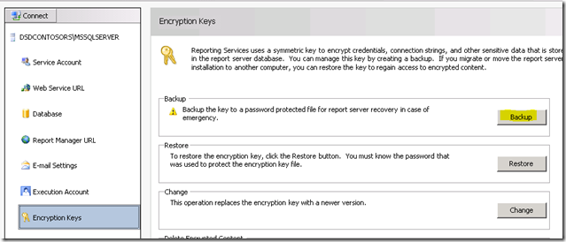

{}

我们在 Reporting Services 服务器上的第一站是 Reporting Services 配置管理器。

{}

## 服务帐号：

**请务必了解您用于 Reporting Services 的服务帐户。如果我们遇到问题，可能与您使用的服务帐户有关。默认为网络服务。当我们部署新版本时，我们总是使用域帐户，因为这就是我们可能遇到问题的地方。对于此服务器实例，我们使用了名为 RSService 的域帐户。**

**图片1：- 设置服务帐户**

## 网络服务网址：

{}

**我们需要配置 Web 服务 URL。这是承载 Reporting Services 使用的 Web 服务以及 SharePoint 将与之通信的 ReportServer 虚拟目录 (vdir)。除非您想自定义 vdir 的属性（即 SSL、端口、主机标头等），否则您应该只需单击此处的“应用”即可开始。**

**Image2:- 设置 Web 服务 URL 设置 Web 服务 URL 后，您应该能够看到以下结果**

**Image3:- 成功设置 Web 服务 URL**
{}

## 数据库：

**我们需要创建 Reporting Services 目录数据库。它可以放置在任何 SQL 2008 或 SQL 2008 R2 数据库引擎上。 SQL11 也可以正常工作，但仍处于测试阶段。默认情况下，此操作将创建两个数据库：ReportServer 和 ReportServerTempDB。**

{}
**另一个重要步骤是确保您选择 SharePoint Integrated 作为数据库类型。一旦做出选择，就无法更改。**

**Image4:- 创建报表服务器数据库**

**图 5：- 设置数据库服务器和身份验证类型**

**Image6:- 设置数据库名称和模式**
{}

**对于凭据，这是报表服务器与 SQL Server 通信的方式。无论您选择什么帐户，都将通过 RSExecRole 在目录数据库以及一些系统数据库中获得某些权限。 MSDB 是用于订阅使用的数据库之一，因为我们使用 SQL 代理。**

**图 7：- 设置报表服务器数据库凭据**

{}

**指定数据库凭据后，我们应该能够获得如下指定的结果。**

**Image8:- 报告服务器数据库创建进度**

**Image9:- Report Server 数据库完成摘要**
{}

## 报告管理器网址：

**我们可以跳过报表管理器 URL，因为当我们处于 SharePoint 集成模式时不会使用它。 SharePoint 是我们的前端。报告管理器不起作用。**

## 加密密钥：

{}
**备份您的加密密钥并确保您知道它们的保存位置。如果您遇到需要迁移数据库或恢复数据库的情况，您将需要这些。**

**图片 10：- 报表服务器加密密钥备份**
{}

{}
**恭喜！我们已使用配置管理器成功配置了 Reporting Services。如果您浏览到“Web 服务 URL”选项卡上的 URL，它应该显示类似于以下内容的内容。**

**图片 11：- 安装后访问报表服务器**

**错误原因：SharePoint 已安装在我们的 WFE 上，并且我们完成了 Reporting Services 的设置。在此示例中，Reporting Services 和 SharePoint 位于不同的计算机上。如果它们位于同一台计算机上，您就不会看到此错误。从技术上讲，我们需要在 RS Box 上安装 SharePoint。这意味着 IIS 也将被启用。**
{}

