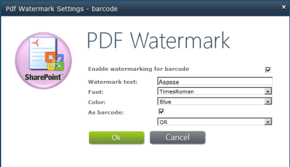

## 将条形码添加到 PDF 文件

{}

Aspose.PDF for SharePoint 允许您将条形码添加到 PDF 文档。用户可以将条形码添加到添加到库的 PDF 文档每页的左下角。下图展示了添加了条形码的 PDF 文档的外观。

### 条形码位于左下角

{}

{}

要为特定库启用条形码功能，请使用 **库工具** 中 **Aspose PDF 水印工具** 选项卡中的 **水印设置** 按钮，如下所示。

### PDF水印设置

为特定库启用条形码后，Aspose.PDF for SharePoint 会将条形码添加到添加到该库的任何 PDF 文档。

{}
