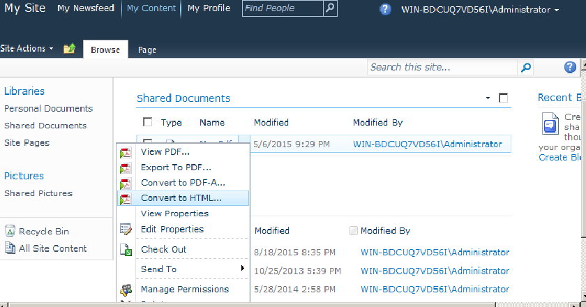

---
title: 在 SharePoint 中将 PDF 转换为 HTML
linktitle: 将 PDF 转换为 HTML
type: docs
weight: 80
url: /zh/sharepoint/convert-pdf-to-html/
lastmod: "2020-12-16"
description: 使用 PDF SharePoint API，您可以将 SharePoint 文档库中的 PDF 文档转换为 HTML 格式。
---

{}

Aspose.PDF for SharePoint 支持将 SharePoint 文档库中的 PDF 文档转换为 HTML 格式的功能。在本文中，我们将演示 PDF 到 HTML 的转换。

{}

## 将 PDF 文档转换为 HTML

将 PDF 文档从 SharePoint 文档库转换为 HTML，如下所示：

1. 单击 PDF 文档 ECB 菜单中的 **转换为 HTML**。

2. 下载生成的 HTML 文件并将其保存到磁盘。

