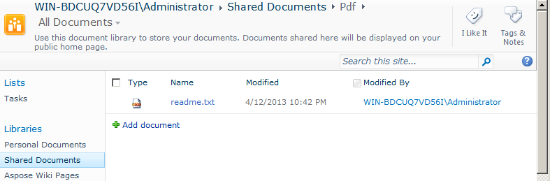

{}

对工作流的支持是 Microsoft Office SharePoint Server 的关键功能。工作流有助于根据业务逻辑自动移动文档，并简化文档组织的成本和时间。本文演示如何在将文档转换为 PDF 的工作流程中使用 Aspose.PDF for SharePoint。

{}

## 设置工作流程

此示例创建一个工作流，将文档库中的任何新项目转换为 PDF 格式并将其存储在另一个文档库中。该示例使用 **个人文档** 库作为源库，使用 **共享文档** 库中的 *​​Pdf** 子文件夹作为目标库。

Aspose.PDF for SharePoint 支持 HTML、文本和图像文件的转换。

### 使用 SharePoint Designer 设计工作流

1. 打开 **SharePoint Designer** 并连接到将实施工作流的站点。
1. 从**站点对象**中选择**工作流程**，然后打开**列出工作流程**。
1. 选择 **个人文档** 库以创建新的列表工作流程并将其附加到文档库。

   **从菜单中选择个人文档**

1. 通过键入工作流程名称和说明，创建列表工作流程并将其附加到 **个人文档** 库。
1. 单击 **确定** 完成此步骤。

   **创建列表工作流程**

将出现工作流程步骤编辑器。这用于定义工作流程的条件和操作。现在添加一个操作，从 **Aspose Actions** 无条件地将新文档转换为 PDF。

1. 从 **操作** 菜单中选择 **通过 Aspose.PDF** 将文件转换为 PDF** 操作。

   **选择和行动**

1. 配置动作参数：
   1. 将 **此文件夹** 参数设置为目标文件夹。
   1. 将其他操作参数保留为默认值或使用操作属性窗口进行设置。 **Overwrite** 参数的默认值为 false。

      **工作流程编辑器**

**设置目标库**

**设置属性**

1. 从**工作流程**菜单中，选择**工作流程设置**。
1. 选择**创建新项目时自动启动工作流程**并从**启动选项**中清除其他选项。

   **设置启动选项**

工作流程设计完成。

1. 保存并发布工作流以在 SharePoint 网站上实施它。

### 测试工作流程

测试工作流程：

1. 打开 SharePoint 网站并将新文档上传到 **个人文档** 文档库。
   Aspose.PDF for SharePoint 支持从 HTML 文件、文本文件和图像（JPG、PNG、GIF、TIFF 和 BMP*）到 PDF 的转换。工作流程配置为在创建新项目时自动启动，因此文件会自动处理。
1. 刷新浏览器。
   工作流程状态显示在工作流程列中，在本例中为 **Aspose.PDF Workflow**。

   **将文档添加到源库**

1. 打开目标文档库以查看转换后的文档。 **共享文档/Pdf** 是本示例中的路径。

   **目标图书馆**

