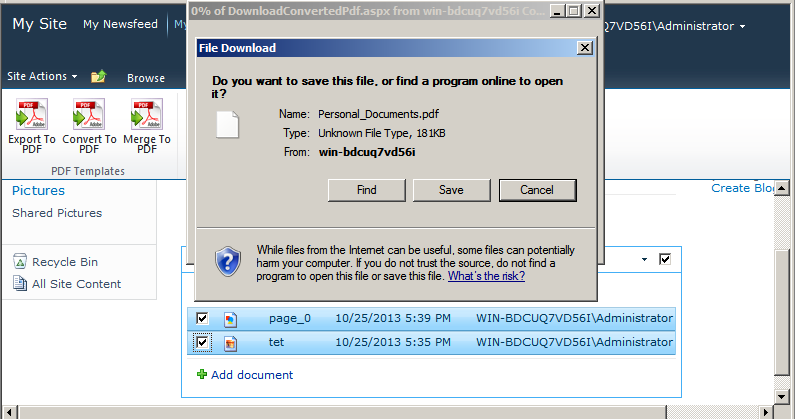

{}

Aspose.PDF for SharePoint 支持创建安全的 PDF。安装 Aspose.PDF for SharePoint 会在站点设置中添加 **PDF 安全设置** 选项。在这里，您可以设置用户密码、所有者密码和算法列表中的任何值来加密输出 PDF。算法列表提供了加密算法和密钥大小的不同组合。传递您选择的价值。

本文演示如何使用Aspose.PDF for SharePoint 生成加密的PDF。

{}

## 创建安全的 PDF

为了演示该功能，首先我们为所有者和用户密码以及加密算法配置 **PDF 安全设置** 选项。然后，该示例合并文档库中的两个文档。

### 设置 PDF 安全设置选项

从站点设置中打开 **PDF 安全设置** 选项并设置算法、所有者密码和用户密码。

加密 PDF 文件时指定不同的用户和所有者密码。

- 如果设置了用户密码，您需要提供该密码才能打开 PDF。 Acrobat Reader 提示用户输入用户密码。如果错误，文档将无法打开。
- 如果设置了所有者密码，则可以控制打印、编辑、提取、评论等权限。Acrobat Reader 根据权限设置不允许使用这些功能。如果您想要设置/更改权限，Acrobat 需要此密码。

### 合并文档

使用 **转换为 PDF** 选项合并两个文档。此功能将多个非 PDF 文件（HTML、文本或图像）合并为 PDF 文件。

1. 打开文档库并从列表中选择所需的文档。

1. 使用“库工具”中的 **合并为 PDF** 选项来保存输出文件。系统会提示您将输出文件保存到磁盘。

### 输出

输出文件已加密。

