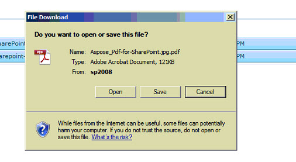

{}

本文介绍如何使用 Aspose.PDF for SharePoint 通过一次转换操作将多个选定文件转换为 PDF 文件。

{}

## 将多个选定文件转换为 PDF

{}

要转换多个选定的文件，请执行以下步骤：

1. 选择要转换的文件

2. 单击“库工具”中的“Aspose 工具”选项卡

3. 单击“转换为 PDF”将所有选定的文件转换为结果 PDF 文件。

4. 将显示提示下载转换后的文件。

{}
