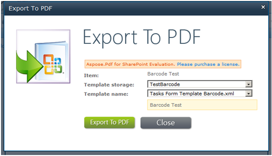

---
title: 使用 PDF 模板引擎将任务列表导出为带条形码的 PDF
linktitle: 使用 PDF 模板引擎将任务列表导出为带条形码的 PDF
type: docs
weight: 40
url: /zh/sharepoint/export-task-list-to-pdf-with-barcode-using-pdf-template-engine/
lastmod: "2020-12-16"
description: PDF SharePoint API 可以使用 PDF 模板引擎将任务列表导出为带有条形码的 PDF。
---

{}

本文介绍如何使用 Aspose.PDF for SharePoint 设置任务列表并将其导出为带有条形码的 PDF。

{}

要使用模板引擎将任务列表导出为带有条形码的 PDF，请执行以下步骤：

1. 创建并上传模板。
1. 填写模板字段并保存模板。
1. 创建并保存新任务。
1. 将文档导出为 PDF。

下面详细给出该过程。

## 将任务列表导出为 PDF

{}

1. 创建 PDF 模板列表。

2. 创建模板后，单击列表中的“添加新项目”并上传 XML 文件。

3. 上传完成后，单击**确定**。
4. 填写表单字段。
5. 保存模板。

模板已配置完毕。

6. 转到 **任务** 列表并创建一个新任务。
7. 保存任务。

8. 在 **Aspose 工具** 选项卡上，单击 **导出为 PDF**。

9. 选择配置的模板，然后单击“**导出**”。

导出的PDF：

{}

